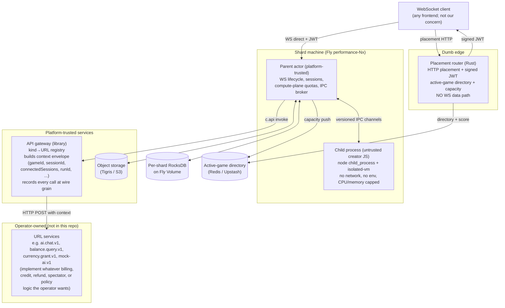
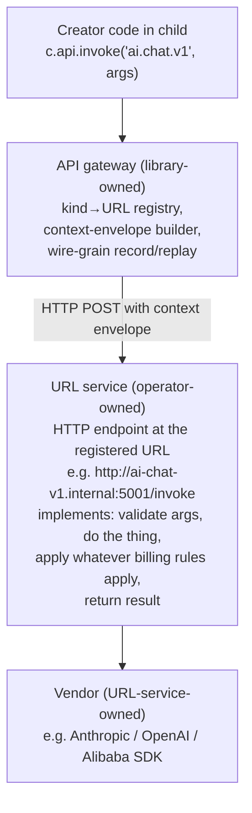

## Mission and philosophy

Build a substrate that does one thing well: **run a creator's untrusted JavaScript inside a per-game sandbox, give it a small typed surface for talking to humans and to operator-defined external services, faithfully record what happened, and stay deliberately ignorant of everything else.**

What this is not:
- A storytelling platform.
- A billing system, ledger, credit store, or payment processor.
- A Pax-branded anything.

What it is:
- A runtime where the contract surface is small enough to specify completely, the testability story is first-class (not retrofitted), and the boundary between *what only the runtime can know* (CPU/RAM/bandwidth usage, connection state, in-process JS execution) and *what the operator wants to layer on top* (AI billing, credits, in-game currency, refunds, marketplace, spectator rules) is sharp and intentional. The substrate owns the first; the operator owns the second.

Paxhistoria, when it sits on top of this runtime, brings:
- A concrete set of registered API kinds (one of which happens to be `ai.chat.v1`) with operator-owned URL services that implement them.
- An identity / user / account / auth system.
- A billing / credit / refund / revenue-share system entirely outside the substrate.
- A frontend that knows how to render games of this shape.
- Concrete entity / spectator / participant semantics layered on top via JWT claims and URL-service policy.

None of that lives in this repo. This repo is the substrate. The Pax-branded layer is a separate concern (and probably a separate repo).

## Sister-repo context (for sibling agents resuming this work)

Three spikes already validated the substrate-shaped pieces independently:

- [pax-spike-fly](/Users/eli/Documents/GitHub/pax-spike-fly/) — proved one-Node-process-per-game on self-hosted Rivet at chat shape; introduced the JWT chokepoint pattern; validated isolated-vm-in-child sandboxing.
- [pax-sharded-spike](/Users/eli/Documents/GitHub/pax-sharded-spike/) — proved the placement-only router + per-shard RocksDB-on-Fly-Volume + Tigris blob topology scales (50k mock games on the orchestration layer).
- [pax-rivet-refactor](/Users/eli/Documents/GitHub/pax-rivet-refactor/) — fixes the Rivet internals (UPS lanes, Tunnel v2, Executor lanes, Routing Directory) so the workaround ledger goes away. This is the vendored Rivet pin source for this repo.

A prior planning iteration ([production-rivet-fly-repo](/Users/eli/.cursor/plans/production-rivet-fly-repo_b749a749.plan.md)) baked in Pax-specific contract surfaces (entity claiming, spectator UI, AI gateway, moderation). This plan is the generic substrate that prior plan should have started from.

The harness design from [scenario-bundle-harness](/Users/eli/.cursor/plans/scenario-bundle-harness_0348a2db.plan.md) ports forward as-is; this plan adopts its discipline.

## Scale target (v1)

**1k concurrent games across 10 Rivet shard machines (100 games per shard).** This is the v1 capacity target — small enough to exercise every channel, every guarantee, and every redeploy path under realistic concurrency without dragging in scale concerns we don't have evidence for yet.

The interesting properties of this substrate (router throughput, ledger contention, per-shard hibernation, cross-shard migration, redeploy safety) are all measurable at this size. If 1k works cleanly we add shards; if it doesn't the scope is tight enough to debug.

Initial Fly resource shape inside the `pax-backend` Fly app:

- **10 Rivet shard machines.** One Fly Volume per shard for RocksDB; 5–10 GB each. Volume usage is bounded by Rivet engine working state (pegboard scheduling, workflow rows), not by lifetime game count — `c.state` and `c.blob` are canonical in Tigris, not on the volume. See §"Storage tiers".
- **1 control+gateway machine.** Placement router, control plane, API gateway, and the reference URL services (`echo`, `delay`, `http.fetch`, `mock-ai.v1`) all co-located for v1. Split out when something gets hot, not before.
- **Scenario-runner driver machines on demand.** Spin up however many we need for a load run, tear them down after.

No in-app Postgres in v1. The substrate has no ledger to back; operator-owned URL services (billing, balance, etc.) live outside this repo entirely and bring their own storage if they need any. We add substrate machines only as evidence demands. Day-one footprint is deliberately small.

## High-level architecture (one diagram)



Note what is and isn't in the diagram: no resource ledger, no Postgres, no balances, no debits. The substrate dispatches calls and records them; URL services (operator-owned, outside this repo) do whatever billing, credit, refund, or policy logic the operator's business model requires.

## The runtime contract — generic, plain language

### The architectural philosophy

> **The parent actor is a dumb pipe. The child is the game. The substrate owns transport, durability, compute, and observability. Anything billing-shaped — caps, balances, refunds, spectator rules, AI-token accounting — lives outside the substrate entirely, in operator-owned URL services and host code.**

### Trust model

- **Platform-trusted (most-trusted):** placement router, control plane, API gateway.
- **Platform-trusted (shard-local):** parent actor. If compromised, the shard is compromised.
- **Untrusted:** child process running creator JS, inside a `node child_process` + `isolated-vm`. No outbound network. No environment variables. CPU/memory capped. Escape-the-ivm leaves the creator in the child sandbox; escape-the-child requires a Node zero-day, which we accept as the security floor.

Load-bearing invariant: **the child can only talk to the outside world through the substrate's API gateway, and the substrate faithfully tells every URL service who was actually connected at the moment of the call.** The substrate doesn't enforce any billing-shaped rule itself (it has no billing vocabulary), but it makes such rules implementable by URL services: the gateway enriches every `api.invoke` with accurate session/runtime context (gameId, triggeringSessionId, connectedSessions snapshot, JWT claims) and records every round trip at wire grain. URL services have everything they need to make whatever trust decisions their billing model requires — "is the named player actually connected right now?", "has this session already spent X?", "is this a spectator JWT?" — because the substrate tells them, faithfully and at dispatch time. The "compromised child charges 10,000 fake users" attack class is closed at the URL-service layer (which sees connectedSessions and can reject), not by substrate-enforced player-connectivity checks.

### Lifecycle hooks (creator-implemented)

| Hook | When | Payload |
|---|---|---|
| `onWake` | Child boots | `{ reason, state, blob, runId, bundleName, bundleCompatTag, blobCompatTag? }`. Reasons: `cold-start`, `reconnect`, `cold-restart-after-crash`, `cold-restart-after-eviction`, `cold-restart-from-storage`, `upgrade`. `bundleName` is the substrate-unique identifier of the bundle that just loaded; `bundleCompatTag` equals this bundle's `manifest.compatTagProduced` (provided for convenience so migration code can compare without a manifest lookup); `blobCompatTag` is the tag the previous bundle stamped on the blob on its last successful sleep, undefined on `cold-start`. `cold-restart-from-storage` covers both planned cross-shard migration and unplanned shard loss; `state` reflects the last durable flush — zero loss on planned transitions, at most the configured flush window of writes lost on unplanned crash. On `upgrade` (bundle pointer was flipped while this game was asleep), `blobCompatTag` will typically differ from `bundleCompatTag`; the bundle's `onWake` decides how to migrate. See "Bundle compatibility" below for the model |
| `onSleep` | Imminent shutdown | `{ deadline, reason }`. Creator persists final `c.state` / `c.blob`; returning past `deadline` = killed and last checkpoint kept |
| `onPlayerConnect` | Player WS opens after auth | `{ playerId, sessionId, jwtClaims, connectedAt }`. `sessionId` is the substrate-generated unique id for this connection (stable for its lifetime). `jwtClaims` is the verbatim claims object the operator signed into the JWT — opaque to the substrate; the creator can read whatever the operator put there |
| `onPlayerDisconnect` | Player WS closes | `{ playerId, sessionId, reason: 'left' \| 'timedOut' \| 'removedFromAllowedPlayers' \| 'shardEvicted' \| 'gameDeleted' }` |
| `onPlayerMessage` | Player sent a WS message | `{ playerId, sessionId, seq, body }`. `seq` is platform-assigned; creator uses `(playerId, seq)` for idempotency |
| `onCapacityWarning` | Compute-plane budget pressure | Best-effort hint; payload includes which budget is under pressure |

Deliberately not exposed: `onCreate` and `onMigrate` (folded into `onWake` reasons), `onDestroy` (admin action; the child just stops loading), `run` (background loops creator can't account for), `onWebSocket` / `onRequest` (platform owns transport), `onStateChange` (creator owns their own write paths), Rivet's `actions` (folded into `onPlayerMessage`), `c.schedule.*` (no scheduled wakeups in v1; async progression happens on player reconnect, not on a timer).

### Storage tiers

Three nouns, one canonical store. The substrate's job here is to keep the
author-facing surface small and predictable while pushing all the "where do
the bytes live" complexity behind the scenes.

- **JavaScript variables in the child** — volatile, ephemeral, lost on any
  process restart. Use for sockets, timers, derived state, anything that
  can be reconstructed.
- **`c.state`** — managed per-game state tier. Whole-object read/write;
  CBOR-serializable; **128 KB cap**. Durable to Tigris object storage within
  a configurable flush window (default 1 s, tunable per preset down to
  single-digit ms). `await c.state.flush()` forces an immediate durable
  flush when the bundle needs the write durable before it returns. **One
  state object per game**, identified by `gameId`.
- **`c.blob`** — explicit object storage namespace per game. Keyed map of
  `(key → bytes)`: `put(key, bytes)`, `get(key)`, `delete(key)`,
  `list(prefix?)`. Async; durable on resolve. Tigris-backed at the prefix
  `blob/<gameId>/`. Caps: **≤ 1024 keys, ≤ 100 MB total per game**. One
  `blobCompatTag` per game, **namespace-level** — per-key versioning is the
  bundle's problem within the namespace.

Tigris is the **canonical store** for both `c.state` and `c.blob`. The
shard's local UDB (RocksDB on a Fly Volume) still exists for Rivet engine
internals (pegboard scheduling, workflow state) but is not in the `c.state`
durability path. This is what makes sleeping games shard-unbound, cross-shard
migration identical to wake, and per-shard volume usage bounded by working
set rather than lifetime traffic.

The three-color rule for authors: **vars if it's reconstructable, state if
it's small and read often, blob if it's big or you need synchronous-durable-
on-write.** A storytelling bundle keeps the current paragraph in `c.state`
(fast, capped) and checkpoints completed chapters into `c.blob` under keys
like `chapter-12.json` (explicit, durable).

The six nouns of a game (no seventh by design): one **identity** (`gameId`),
one **bundle pointer**, one **state** object, one **blob namespace**, one
**roster** (`allowedPlayers`), plus *ephemeral derived state* (sessions,
recent history, recent `api.invoke` records). Anything that wants to be a
seventh top-level noun is an alarm bell.

UniversalDB backend pick: **`FileSystem` (RocksDB on a Fly Volume, one per
shard)**, matching the pax-sharded-spike topology — used for Rivet's own
internal state. Postgres UDB is the alternative but pax-spike-fly hit an
N=20–25 chat ceiling on it without heavy patches.

### Communication channels (the "pipes")

Channel payload shapes are fixed by the bundle's `runtimeContractRequired` (see "Bundle compatibility" below). Payloads carry no in-band version field — the shard knows from the bundle's manifest which contract shapes to use for every channel, before any payload is parsed. Channels:

#### Child → actor

| Channel | Purpose |
|---|---|
| `api.invoke` | Call an operator-defined external API; see "External API channel" section below |
| `state.read` / `state.write` / `state.flush` | Managed per-game state tier; 128 KB cap; whole-object read/write; `flush` forces an immediate durable write. Tigris-canonical with a configurable flush window |
| `blob.put` / `blob.get` / `blob.delete` / `blob.list` | Keyed per-game blob namespace; ≤ 1024 keys and ≤ 100 MB per game; async; Tigris-backed at prefix `blob/<gameId>/` |
| `ws.send` | Send a WS message to one or more players; payload is an arbitrary JSON-safe object plus target `playerId` (or `'all'`) |
| `players.allowed` | Read the set of players currently allowed to connect to this game (the substrate's per-game whitelist). Useful for "5 of 7 invited players are here" UX |
| `players.connected` | Read the set of currently-connected players with their `sessionId`s and `connectedAt` timestamps |
| `compute.budget` | Read current compute-plane usage and the configured limits for this game (CPU, memory, bandwidth, message rate, state/blob bytes, api invocations per minute) |
| `log.emit` | Structured log; routed to observability backend with `(gameId, bundleName, bundleCompatTag)` tags. `console.log` proxied with `source: 'console'` |
| `metrics.emit` | Numeric metrics; counter / gauge / histogram shapes |
| `lifecycle.requestSleep` | Voluntary shutdown signal |

#### Actor → child

| Channel | Purpose |
|---|---|
| `onWake` | Child startup notification (see lifecycle) |
| `onSleep` | Imminent shutdown |
| `onPlayerConnect` / `onPlayerDisconnect` | Player lifecycle |
| `onPlayerMessage` | Player WS message in |
| `onCapacityWarning` | Compute-plane budget pressure hint |

Conspicuously absent from the substrate-defined channels: `c.ai`, `c.entity`, `c.asset`, `c.resources`, `c.moderation`. None of these are substrate concerns. AI is just one `api.invoke` kind (e.g. `ai.chat.v1`) implemented by an operator-owned URL service. Entity-claim is host territory. Assets are fetched via `api.invoke` with an `asset.fetch.v1` kind (when an operator registers one). Balances, credits, billing, and moderation pipelines are all operator-shipped URL services (see "External API channel" below).

### Compute-plane resources — what the runtime enforces

The substrate enforces *compute-plane* resource budgets because only the runtime can measure them. These are first-class, per-game-instance, and reset per-window. They are NOT the same as "AI tokens" or "image credits" or any operator-defined business resource (those don't exist in this library at all — see "External API channel" below).

The enumerated compute budgets:

| Budget | Window | Enforcement |
|---|---|---|
| `cpu-ms-per-tick` | Per `onPlayerMessage` / `onWake` / `onSleep` invocation | Handler killed if exceeded; child stays alive |
| `memory-bytes` | Steady-state RSS | Child killed (OOM); restart with `onWake({ reason: 'cold-restart-after-crash', errorClass: 'oom' })` |
| `bandwidth-bytes-per-sec` | Sliding 1-second window | `ws.send` returns `bandwidthExceeded`; child stays alive |
| `ws-messages-per-sec` | Sliding 1-second window | `ws.send` returns `rateExceeded`; child stays alive |
| `state-bytes` | Total `c.state` size | `state.write` returns `sizeExceeded` |
| `blob-bytes` | Sum of all keys in the `c.blob` namespace | `blob.put` returns `sizeExceeded` |
| `blob-keys` | Distinct key count in the `c.blob` namespace | `blob.put` returns `keyCountExceeded` |
| `api-invocations-per-min` | Sliding 1-minute window | `api.invoke` returns `apiRateExceeded`; URL service not contacted |

Each budget has a per-game default; operators can override per-preset via the preset manifest. Defaults and current usage are readable via `c.compute.budget()`. When usage approaches limits, the substrate fires `onCapacityWarning({ budget, currentUsage, limit })` so creator code can shed load gracefully.

**There are no other resource concepts in the substrate.** No `ai-tokens`, no `gold`, no `gamePool`, no balances, no caps, no debits, no reservations. Those all live in URL services and the operator's billing system — see next section.

### External API channel — creator code's only path to the outside world

The single channel `c.api.invoke(kind, args)` is how creator code talks to anything external (LLMs, image generators, web fetches, moderation services, host-defined balance queries, anything else). The operator owns the kind→URL registry; the library is the trust-seam, the context-envelope builder, and the wire-grain recorder.

**The substrate is opinion-free about what API calls *mean*.** It does not validate `args`, interpret `result` bodies, model billing, enforce caps, or know what an "AI token" is. Its only job: take a call from creator code, enrich it with accurate session/runtime context, dispatch it to the registered URL, record the wire bytes, and return the response verbatim.

#### The wire shape

```ts
type ApiInvokeRequest = {
  kind: string                    // "ai.chat.v1" | "image.generate.v1" | "web.fetch.v1" | ...
  args: unknown                   // kind-specific shape; opaque to the library
  idempotencyKey?: string         // optional creator-side dedupe key; passed through to URL service verbatim
}

type ApiInvokeResponse =
  | { ok: true, result: unknown }       // result is URL-service-defined; opaque to the library
  | {
      ok: false
      error:
        | 'kindUnknown'           // kind is not in the gateway's URL registry
        | 'providerError'         // URL service returned non-2xx or timed out
        | 'apiRateExceeded'       // compute-plane api-invocations-per-min budget exceeded
        | 'replayCoverageGap'     // replay mode and no recorded response matches the request fingerprint
      detail?: unknown            // opaque error payload from URL service or library
    }
```

The IPC envelope between child and parent carries no in-band version field; the shape is fixed by the bundle's `runtimeContractRequired` (see "Bundle compatibility"). The HTTP envelope between gateway and URL service is versioned separately via the `X-Gateway-Envelope-Version` header below.

If the creator wants to communicate billing intent to a URL service (e.g. "bill this call to player P1 at most 100 ai-tokens"), they put it inside `args` where the library never looks. The URL service is responsible for interpreting it and applying whatever billing rules it owns.

#### URL-per-kind architecture

The library has no opinion about *what* an API kind does, *how* it's implemented, *what schema* its `args` take, or *where* it physically runs. The entire kind registry is a flat config table mapping `kindName → URL` loaded at gateway boot. When creator code calls `c.api.invoke('ai.chat.v1', args)`, the library looks up the URL, builds the context envelope, makes an HTTP call, records the wire bytes, and returns the response verbatim. The thing at the URL — a Node service, a Rust service, a Python script, a serverless function, an HTTP route within the gateway process — is opaque to the library.



| Layer | What it owns | What it does NOT own |
|---|---|---|
| **Library (substrate)** | Kind→URL registry; canonical HTTP envelope with rich session context; wire-grain record/replay; api-invocations-per-min compute budget | Args schemas; result schemas; billing; balances; caps; spectator rules; pricing math; protocol semantics (streaming, retries); vendor SDKs; deprecation timing |
| **URL service (operator)** | Args validation; result shape; billing, debit math, balance queries, refunds, credit grants; the actual provider call; retries; streaming; whatever spectator/role rules the operator wants | Library trust seam; session/connection state (queried from substrate); the kind→URL registry |
| **Vendor implementation** | The actual SDK call to one provider (Anthropic, OpenAI, Alibaba, etc.); vendor-specific quirks | Anything outside its provider |

**Versioning.** The version is part of the kind name. `ai.chat.v1` and `ai.chat.v2` are two separate registered kinds with two separate URLs (or the same URL behind a path discriminator — the library doesn't care). The library does no version resolution; it just looks up the registered name. If an operator wants to deprecate v1, they unregister it. The library does not enforce a deprecation window.

**Deployment topology.** For v1, all URLs point at services running in the same Fly app as the gateway. Tomorrow, any kind can move to its own Fly app, its own region, its own runtime, or behind a serverless function — without touching the library or the SDK.

#### The HTTP wire protocol (library-defined envelope)

The library is opinionated about exactly one thing: the shape of the request it sends to the URL and the shape of the response it expects back. URL services must conform to this envelope; everything inside `args` and `result` is opaque.

```
POST <registered URL>
Content-Type: application/json
X-Gateway-Envelope-Version: 2                 // bumps only when the envelope shape below changes; independent of bundle runtime contract
X-Gateway-Request-Id: <uuid>
X-Gateway-Game-Id: <gameId>
X-Gateway-Kind: <kindName>
X-Gateway-Mode: live | replay

{
  "args": <opaque to library, creator-provided>,
  "context": {
    "gameId": "...",
    "triggeringSessionId": "..." | null,   // sessionId of the player whose action triggered this call (in onPlayerMessage); null for lifecycle-triggered calls (onWake/onSleep)
    "triggeringJwtClaims": { ... } | null, // verbatim JWT claims of the triggering session (so URL services can read whatever opaque info the operator signed in); null when triggering session is null
    "connectedSessions": [                 // snapshot of all currently-open sessions for this game at the moment of dispatch
      { "sessionId": "...", "playerId": "...", "connectedAt": "..." },
      ...
    ],
    "bundleName": "...",                   // identifier of the bundle that issued this api.invoke
    "bundleCompatTag": "...",              // == bundle.manifest.compatTagProduced
    "runId": "...",
    "traceId": "..." | null,
    "idempotencyKey": "..." | null
  }
}

→
200 OK
{ "result": <opaque to library> }

OR
4xx/5xx + { "error": <error-code>, "detail": <opaque> }
```

The `X-Gateway-Envelope-Version` header is the substrate↔URL-service wire version (Axis B in the versioning matrix). It is independent of the bundle's `runtimeContractRequired` (Axis A) and of the kind name's embedded version like `ai.chat.v1` (Axis C). URL services dispatch on the header to know which envelope schema to parse; bumping the substrate runtime contract does not by itself bump this header, and vice versa.

The `connectedSessions` snapshot is the substrate's key contribution to billing-aware URL services: at the moment of this call, here are all the open sessions with their sessionIds, playerIds, and connection timestamps. URL services that want to implement "only bill players who are connected right now," "this player is a spectator (cap = 0 in our shadow table)," "this is an offline call so apply different rules," or "verify the player named in args is actually connected" do so by consulting this list, their own shadow tables keyed on (sessionId, playerId), or the substrate's session admin endpoints. The substrate guarantees the snapshot is accurate at dispatch time.

URL services that need richer historical info — "was player X connected during the last hour?" — call `GET /admin/games/:id/sessions?from=...&to=...` or tail the session-event stream.

**If an operator wants typed creator-facing wrappers** (so creators see `c.api.aiChatV1(args)` instead of `c.api.invoke('ai.chat.v1', args)`), they ship their own SDK package whose typed wrappers compose around the library's generic `c.api.invoke` surface.

#### First-party reference URL services

The substrate ships four reference URL services in `orchestration/url-services/` (they deploy with the gateway on `pax-backend-control`):

- `echo` (no-op; returns args verbatim)
- `delay` (controllable latency)
- `http-fetch` (real outbound HTTP against an allowlist)
- `mock-ai.v1` (canned responses keyed by `args` hash; no billing logic — just a deterministic ai-shaped responder)

Plus a *reference* `billing-mock.v1` URL service in `examples/url-services/billing-mock.v1/` that demonstrates *one way* an operator could implement balance/credit/refund/spectator logic on top of the substrate's session observability. It's a worked example for documentation and for the scenario-runner's end-to-end tests — not part of the substrate's contract. Operators are free to ignore it entirely.

#### Wire-grain recording and the replay boundary

Every `c.api.invoke` round trip is recorded at **wire grain** to the bundle's history by the library:

- The canonical fingerprint: `sha256(serialize(outbound HTTP payload))`.
- The raw outbound HTTP payload sent to the URL service (the library-defined envelope plus `args`).
- The raw inbound HTTP payload received from the URL service (the library-defined envelope plus `result`).

The library computes the fingerprint itself; the URL service does not need to know about replay or fingerprinting. From the URL service's perspective, every call is a live call — the library makes the live-or-replay decision before deciding whether to actually dispatch.

In **production** the gateway dispatches the HTTP call; the wire bytes are recorded and the response is returned to creator code.

In **test or replay** mode the gateway short-circuits the dispatch: it looks up a recorded inbound payload by request fingerprint and returns it to creator code without making the HTTP call. **If no recorded response matches**, the gateway hard-fails with `replayCoverageGap` rather than silently falling through to a live URL service. Silent fall-through to live services makes oracle results meaningless.

The trust seam is the **HTTP egress from the gateway to the URL service**. Anything the URL service does internally (its own calls to vendors, its own ledger writes, its own caches) is invisible to the library; only the URL service's final HTTP response is captured. A replay against a new binary version re-executes everything inside the library (gateway logic, runtime, creator code) while freezing what the URL service returned.

#### The call flow (definitive)

```mermaid
sequenceDiagram
  participant Child as "Child (creator code)"
  participant Actor as "Parent actor"
  participant GW as "API gateway"
  participant Service as "URL service for kind"

  Child->>Actor: "api.invoke(kind, args)"
  Actor->>GW: "forward (with shard-verified gameId, triggering sessionId)"
  GW->>GW: "check api-invocations-per-min budget (fail apiRateExceeded if over)"
  GW->>GW: "lookup URL for kind (fail kindUnknown if absent)"
  GW->>GW: "build context envelope (gameId, triggeringSessionId, connectedSessions, runId, ...)"
  GW->>GW: "fingerprint = sha256(serialize(outbound envelope))"
  alt replay mode
    GW->>GW: "lookup recorded response by fingerprint"
    GW->>GW: "fail replayCoverageGap if no match"
  else production mode
    GW->>Service: "HTTP POST envelope"
    Service-->>GW: "{ result } (or 4xx/5xx)"
    GW->>GW: "record (fingerprint, raw outbound, raw inbound) to history"
  end
  alt URL service error
    GW-->>Actor: "ok=false, error=providerError"
  else success
    GW-->>Actor: "ok=true, result"
  end
  Actor-->>Child: "response"
```

No reservation, no commit, no ledger touch, no debit verification. The library hands off, records, and returns. Whatever the URL service does with billing is its own affair.

#### What this whole structure delivers

- **Library scope stays small.** URL registry, HTTP envelope, record/replay shim, api-rate budget. A few hundred lines.
- **Billing, accounting, credits, refunds, spectator rules — all out.** The substrate doesn't have a vocabulary for any of these.
- **Replay is meaningful.** Wire-grain recording at the gateway↔URL-service boundary lets a new binary version be tested against historical behavior, with the only frozen variable being what came back from the URL service.
- **Existing host-platform integrations port cleanly.** Anything that today is an HTTP-speaking service can become a URL service; the only contract is the envelope shape.
- **The substrate is the source of truth for session observability.** URL services know exactly who was connected when, because the substrate tells them in every call and exposes admin endpoints for richer queries.

### Session observability — the foundation for everything operator-owned

Because the substrate is opinion-free about billing, spectator rules, refunds, fraud detection, and every other business-plane concern, the one thing it must do extremely well is **tell URL services and the operator's host code exactly who was connected to what game at what time**. That observability is what enables operators to build arbitrarily sophisticated policy on top.

The substrate guarantees:

- **Every WS connection gets a unique `sessionId`.** Substrate-generated, opaque to creator/operator, stable for the lifetime of the connection. Cluster-wide unique.
- **The `Session` unit is first-class** with `{ gameId, playerId, sessionId, connectedAt, lastActivityAt, disconnectedAt?, shardId, jwtClaims }`. Ephemeral while active; an immutable historical record after disconnect.
- **Two history events bracket every session:** `session.opened` and `session.closed`, both with full session metadata.
- **Every `api.invoke` context envelope** includes the full `connectedSessions` snapshot at dispatch time, plus the `triggeringSessionId` (and its `jwtClaims`) if the call was made during `onPlayerMessage`.
- **Admin endpoints** expose live and historical session info: `GET /admin/games/:id/sessions?from=...&to=...`, `GET /admin/games/:id/connected-players`.
- **The history stream** carries every session event, allowing host code to maintain shadow tables in real time.

URL services and host code can use this to implement: "only bill connected players," "this sessionId has spent X already, so block further calls," "spectators have a special JWT claim," "refund all calls in the last 5 minutes for game G," "cross-check that creator code didn't try to bill a player who wasn't there," and anything else.

### Bundle compatibility — opaque tags, runtime contract, and rolling deploys

The substrate enforces exactly two compatibility relations and stays opinion-free about everything else:

1. **Bundle ↔ blob** (data-shape compatibility). Each game blob carries an opaque `compatTag: string` that the substrate stamps on every successful sleep from the active bundle's `compatTagProduced`. Each bundle manifest declares a `compatTagProduced: string` (what it writes) and `compatTagsAccepted: string[]` (what its `onWake` can read; must include `compatTagProduced`). The substrate refuses any bundle-pointer flip or cold wake where `blob.compatTag ∉ bundle.compatTagsAccepted`. **The substrate has zero vocabulary about "game type," "schema family," "data version," "newer," or "older" — it only checks set membership over opaque strings.** Any structure on tag names is operator convention.
2. **Bundle ↔ shard** (runtime contract compatibility). Each bundle declares `runtimeContractRequired: number` — a single integer naming the substrate-runtime surface (channels, IPC, lifecycle hooks, gateway envelope) it compiled against. Each shard ships a `runtimeContractsSupported: [min, max]` integer range baked into its image. The placement router refuses to route a game onto a shard whose range does not include the bundle's `runtimeContractRequired`. Integer-linear because there is exactly one substrate runtime evolving in one direction. Channel payloads carry no in-band version field — the contract version is the single source of truth and dispatch happens before any payload is parsed.

The manifest a bundle ships at upload:

```ts
type BundleManifest = {
  compatTagProduced: string          // what this bundle writes on sleep
  compatTagsAccepted: string[]       // what this bundle's onWake can read (must include compatTagProduced)
  runtimeContractRequired: number    // single integer; substrate-runtime contract version
}
```

The substrate's invariants — all scenario-runner testable:

- **At upload** (`POST /admin/bundles/:bundleName`): manifest is parsed; reject if `compatTagProduced ∉ compatTagsAccepted` (a bundle must be able to read what it writes).
- **At flip** (`POST /admin/games/:id/bundle`): refuse with `409 compatTagOutOfRange` if `game.blobCompatTag ∉ newBundle.manifest.compatTagsAccepted`. The 409 body includes `{ blobCompatTag, bundleCompatTagsAccepted }` so operator tooling can compute a bridge.
- **At placement** (router): refuse with a typed error if `bundle.runtimeContractRequired ∉ shard.runtimeContractsSupported`.
- **At cold wake** (shard, before invoking `onWake`): re-check the flip-gate condition; refuse identically if the blob has drifted (defense-in-depth against control-plane bugs).

#### What this enables platforms to express on top of it

Because the tag is opaque and the library only does set membership, platform owners can encode any schema-evolution policy they want **without library changes**. Worked examples, all using the same five manifest fields:

- **Single linear version chain.** Operator names tags `"v1"`, `"v2"`, `"v3"`. A bundle with `produced: "v7", accepted: ["v5","v6","v7"]` is the classic monotonic-integer model.
- **Multiple isolated game families.** Operator names tags `"chat:v3"`, `"strategy:v7"`, `"drawing:v2"`. A chat bundle declares `produced: "chat:v7", accepted: ["chat:v5","chat:v6","chat:v7"]`. A strategy bundle declares an entirely disjoint set. Cross-family flips are physically impossible because the strings don't overlap; the library enforces family isolation by accident-of-naming, with no awareness of "family" as a concept.
- **Branching and recombining schemas.** Tags `"chat:v5-stable"` and `"chat:v5-experimental"` coexist. A recombining bundle declares `accepted: ["chat:v5-stable","chat:v5-experimental"], produced: "chat:v6"` and divergent histories merge cleanly at the flip.
- **Forking a family.** A bundle reads `accepted: ["chat:v9"]` and produces `"voice-chat:v1"`. After the flip, the game has migrated families. The substrate doesn't know it happened.
- **Schema fingerprinting (Avro/Protobuf-style).** Tags are content hashes like `"sha256:abc123…"` computed from the schema-as-data. The operator's publishing tooling chooses tags; the substrate just stores and matches them.
- **Strict integer monotonicity, deprecation windows, dormant-version floors, predecessor/successor graphs, chained intermediate bundles.** All implementable in operator-side bundle-publishing tooling. The substrate doesn't provide them but doesn't fight them either.

The platform-side complexity scales with the platform's actual needs; the library does not. Whether one operator stays at one linear chain forever and another grows to fifty game families with branching schemas, the substrate has the same five fields and the same two gates.

#### Helping the operator plan migrations

Because the tag is opaque, the substrate can't compute migration paths or predecessor relationships. It can, however, expose the current tag population so operator tooling can plan client-side:

- `GET /admin/games/compat-tags` — histogram, e.g. `{ "chat:v5": 120, "chat:v6": 800, "strategy:v3": 80 }`.
- `GET /admin/games/by-compat-tag/:tag` — paginated list of games at a given tag.
- `GET /admin/games/:id/bundle-compat?bundleName=...` — dry-run of the flip gate; returns the same body the 409 would, without side effects.

With these three endpoints, a deploy tool can answer "if I flip the bundle pointer for every `chat:v5` game to bundle X, which ones will refuse?" entirely client-side, walk them through an intermediate bundle, and re-attempt.

#### The three versioning axes the substrate exposes (and one it doesn't)

The substrate carries exactly three independent version identifiers and nothing else. Naming them explicitly so they don't collapse together in future thinking:

| Axis | Boundary | Mechanism | Substrate opinion | Why it exists |
|---|---|---|---|---|
| A. Substrate ↔ bundle wire | Child (creator JS) ↔ parent actor | `runtimeContractRequired: int` (bundle) and `runtimeContractsSupported: [min,max]` (shard); placement gate | Single linear evolution | Library owns both sides of the wire; one source of truth keeps the dispatch path simple. |
| B. Substrate ↔ URL-service wire | Gateway ↔ URL service | `X-Gateway-Envelope-Version` HTTP header | Single linear evolution | URL services are operator-owned across a process boundary; need a header dispatch to know which envelope schema to parse. |
| C. Bundle ↔ URL-service application | Creator code ↔ URL service application logic | Version baked into kind name (`ai.chat.v1`, `ai.chat.v2`) | Opaque (substrate just looks up the string) | Operator's namespace; substrate has no business interpreting application protocols. |

What's deliberately absent: per-channel `v:` envelopes on individual payloads (subsumed by Axis A), and any substrate-level "audience" or "channel" tag (see "Beta testing" below for how that's expressed without a new primitive).

#### Beta testing and canary rollouts (host-driven)

Beta and canary channels are not a substrate primitive. They compose from per-game bundle pinning plus the existing placement gate, with the policy of *which* game gets *which* bundle living entirely in host code.

The recipe:

1. **Stand up beta-capable shards.** Operator deploys 1–2 shards with `runtimeContractsSupported: [N, N+1]` while existing shards stay at `[N-1, N]`. The cluster now has a small "newest" pool.
2. **Publish a beta bundle.** Operator uploads a bundle with `runtimeContractRequired: N+1` and whatever `compatTagsAccepted` covers the games it wants to migrate. The placement gate (guarantee #16) now structurally prevents this bundle from being placed on the older shards.
3. **Host decides which games get the beta bundle.** Per-user opt-in UI, manual operator selection, A/B coin flip, automatic cohort, whatever the platform wants. The host calls `GET /admin/games/:id/bundle-compat?bundleName=beta-bundle` to pre-check (no side effects), then `POST /admin/games/:id/bundle` to flip. Substrate validates the compat-tag gate; if it passes, the game is now pinned to the beta bundle, which means it can only place on beta-capable shards.
4. **Roll forward or roll back.** To promote beta to general: upgrade more shards to `[N, N+1]`, flip more games. To abort beta: flip the affected games' bundle pointers back to the regular bundle (subject to the compat-tag gate; if beta wrote a tag the regular bundle doesn't accept, the operator either ships a regular-side bundle that accepts the beta tag or accepts that those games are stuck on beta). To fully sunset old contract: bump all shards to `[N+1, N+2]`, drain remaining contract-N-only games naturally.

Worked example mapping onto your "beta site" scenario:

- **Convergence window (beta and regular bundles equivalent):** the beta site and regular site point at the same bundle. Substrate has no notion of "site"; both sites' users see the same game. Nothing is pinned. Cross-compat is automatic.
- **Divergence (beta is ahead):** host's "create new game on beta site" call sets `bundleName` to the beta bundle; "create new game on regular site" sets it to the regular bundle. Substrate places each on the eligible shard pool. A user from the regular site loading a beta game's URL is the host's frontend problem: read `GET /admin/games/:id` to see `currentBundleName`, recognize it as a beta bundle, render a "play this on beta site →" link. A user from the beta site loading a regular game just plays it (or, if the beta frontend needs a specific bundle, the host similarly renders a redirect — substrate uninvolved).
- **Connect-time client-vs-blob incompatibility:** the bundle's `onPlayerConnect` reads `jwtClaims` (which the host can populate with whatever it wants — frontend version, channel name, anything), decides whether to engage, and replies via `ws.send` with a typed payload the host's frontend renders as "your client can't play this game." Substrate is a transport; the bundle owns the policy.
- **"Push a new shard version that only beta users with compatible games will touch."** The two gates compose: beta-pool shard has `runtimeContractsSupported: [N+1]`; only bundles with `runtimeContractRequired: N+1` can place there (Axis A enforcement). The host decides which games run that beta bundle (host-side opt-in policy). Substrate enforces routing; host enforces selection.

#### Why no substrate-level "channel" / "audience" primitive

An earlier design iteration considered adding opaque `audienceTagsAllowed` / `audienceTagsServed` / `audienceTag` fields to enforce cohort-based admission and shard routing at the substrate layer. We rejected it because the contract-version placement gate already does the routing half, and bundle code via JWT claims already does the admission half. Adding an audience primitive would be a less flexible reimplementation of "what bundle is this game on, and which shards can host it," with substrate-level opinions about cohort vocabulary the substrate doesn't need. The only thing it could have added that bundle-code-via-JWT can't is a typed substrate-level rejection at connection time (vs a bundle-defined `ws.send` payload), and the marginal value didn't justify the new axis.

#### Rolling shard deploys

When shards on runtime contract `N` and `N+1` coexist during a rolling deploy, the placement router restricts bundles with `runtimeContractRequired: N+1` to N+1 shards. Bundles with `runtimeContractRequired ≤ N` place on either. Drain-the-old completes when all `N`-only games have slept naturally. The "don't accidentally route a new-only bundle onto an old shard" property is enforced by the placement gate, not by deploy choreography — operators don't have to time bundle pointer flips around shard rollouts, and the same property protects bundle rollbacks (a bundle pinned to an older contract is always placeable as long as one in-range shard exists).

## Unit boundaries — what the substrate owns vs what the host owns

The substrate's data model is deliberately narrow. Anything required for the runtime to function lives here; everything else — and in particular, anything billing-shaped — lives in URL services and the host's own systems.

### Substrate-owned units

These are first-class entities the substrate stores, mutates, and serves:

1. **Game** — `{ gameId, currentBundleName, currentShardId, status, createdAt, lastActivityAt, blobCompatTag? }`. Created via the admin API; destroyed on demand. Status is one of `active | asleep | destroyed`. `blobCompatTag` is set by the substrate on every successful sleep from the current bundle's `manifest.compatTagProduced`; undefined until first persist.
2. **AllowedPlayersList** — `{ gameId, allowedPlayers: Set<playerId> }`. The whitelist. The substrate's entire connection-control model. Mutated via `addAllowedPlayer` / `removeAllowedPlayer`. Removing a connected player force-disconnects them.
3. **Bundle** — `{ bundleName, blobContent, publishedBy?, publishedAt?, manifest: { compatTagProduced: string, compatTagsAccepted: string[], runtimeContractRequired: number } }`. Stored in platform-owned object storage. Immutable-by-policy: bundle names are write-once. Manifest is parsed and validated at upload; reject if `compatTagProduced ∉ compatTagsAccepted`. The library has no opinion about tag content — it only enforces set membership.
4. **Shard** — `{ shardId, status, healthSignals, currentGameCount, version, runtimeContractsSupported: [min, max] }`. Substrate-managed runtime topology. `runtimeContractsSupported` is baked into the shard image and self-reported at startup; the placement router consults it on every placement decision.
5. **Session** — `{ gameId, playerId, sessionId, connectedAt, lastActivityAt, disconnectedAt?, shardId, jwtClaims }`. Per-WS-connection. Live while connected, immutable historical record after disconnect. `sessionId` is substrate-generated, opaque, cluster-wide unique, stable for the connection's lifetime.
6. **ComputeBudget** — per-game enforced budgets (CPU-ms-per-tick, memory-bytes, bandwidth-bytes-per-sec, ws-messages-per-sec, state-bytes, blob-bytes, api-invocations-per-min). Configured per-preset; current usage tracked in-memory; never persisted as a ledger.
7. **HistoryEvent** — every channel call, every lifecycle transition, every session event, every shard event, every wire-grain api.invoke record. The thing tests and observability consume.
8. **APIKindRegistration** — `{ kindName, url }`. Operator-configured. Mutated via admin endpoints.

### Explicitly NOT owned by the substrate

These belong to the host product (Pax-historia Next.js or whatever the host is) or to operator-owned URL services. The substrate has no opinion about them and no storage for them:

- **Billing primitives** — no balances, no debits, no reservations, no ledger, no `Balance` / `Reservation` / `DebitLogEntry` units. AI tokens, image credits, gold, prepaid pools, refunds, top-ups, transfers — all of it lives in operator-owned URL services and the operator's own storage. The substrate has no vocabulary for any of this.
- **User** — no user table. Players exist implicitly via the `playerId` strings that show up in `AllowedPlayersList` and `Session`. The substrate trusts whatever the JWT claims; identity is host-side.
- **Preset / preset version metadata** — no preset table. The substrate sees only `bundleName`. The host maps `preset_id → preset_version → bundleName` in its own DB.
- **Game metadata** — title, description, preview image, creator name, tags, ratings, comments, friend graph. Host territory.
- **Authentication** — substrate verifies JWT signatures; host signs them. Host owns signing keys, login flows, OAuth, MFA.
- **Authorization policy** — substrate trusts JWT claims and the allowed-players list. Host decides when to issue a JWT and when to mutate the allowed-players list. All access policy decisions happen upstream.
- **Spectator / participant / role concepts** — host decides via JWT claims and URL-service policy. The substrate doesn't know what a role is and doesn't enforce any "this player is read-only" rule — URL services do that by consulting their own state when they receive an `api.invoke` for that player's session.
- **Per-session spending caps** — *not a substrate concept*. If an operator wants to cap a player's spend per session, they implement it in their billing URL service (which sees every relevant `api.invoke` and knows the session's history).
- **Block lists (global or per-game)** — host iterates: to block player X from game G, host calls `removeAllowedPlayer(G, X)`. To block X from everything, host iterates all games.
- **Roster / "has-ever-played" / per-character world state** — creator-side state in `c.state` or `c.blob`.
- **Marketplace / discovery / search / recommendations**.
- **Pricing / payment processing / credit-card flows** — the host charges users in its own systems; the substrate never sees a credit card.
- **Revenue share / accounting / financial reporting**.
- **Moderation pipelines** — if an operator wants moderation, they implement it as a URL service kind (`moderation.classify.v1` or whatever) plus their own internal moderation workflow.
- **Social graph, presence, notifications, anything user-facing in pixels**.

### The boundary in one sentence

> The substrate enforces *runtime rules* (connection authentication, allowed-players whitelist, compute-plane quotas, session lifecycle) and *records what happened* (history, sessions, wire-grain api.invoke). Everything else — billing, credits, spectator rules, refunds, marketplace, identity, metadata — lives in operator-owned URL services and host code, which use the substrate's session observability to make whatever decisions they want.

## Admin surface (REST)

The host product calls into the substrate via a small, deliberate REST surface. The design rule: every endpoint maps to one substrate-owned unit; nothing in the API depends on host-side metadata; nothing in the API is a fancy query engine; nothing in the API touches billing.

### Game lifecycle

- `POST /admin/games` — create a game. Body: `{ gameId, bundleName, initialState? | initialStateUrl?, initialBlob? | initialBlobUrl?, allowedPlayers? }`. `allowedPlayers` may be empty; host adds players afterwards. State/blob may be inlined (small) or referenced by URL (substrate fetches JSON and stores it). On create the game has no `blobCompatTag` yet; the first successful sleep stamps it from the bundle's manifest.
- `GET /admin/games/:id` — basic game info: status, current shard, current bundle, `blobCompatTag`, allowed-player count, connected-player count, created/last-activity timestamps.
- `DELETE /admin/games/:id` — ends any active session; archives or drops state/blob per operator config; removes from directory.
- `POST /admin/games/:id/bundle` — `{ newBundleName }`. Refuses with `409 compatTagOutOfRange` if `game.blobCompatTag ∉ newBundle.manifest.compatTagsAccepted`; the 409 body includes `{ blobCompatTag, bundleCompatTagsAccepted }` so operator tooling can plan a bridge. On success, triggers the snapshot-before-first-wake migration.
- `GET /admin/games/:id/bundle-compat?bundleName=...` — dry-run of the flip gate; returns the would-be 409 body (or `{ ok: true }`) without side effects. Used by host deploy tooling to plan fleet-wide flips before issuing them.
- `GET /admin/games/:id/snapshot` — fat introspection endpoint. Returns allowed-players + active sessions + current `c.state` raw + current `c.blob` raw + recent `api.invoke` wire records for this game. Supports `?includeBlob=false` to omit the (potentially large) blob.

### Allowed-players management

- `POST /admin/games/:id/allowed-players/:playerId` — add. Idempotent.
- `DELETE /admin/games/:id/allowed-players/:playerId` — remove; force-disconnects the player from this game if connected.
- `GET /admin/games/:id/allowed-players` — list.
- `GET /admin/games/:id/connected-players` — list (derived from WS state; cheap; for URL services and host UIs). Returns `[{ sessionId, playerId, connectedAt }]`.
- `GET /admin/players/:playerId/games` — reverse lookup: every game where this player is allowed.

### Compatibility-tag observability

The substrate stays opinion-free about what tags "mean" — it can't compute migration paths or predecessor relationships. These endpoints expose the current tag population so host deploy tooling can plan client-side:

- `GET /admin/games/compat-tags` — histogram of `blobCompatTag` across all games, e.g. `{ "chat:v5": 120, "chat:v6": 800, "strategy:v3": 80 }`. Includes a separate `untagged` bucket for games that have never persisted.
- `GET /admin/games/by-compat-tag/:tag` — paginated cursor list of games at a given tag. Useful for "show me every game I'd need to bridge before flipping bundle X."

### Session observability

- `GET /admin/games/:id/sessions` — historical session records for this game; filters by `from=...&to=...&playerId=...`. Returns `[{ sessionId, playerId, connectedAt, disconnectedAt?, reason?, shardId }]`. Used by URL services that want to answer "was this player connected at time T?" without tailing the event stream.
- `GET /admin/sessions/:sessionId` — single session lookup (useful for URL services that received a `triggeringSessionId` in their context envelope and want to know more).

### Players (sugar)

- `DELETE /admin/players/:playerId` — atomic: for every game where the player is allowed, calls `removeAllowedPlayer` (which force-disconnects); writes a `player.deleted` history event. Does NOT touch any billing state because there is no billing state in the substrate. If the host's billing system needs to zero out balances or block future top-ups, the host's billing service does that separately.

### Bundles

- `POST /admin/bundles/:bundleName` — operator-trusted upload. Name is write-once.
- `GET /admin/bundles/:bundleName` — content (for shards to fetch on wake).
- `DELETE /admin/bundles/:bundleName` — refused if any game still references it.

### Shards

- `GET /admin/shards` — list shards with health, capacity, active game count, version.
- `GET /admin/shards/:id` — detail.
- `POST /admin/shards/:id/drain` — start drain (sets `accepting_wakes=false`; in-flight games run to natural sleep).

### API kinds

- `POST /admin/api-kinds` — `{ kindName, url }`. Register a kind→URL mapping.
- `GET /admin/api-kinds` — list.
- `DELETE /admin/api-kinds/:name` — unregister (subsequent calls fail with `kindUnknown`).

### History query

- `GET /admin/history` — paginated structured event log with filters by event kind / gameId / playerId / sessionId / shardId / timerange. Cursor-based pagination supports both batch pulls and live-tail.

### Explicitly NOT in the admin surface (v1)

- **No ledger endpoints.** No `POST /admin/ledger/mutate`, no `GET /admin/ledger/balance`, no debit log. The substrate has no ledger; balances live in operator billing systems.
- **No webhook subscription endpoint.** Host polls or tails the history pull endpoint. We add webhooks later if polling cost ever hurts.
- **No `forceDisconnect`** that kicks without removing from the allowed-players list. Drain-kicks are internal; host-driven kicks always use `removeAllowedPlayer`.
- **No metadata endpoints.** Game titles, preset names, user profiles — host territory.
- **No analytics or stats endpoints.** Count games-by-tag, top creators, hottest resources — host queries the history if it cares.
- **No multi-game atomic operations** beyond `DELETE /admin/players/:playerId`.
- **No spectator / role / membership-mode endpoints.** Spectator policy lives in URL services and JWT claims.

## Strong platform guarantees (the contract's commitments)

The platform commits to these. They are testable; the scenario-runner ships oracles for every one of them. Note that none of these mention billing, balances, debits, or caps — those aren't substrate concerns.

1. **Singleton game.** Exactly one running child per `gameId` at a time, anywhere on the cluster.
2. **Allowed-only connection.** Substrate refuses any WS connect for a player not in `allowedPlayers(gameId)`, regardless of JWT validity. Removing a player from the allowed list force-disconnects any active session they have on that game.
3. **Unique, stable `sessionId`.** Every WS connection gets a cluster-wide-unique `sessionId`, stable for the connection's lifetime. The substrate guarantees this id is opaque, unforgeable, and matches between `onPlayerConnect`, `onPlayerMessage`, `onPlayerDisconnect`, the `triggeringSessionId` in `api.invoke` context envelopes, and the `session.opened`/`session.closed` history events.
4. **Session observability accuracy.** The `connectedSessions` snapshot in every `api.invoke` context envelope, the `GET /admin/games/:id/connected-players` response, and the live session history events all reflect the substrate's actual connection state at the moment of observation. URL services can trust this snapshot for billing/spectator/anti-fraud decisions.
5. **Faithful API dispatch and recording.** Every `api.invoke` either: (a) is dispatched to the URL service with the library-defined context envelope and the response is returned verbatim, OR (b) fails with a typed error that names exactly which substrate check refused (`kindUnknown`, `apiRateExceeded`, `providerError`, `replayCoverageGap`). In either case the round trip is recorded at wire grain in the history.
6. **Idempotent player input.** No `(playerId, seq)` is ever delivered to the child twice; if the child is restarting, the platform replays at most once and never duplicates.
7. **Compute-plane quotas honored.** Each enumerated compute budget (CPU-ms-per-tick, memory-bytes, bandwidth-bytes-per-sec, ws-messages-per-sec, state-bytes, blob-bytes, api-invocations-per-min) is enforced per game. Over-quota means call rejected with a typed error or child killed per the budget's kind. No silent degradation.
8. **Crash blast radius = 1 game.** A child crash, OOM, or CPU timeout affects only that game.
9. **No random parent crashes.** Actor process death without `onSleep` is a platform bug and is alerted/post-mortemed. Creators don't need to defensively code around this.
10. **Eviction has a minimum budget.** `onSleep` always gives the creator at least the documented per-shape minimum to flush.
11. **`c.state` flush-window durability.** Tigris is the canonical store for `c.state`. On planned sleep / drain / cross-shard migration, the substrate flushes all pending writes before releasing the game — zero loss. On unplanned process or machine death, at most the configured flush window of writes is lost; recovery surfaces `cold-restart-from-storage`. Same-shard restart resumes from the same canonical object.
12. **`c.blob` namespace survives everything.** Every `put` is durable on resolve. The per-game namespace at `blob/<gameId>/` survives cross-shard, cross-deploy, and cross-volume-loss. Substrate-side operations (snapshot, delete-game) treat the namespace as a unit; deletion clears all keys.
13. **Migration rollback safety.** Buggy `onWake` on a new bundle version rolls back to the previous version after N consecutive failures; 7-day backup retention.
14. **History is complete.** Every channel call, every lifecycle event, every session transition, every shard event, every `api.invoke` wire round trip is recorded to a structured history that tests and the platform can read.
15. **Bundle compatibility safety.** The substrate refuses any bundle-pointer flip or cold wake where the game's `blobCompatTag` is not in the new bundle's `compatTagsAccepted`. Equivalently: no game ever wakes on a bundle whose `onWake` cannot read the blob it is being handed. The substrate has no opinion about what tags "mean" — it only enforces set membership. Flip refusals return `409 compatTagOutOfRange` with `{ blobCompatTag, bundleCompatTagsAccepted }` so operator tooling can plan a bridge.
16. **Placement contract safety.** The placement router refuses to route a game onto a shard whose `runtimeContractsSupported` range does not include the game's `bundle.runtimeContractRequired`. Equivalently: no shard ever loads a bundle that calls a hook or channel it does not implement, and no rolling shard upgrade can accidentally place a new-only bundle onto an old shard mid-deploy.

The list above is the spec the scenario-runner's first-party oracle library targets. If a creator can write a bundle that violates one of these, the substrate has a bug. **Note what is NOT in this list:** any guarantee about billing, balances, caps, debits, or whether a player "should have been allowed" to pay for something. Those properties live in the operator's URL services; the operator owns and tests them in their own service.

## Sandboxing — provisional

**Provisional pick: `isolated-vm` inside `child_process` per game, on shared shard runners.** This matches the paxhistoria production pattern and what every sibling spike has used by default. Pattern B (per-game Fly Machine) is out for the structural reasons documented in the prior plan (engine-tunnel conflict with `auto_stop_machines = "suspend"`, no spike precedent at scale).

We are deliberately *not* litigating sandboxing depth further in v1. The goal of v1 is to validate the *shape* of this library — the contract, the channels, the resource model, the test harness, the redeploy story — by building it and exercising it end-to-end. Security depth is a tunable we revisit once the substrate is exercised and we know:

- Which channels actually get used heavily and which sit idle.
- Where the real performance ceilings are on the rebuilt Rivet substrate.
- Whether `isolated-vm`'s maintainer-risk story has materialized.
- Whether a Bun or successor isolate library has emerged as a better fit.

Architectural insurance we ship from day one (cheap, high-leverage):
- The runtime adapter is a separate package from the SDK. `@pax-backend/runtime-ivm` ships v1; the SDK is portable to a future no-ivm or successor runtime without contract changes.
- The child IPC schema is independent of the inner runtime. Swapping runtimes is a per-game flag, not a contract change.

That's enough for v1. The deeper evaluation work waits for evidence.

## Testability — first-class, not retrofitted

This is the half of the project the prior plan made an afterthought. Now it's a co-architecture.

Adopt the [scenario-bundle-harness](/Users/eli/.cursor/plans/scenario-bundle-harness_0348a2db.plan.md) design wholesale:

- One artifact: a **scenario bundle** = creator code (or ref) + client script + initial state/blob fixtures + initial allowed-players + URL-service-response fixtures (canned wire-grain replays) + PRNG seed + declarative oracles + determinism-level claim. Any business-plane setup (initial balances, etc.) is set up against the URL services the scenario targets — typically the `billing-mock.v1` reference — and is not a substrate concept.
- Three run modes: **load**, **property**, **fuzz**. Same artifact.
- Replay mode for cross-version oracle re-runs.
- Nemeses (fault profiles) are orthogonal and composed at run time, not baked into scenarios.
- **Determinism dial = Medium.** Creator SDK exports `c.rng()` / `c.now()`; raw `Math.random` / `Date.now` linted out at publish.
- Bundle-level shrinking for fuzz failures (drop clients, halve duration, strip channels).
- The history file is the only oracle interface — oracles read recorded events, they do not peer into runtime memory.

The substrate's testability surface, baked in from day one:

- **Every channel records to the history** with monotonic timestamps and causal IDs.
- **Every session transition emits a history event** — `session.opened` / `session.closed` with full metadata. Tests can reconstruct exact who-was-where-when from the history alone.
- **Every `api.invoke` records the wire-grain bytes** (fingerprint, raw outbound envelope, raw inbound response). Tests can replay any historical session against a new substrate build and assert the same wire behavior reproduces.
- **Initial state / initial blob / initial allowed-players** are injectable fixtures via `POST /admin/games`, not magic constants.
- **A platform-trusted "test mode" flag** swaps live URL-service dispatch for in-bundle recorded fixtures: the gateway looks up responses by request fingerprint in the bundle's `fixtures/api-responses/` directory and hard-fails with `replayCoverageGap` if nothing matches. Generalized to every kind, enforced at the library layer.
- **Seed-pinning is a substrate property**, not a scenario-runner-only property. The platform's PRNGs (server-side `c.rng`, message-ordering tiebreakers, jitter, sessionId generation) all derive from the bundle's pinned seed in test mode.

Oracles split cleanly into two layers:

- **Substrate-side oracles** check things the substrate can know from history alone: singleton game, idempotent input, crash blast radius, allowed-only connection, sessionId stability, session observability accuracy, faithful API dispatch and recording, compute quotas honored, `c.state`/`c.blob` durability, migration rollback safety, history completeness.
- **URL-service-side oracles** check things only the operator's billing service knows: balance arithmetic, refund correctness, hot-row throughput, top-up integrity, regulatory event emission, spectator-rule correctness. These live in the operator's billing-service test suite. The `billing-mock.v1` reference URL service is the worked example for how to ship those tests.

This split is *why* the substrate dropped billing concerns: tests against the substrate's contract can be exhaustive and fast because the substrate's contract is small. Tests against billing logic can be as elaborate as the operator needs without dragging the substrate's release gate into accounting questions.

## Observability — the substrate's narration of itself

Observability is a co-architecture with Testability, not an afterthought. The substrate's job to narrate what happened faithfully is what enables both — oracles read the narration to assert guarantees, operators read it to attribute production bottlenecks to a named subsystem within minutes, not days. The sister spikes ([pax-rivet-refactor](/Users/eli/Documents/GitHub/pax-rivet-refactor/), [pax-spike-fly](/Users/eli/Documents/GitHub/pax-spike-fly/), [pax-sharded-spike](/Users/eli/Documents/GitHub/pax-sharded-spike/)) collectively spent days proving which observability primitives actually attribute cliffs and which ones merely *localize* them. We ship those lessons as a contract instead of rediscovering them.

The full design lives in [docs/ops/observability.md](docs/ops/observability.md), with the operational provisioning runbook in [docs/ops/observability-betterstack-setup.md](docs/ops/observability-betterstack-setup.md). Load-bearing decisions:

- **Five surfaces** get the same four primitives. Placement router, parent actor, child runner, API gateway, and the vendored Rivet engine each emit structured logs (JSON), Prometheus metrics (`/metrics`), OTLP traces (W3C `traceparent`), and history events. The substrate's job is to make the seams between surfaces legible, not to invent a per-seam observability product.
- **One correlation backbone**. A W3C `trace_id` flows from the client's HTTP placement request through the signed JWT, into the WS session, through the IPC envelope to the child, out the API gateway envelope to URL services, and into Rivet's own spans via the `RIVET_OTEL_ENABLED=1` path. The substrate also stamps `run_id` (scenario-runner only), `game_id`, `session_id`, and a monotonic-per-shard `pax_seq` on every event for causal ordering oracles can trust.
- **Threshold-triggered slow-hop warns are the load-bearing attribution surface**, not Prometheus histograms alone. The [pax-rivet-refactor](/Users/eli/Documents/GitHub/pax-rivet-refactor/) lesson: ~25 named hops (`prepare_keyed_create`, `wait_create_complete_v1`, `allocate_actor_v2.tx_total`, `lockWait`, etc.), each with a structured warn at a documented threshold, parsed by the scenario-runner into a per-rung `setupBottleneckGuess` attribution sentence. Strict label discipline keeps Prometheus metric cardinality bounded; raw IDs live in logs/traces/history only.
- **Testing mode amplifies, doesn't replace**. The scenario-runner auto-switches a sub-second `cliff_hold` sampling profile on the saturation rung ±1, against an explicit `FAST_FAMILIES` Prometheus allowlist ([pax-spike-fly](/Users/eli/Documents/GitHub/pax-spike-fly/)'s lesson — the unfiltered 1s scrape OOM'd their load-bot). Every `result.json` must carry an attribution sentence and the 16 substrate-side oracles (one per Strong Platform Guarantee above) must pass.
- **BetterStack-shipped in cloud, BetterStack-shipped locally too**. One Vector sidecar per Fly app scrapes the `/metrics` endpoints, ingests OTLP, tails stdout, and pushes to BetterStack Logs/Metrics/Telemetry + Tigris (for long-term history replay). Local dev uses per-developer Sources in the same BetterStack team (`Pax-Historia`) so the dev loop exercises the exact same wires as production. Offline knobs (`PAX_OBSERVABILITY=off|buffer|on`) preserve `pnpm smoke` when no network.

The companion docs (planned: `metrics-catalog.md`, `attribution-playbook.md`, `trace-id-flow.md`, `history-schema.mts`, the URL-service template) extend this contract zone-by-zone as the implementation lands.

## What we keep from the prior plan (verbatim)

- The three-zone repo discipline (`runtime/` / `orchestration/` / `tooling/`) from [pax-sharded-spike/docs/ownership.md](/Users/eli/Documents/GitHub/pax-sharded-spike/docs/ownership.md).
- The placement-only router from [pax-sharded-spike/orchestration/router-placement/](/Users/eli/Documents/GitHub/pax-sharded-spike/orchestration/router-placement/) ported verbatim.
- The vendored Rivet at the `pax-rivet-refactor` pin.
- The RocksDB-on-Fly-Volume-per-shard topology for Rivet engine internals (pegboard, workflow state).
- The Tigris-backed durable storage tier — now canonical for **both** `c.state` and `c.blob` (see §"Storage tiers"; the prior plan's "shard-local state lost on cross-shard migration" carveout is gone).
- The sandboxing decision (isolated-vm-in-child).
- The three independently-deployable surfaces (orchestration, shard image, creator bundle) with three different rollout cadences. **One fewer surface than the prior plan** because the frontend / client-bundle surface is no longer ours.

## What we explicitly drop from the prior plan

- All entity / spectator / participant model. Out of scope.
- The dedicated AI gateway. Folded into the generic external API channel with `ai.chat.v1` as one registered kind backed by an operator-owned URL service.
- Asset store, asset request channels. Out of scope.
- Moderation as a first-class subsystem (both `moderation.submit` and `onModerationAction` channels removed). Operators implement moderation as URL service kinds (`moderation.classify.v1` etc.) and as host-side workflows.
- Frontend, client bundles, client-bundle versioning, iframe authentication, default client.
- The `c.entity.created` / `c.entity.destroyed` channels.
- The `c.resources.read` channel.
- All ledger primitives — `Balance`, `Reservation`, `DebitLogEntry`, `reserveDebit`, `commitReservation`, `releaseReservation`, `applyExternalMutation`, `readBalance`. No ledger in the substrate.
- `authorizedDebits` and `debited` from the `api.invoke` wire shape. The substrate doesn't have a billing vocabulary.
- `sessionResourceCaps` and the per-session cap enforcement. Caps are an operator-side concern enforced in URL services.
- Offline-spend protection. Async-game billing is the operator's URL-service responsibility.
- The two-phase reservation/commit dance, hot-row sharding, the billing-fuzz hot-row release gate. None of these belong in the substrate.
- The in-app Postgres dependency, `orchestration/resource-ledger/`, and `orchestration/ledger-db/` zones.
- Revenue share mechanics.
- Spectator-via-empty-caps as a substrate-enforced pattern. Spectators are entirely a URL-service / JWT-claims convention now.

### Why no billing primitives

The substrate exists to be the trust seam for untrusted JavaScript and the faithful recorder of what happened. Adding a billing model bolted onto that — even one as small as "per-session caps" — pulls in pricing, refunds, currency, regulatory shape, and accounting semantics that vary wildly per operator. Two operators using this substrate could have completely different ideas about what "ai-tokens" means; baking either opinion into the library forks the substrate the moment a second operator shows up. The cleanest separation is: the substrate is honest about who-was-where-when (session observability), URL services do whatever billing makes sense, and the two communicate via a simple HTTP envelope. Paxhistoria's existing billing logic stays in its own service, plugged in as the URL implementation for `ai.chat.v1` (and any future kinds), with the substrate as a faithful narrator. If a different operator shows up wanting a totally different billing model, they bring their own URL services and the substrate doesn't need to change.

## Resolved

### Storage tiers v2 (most recently resolved)

- **Tigris is the canonical store for `c.state` and `c.blob`.** Shard-local RocksDB is reserved for Rivet engine internals (pegboard, workflows); it is **not** in the `c.state` durability path. The previous "shard-local state lost on cross-shard migration" carveout is gone. (See §"Storage tiers" + guarantee #11.)
- **`c.state` flush-window durability.** Sync-feeling API (read returns the in-process cached value; write is non-blocking against the cache) with eventually-durable semantics: writes flush to Tigris within a configurable window (default 1 s, tunable per preset down to single-digit ms). `await c.state.flush()` forces a synchronous flush. Planned sleep / drain / cross-shard migration always flushes before releasing the game — **zero loss on planned transitions**. Unplanned process / machine death loses at most the flush window of writes.
- **`c.blob` is a keyed per-game namespace.** API surface is `put(key, bytes)` / `get(key)` / `delete(key)` / `list(prefix?)`; Tigris prefix is `blob/<gameId>/`. Caps: **≤ 1024 keys, ≤ 100 MB per game**. One `blobCompatTag` per game (namespace-level), not per key. Substrate-side operations (snapshot, delete-game) treat the namespace as a unit; there is no per-key admin surface.
- **Sleep is dormancy.** Once state is Tigris-canonical, a sleeping game holds no resources on any shard; the next wake is a placement decision on whichever shard has capacity, followed by one Tigris GET. No new lifecycle stage and no shard-pinning of inactive games. Per-shard volume use is bounded by working set, not by lifetime game count.
- **Six nouns of a game, by design.** `gameId`, bundle pointer, state, blob namespace, roster, plus ephemeral derived state (sessions, history, recent `api.invoke` records). Anything that wants to be a seventh top-level noun is an alarm bell. The blob namespace's internal keying is the namespace's structure, the same way a database table has rows — we still talk about "the database" and "the game's blob" as singular nouns. The client bundle, marketing site, billing, etc. all live outside the substrate by deliberate scope discipline (see [docs/why/why-no-billing.md](docs/why/why-no-billing.md)).
- **Wake reasons collapsed.** `cold-restart-after-shard-loss` is gone — its job is folded into the new `cold-restart-from-storage` reason, which covers both planned migration and unplanned machine death. Bundles get the last durable state in both cases; the substrate doesn't surface a needless distinction.

### The big-picture scope decision

- **Substrate scope discipline: compute-plane resources in, business-plane resources out.** The library enforces compute-plane budgets (CPU, RAM, bandwidth, message rate, state/blob bytes, api-invocations-per-min) because only the runtime can meter them. The library does NOT model AI tokens, image credits, gold, balances, debits, reservations, caps, refunds, or any other business-plane resource. Those all live in operator-owned URL services and host code, which use the substrate's session observability to make whatever billing decisions they want. (See "Why no billing primitives" subsection and the Compute-plane resources / External API channel sections.)
- **No ledger in the substrate.** No `Balance`, no `Reservation`, no `DebitLogEntry`, no `reserveDebit`/`commitReservation`/`releaseReservation`/`applyExternalMutation`. No in-app Postgres. URL services that need to maintain balances bring their own storage.
- **No `authorizedDebits` / `debited`.** The `api.invoke` wire shape has just `kind`, `args`, `idempotencyKey?`. Whatever the creator wants the URL service to know about billing intent goes inside `args` (opaque to the library).
- **No per-session caps in the substrate.** Cap-style protection (including spectator-shaped read-only access) lives in URL services, which consult their own state keyed on (sessionId, playerId) when they receive an `api.invoke`.
- **`sessionId` as substrate primitive.** Every WS connection gets a unique, stable, cluster-wide-unique `sessionId`. Surfaced in every lifecycle hook, in every `api.invoke` context envelope, and in every session history event. This is the substrate's key contribution that makes operator-owned billing possible.

### Topology and identity

- **Scale target.** 1k concurrent games across 10 Rivet shard machines (100 per shard). All other infrastructure (router, control plane, gateway, reference URL services) starts co-located on one machine and gets split out as evidence demands. (See "Scale target (v1)" section.)
- **Naming.** Repo `pax-historia/pax-backend`. Fly app `pax-backend`. Infisical project `pax-backend`. SDK packages scoped `@pax-backend/...`.

### API kind model

- **API kind registry shape.** URL-per-kind. The registry is a flat config table mapping `kindName → URL` loaded at gateway boot. The library makes HTTP calls to those URLs with a fixed envelope; the URL service is opaque to the library. The substrate ships four reference URL services for `echo`, `delay`, `http.fetch`, and `mock-ai.v1` (sufficient for the test harness and the hello-world bundles), plus an optional `billing-mock.v1` as a worked example. Real production kinds are operator-owned URL services outside this repo. (See External API channel section.)
- **API kind versioning.** Version is baked into the kind name (e.g. `ai.chat.v1` and `ai.chat.v2` are two distinct registered kinds with two distinct URLs). The library does no version dispatch; it just looks up the registered name.
- **API kind deprecation.** Not a library concern. When an operator unregisters a kind from the gateway config, subsequent calls fail with `kindUnknown`. The library never automatically expires a kind.
- **URL service physical location.** Decoupled from the library. For v1, all URLs point at services running in the same Fly app as the gateway. Tomorrow, any kind can move to its own app / region / runtime / serverless function without library or SDK changes.
- **Library vs URL-service scope.** The library owns the kind→URL registry, the canonical HTTP envelope (including the rich context with `connectedSessions`, `triggeringSessionId`, `triggeringJwtClaims`, etc.), the wire-grain record/replay primitives, and the api-invocations-per-min compute budget. URL services own args/result schemas, all billing/credit/refund/spectator logic, vendor SDK calls, protocol semantics. The library never interprets `args` or `result` bodies.
- **Determinism for `api.invoke` results.** Replay mode uses **URL-service-frozen with hard-fail on coverage gaps**. The library records the raw HTTP request it sent and the raw HTTP response it received; in replay it returns the recorded response without making the HTTP call. `replayCoverageGap` is an explicit error rather than a silent fall-through.
- **API call shape simplified.** Wire request: `{ v, kind, args, idempotencyKey? }`. Wire response: `{ v, ok, result }` or `{ v, ok: false, error, detail? }`. No `authorizedDebits`, no `debited`, no billing vocabulary.

### Bundle compatibility and runtime contract

- **Opaque compatibility tags.** Each game blob carries an opaque `compatTag: string` that the substrate stamps on every successful sleep from the active bundle's `compatTagProduced`. Each bundle manifest declares `compatTagProduced: string` and `compatTagsAccepted: string[]` (must include `compatTagProduced`). The substrate enforces set membership only — it has no vocabulary for "game type," "schema family," "data version," "newer," or "older." Platform owners impose whatever structure they want on the tag namespace (linear integer chains, family-scoped tags like `"chat:v3"`, branching schemas, schema fingerprints, anything). See the "Bundle compatibility" section earlier in this plan for worked examples.
- **Integer-linear runtime contract.** Each bundle declares `runtimeContractRequired: number`; each shard declares `runtimeContractsSupported: [min, max]`. The router refuses to place a bundle on a shard whose range does not include the bundle's required contract. Single integer because there is exactly one substrate runtime, evolving in one direction. Per-channel `v:` versions remain a within-contract graceful-evolution niceness, not load-bearing for cross-shard compat.
- **Two enforcement gates, both library-owned and scenario-runner testable.** Flip gate: `POST /admin/games/:id/bundle` returns `409 compatTagOutOfRange` if `game.blobCompatTag ∉ newBundle.compatTagsAccepted`, with `{ blobCompatTag, bundleCompatTagsAccepted }` in the body so operator tooling can compute a bridge. Placement gate: router refuses to place onto a shard whose `runtimeContractsSupported` doesn't include the bundle's `runtimeContractRequired`. These ship as Strong Platform Guarantees #15 and #16.
- **Substrate stays small.** No migration registry, no predecessor/successor graph, no auto-chaining of intermediate bundles, no monotonicity enforcement, no opinion about tag structure. Operator deploy tooling computes migration paths client-side using `GET /admin/games/compat-tags` (histogram), `GET /admin/games/by-compat-tag/:tag` (filter), and the dry-run `GET /admin/games/:id/bundle-compat` endpoint.
- **Migration code lives inside the bundle.** When `onWake` fires with `blobCompatTag !== bundleCompatTag`, the bundle's own code transforms the blob and proceeds. Bundle authors choose how far back to support by widening `compatTagsAccepted`; the substrate enforces whatever floor the operator's bundle declares.
- **Per-game heterogeneity is supported by default.** A "fleet-wide bundle update" is a host-side iteration over `POST /admin/games/:id/bundle`. Some games may flip and others may refuse (`409`); the host's tooling decides whether to bridge them through an intermediate bundle or leave them on the old pointer. The substrate doesn't need a "preset" or "group flip" primitive.
- **`onWake` payload uses the new stamps.** `presetVersion` / `previousPresetVersion?` removed (those were host vocabulary leaking into the substrate). Replaced with `bundleName`, `bundleCompatTag` (== this bundle's `manifest.compatTagProduced`, provided for convenience), and `blobCompatTag?` (the tag the previous bundle stamped; undefined on `cold-start`).
- **Three versioning axes, no fourth.** Substrate↔bundle wire (Axis A, `runtimeContractRequired` integer), substrate↔URL-service wire (Axis B, `X-Gateway-Envelope-Version` header), and bundle↔URL-service application (Axis C, kind-name suffix like `ai.chat.v1`) are the only versioning identifiers the substrate carries. Per-channel `v:` envelopes on individual payloads were removed because Axis A subsumes them; the shard knows every payload's shape from the bundle's `runtimeContractRequired` before parsing.
- **Beta / canary channels are not a substrate primitive.** They compose from per-game bundle pinning plus the contract-version placement gate (guarantee #16). Host code owns the policy (which game gets which bundle, when, triggered by what). Substrate owns routing (place pinned bundles on eligible shards). We considered an opaque `audienceTagsAllowed` / `audienceTagsServed` / `audienceTag` axis and rejected it: the placement gate already does the routing half, JWT-claims-plus-bundle-code already does the admission half, and adding a fourth axis would be a less-flexible reimplementation without enough marginal value. See "Beta testing and canary rollouts (host-driven)" section above for the recipe.

### Membership and session model

- **Membership model.** Per-game whitelist only (`allowedPlayers: Set<playerId>`). No open-with-blocklist mode, no per-game blocklist, no global block list — those are all host-side iteration over `removeAllowedPlayer`. Substrate stays a "dumb follower of instructions." Connection allowed iff JWT valid AND `playerId ∈ allowedPlayers(gameId)`. (See "Unit boundaries" + guarantee #2.)
- **Spectator concept.** Not a substrate concept. The operator implements spectator behavior in their URL services (which see the session context envelope and can refuse, charge differently, or behave however) and/or in their frontend UX (click-through overlays, etc.). The substrate has zero awareness of roles.
- **Membership-change events to creator.** Not exposed. The creator learns about players via `onPlayerConnect` / `onPlayerDisconnect` only. `c.players.allowed()` and `c.players.connected()` are read-on-demand channels for inspection.
- **Empty allowed-players list at game create.** Allowed. Game can exist with zero players allowed; host adds them afterwards via the admin API.

### Admin and observability

- **Game-state introspection.** `GET /admin/games/:id/snapshot` returns a fat summary (allowed-players + active sessions + current `c.state` raw + current `c.blob` raw + recent api.invoke wire records) inline. Optional `?includeBlob=false` for routine snapshots.
- **Initial state/blob upload.** Both modes supported: inline in the `POST /admin/games` body (for small payloads) or by URL reference (substrate fetches and stores). Operator picks per call.
- **Delete-player semantics.** First-class `DELETE /admin/players/:playerId` is sugar that removes the player from every `allowedPlayers` list (which force-disconnects) and writes a `player.deleted` audit event. Does NOT touch any billing state (there is no substrate-side billing state). If the host's billing system needs to zero balances or block top-ups, the host's billing service does that separately.
- **Session admin endpoints.** `GET /admin/games/:id/sessions` and `GET /admin/sessions/:sessionId` for URL services / host code that need historical session info beyond the live snapshot in the `api.invoke` context envelope.
- **Observability model.** Pull-only REST surface over the substrate's own data; no push subscriptions / webhooks in v1. Host polls or tails `GET /admin/history`. We add push later if polling cost actually hurts.
- **Admin surface minimalism.** Deliberately small: game lifecycle, allowed-players management, session observability, players (sugar), bundles, shards, API kinds, history query. No ledger endpoints, no metadata endpoints, no analytics endpoints, no multi-game atomic ops beyond delete-player, no `forceDisconnect` separate from `removeAllowedPlayer`.

### Runtime and security

- **Sandboxing depth.** Provisionally: `isolated-vm` inside `child_process` per game. Not litigated further in v1 because the goal is validating the library *shape* first; security depth is a tunable we revisit once the contract surface and harness are exercised end-to-end. (See "Sandboxing — provisional" section.)
- **Cost watchdog.** Not in v1. The platform-wide kill-switch is a host-product concern. If a host product wants one, it can implement it in upstream JWT issuance or in URL service policy.
- **Bundle integrity & verification.** v1 uses creator-scoped, monotonic, **immutable-by-storage-policy** object names (e.g. `bundles/<creator-id>/v3`). The directory entry references the bundle by name; every bundle load emits a structured audit event regardless of whether any cryptographic verification is in place. No mandatory content-addressing or cryptographic signing in v1, because we own the storage, the runtime, the directory, and the auth system end-to-end. Defense-in-depth extensions (sha256, signature) are welcome where cheap to engineer.

### Unit boundaries

- **Unit boundaries.** The substrate owns 8 first-class units (Game, AllowedPlayersList, Bundle, Shard, Session, ComputeBudget, HistoryEvent, APIKindRegistration). Everything else — users, presets, game metadata, auth flows, roles, block lists, marketplace, social, *and all billing/ledger/balance/debit primitives* — is host or URL-service territory. (See "Unit boundaries" section.)

## What stays open

None at the substrate-design layer. Implementation-time questions (specific volume sizes, specific Postgres pool sizes, specific deprecation cadences) will surface during build; they are not load-bearing for the contract.

## Repo shape

Repo lives at `pax-historia/pax-backend` on GitHub. The convention in one
sentence: **"where does it run?" answers the top-level folder; "what kind
of thing is it?" answers the sub-folder.** The full three-sentence mental
model is in [`docs/dev/layout.md`](docs/dev/layout.md).

```
pax-backend/
  runtime/                       # deploys to pax-backend-shards
    shard-image/                 # Dockerfile + entrypoint; bundles vendored Rivet + parent + child runners
    parent-actor/                # Platform-trusted RivetKit actor; channel broker
      src/
        lifecycle/               # one file per lifecycle hook
        ipc/                     # one file per IPC channel
        budgets/                 # one file per compute-plane budget
        sessions/                # session generation, tracking, eviction
        parent.mts               # entrypoint
    child-runner-ivm/            # Default v1 untrusted-JS runner (isolated-vm in child_process)
    child-runner-noivm/          # Alternate runner for the no-ivm conformance gate

  orchestration/                 # deploys to pax-backend-control
    placement-router/            # Rust crate; HTTP placement + JWT; runtime-contract placement gate
      src/
        gates/                   # one file per placement gate
        jwt.rs
        directory.rs             # active-game directory (Redis)
        registry.rs              # shard registry reader
        main.rs
    control-plane/               # TS; shard registry, drain, admin REST surface
      src/
        admin/<resource>/<action>.ts   # e.g. admin/games/flip-bundle.ts
        app.ts
    api-gateway/                 # TS; kind→URL registry, context envelope, wire-grain record/replay
      src/
        registry.ts
        envelope.ts
        record-replay.ts
        budgets.ts
        app.ts
    url-services/                # First-party reference URL services
      echo/
      delay/
      http-fetch/
      mock-ai.v1/

  sdk/                           # published to npm
    runtime-sdk/                 # @pax-backend/runtime-sdk; the typed creator surface
      src/
        c/<surface>.ts           # one file per c.* surface (api.ts, ws.ts, state.ts, ...)
        manifest.ts
        define-bundle.ts
        types/
        index.mts
    runtime-sdk-test-harness/    # @pax-backend/runtime-sdk-test-harness; local dev loop + record/replay
    bundle-tools/                # @pax-backend/bundle-tools; creator CLI (build, publish, verify)
      src/
        commands/<command>.ts    # one file per CLI command

  testing/                       # deploys to pax-backend-driver (on demand)
    scenario-runner/             # The scenario-bundle harness (load / property / fuzz / replay)
    scenarios/<scenario>/        # one folder per scenario
    nemeses/<nemesis>/           # one folder per fault profile
    oracles-lib/                 # Reusable oracle helpers (substrate-side only)
      src/
        guarantees/<name>.ts     # one file per Strong Platform Guarantee (NAMED, not numbered)
    smoke-bot/                   # End-to-end vertical-smoke driver; the acceptance gate

  examples/                      # never deployed; pure demos
    bundles/<name>/              # creator-facing example bundles
    url-services/<service>/      # operator-facing reference URL services

  shared/                        # cross-zone contract code
    ipc-protocol/                # @pax-backend/ipc-protocol; envelopes + Redis row schemas + ID generators

  vendor/                        # third-party source, vendored Google-style (read-only)
    rivet/                       # Vendored from pax-rivet-refactor's pin
      UPSTREAM.md                # provenance + re-pin procedure

  docs/                          # markdown only
    contract/                    # contract.md, contract-spec.md, api-kinds-catalog.md,
                                 #   bundle-compatibility.md, compute-budgets-catalog.md
    ops/                         # redeploy-runbook.md, fly-topology.md, sandboxing-current-pick.md
    dev/                         # dev-loop.md, layout.md
    why/                         # why-no-billing.md

  scripts/                       # local + CI helpers
    bootstrap/                   # spin-up.sh, tear-down.sh (Fly + Infisical provisioning)
    dev/                         # local-up.sh, local-down.sh, spawn-engine.mts
    build/                       # build-engine.sh, build-router.sh, build-vendor-ts.sh, build-bundles.sh

  .github/workflows/
    smoke.yml                    # pnpm smoke must be green — the acceptance gate
    typescript-strict.yml        # tsc -b across the workspace
    deploy-shards.yml            # runtime/ → pax-backend-shards (scoped Fly token)
    deploy-control.yml           # orchestration/ → pax-backend-control (scoped Fly token)
    deploy-driver.yml            # testing/ → pax-backend-driver (scoped Fly token)
    publish-sdk.yml              # sdk/ → npm (scoped npm token)
```

Seven zones. Three of them are deployable (`runtime/`, `orchestration/`,
`testing/`); the rest are either consumed elsewhere (`sdk/` ships to npm,
`vendor/` rebuilds into the shard image), pure documentation (`examples/`,
`docs/`), or cross-zone infrastructure (`shared/`, `scripts/`,
`.github/`). Multi-zone PRs are encouraged — the zones exist for
discovery and deploy-token scoping, not for review restriction.

### What's deliberately NOT in this layout

- **No per-channel "version" folders.** Channel payload shapes are fixed
  by the bundle's `runtimeContractRequired` (Axis A in §"Bundle
  compatibility"); the IPC envelope carries no in-band version field.
- **No `runtime/billing/` folder.** The substrate has no billing
  vocabulary. The layout enforces this by absence — nobody can put
  billing code under `runtime/` because there's no obvious place for it.
  Billing layered on top lives in operator-owned URL services
  (`examples/url-services/billing-mock.v1/` is a reference, not a part
  of the substrate).
- **No `shared/wire/spec/` + codegen on day one.** Defer until the Rust
  router (or any Rust consumer) actually needs to consume shared
  constants. Today's duplication between the router's Redis row structs
  and `@pax-backend/ipc-protocol`'s TypeScript interfaces is a known
  debt with a known fix.
- **No multi-zone-PR ban.** CI only enforces what the layout can't
  (types, smoke, deploy-token scoping).

## Production redeploy strategy (simpler now)

Three independently-deployable surfaces, three cadences:

1. **Orchestration redeploy** (router, control plane, API gateway, reference URL services): rolling deploy behind shared hostnames. No game is connected through these in the WS path (the API gateway is request/response only). Brief in-flight request drains; zero player impact. Multiple per day if needed.
2. **Shard image redeploy** (runtime + vendored Rivet): canary one shard, watch metrics for 10–30 minutes, rolling drain-and-replace. Per-shard drain = `accepting_wakes=false`, in-flight games run to natural sleep, blob is source of truth across the swap. When shards at runtime contract `N` and `N+1` coexist, the placement router (per guarantee #16) restricts bundles with `runtimeContractRequired: N+1` to N+1 shards; bundles with `runtimeContractRequired ≤ N` place on either. Drain completes when all `N`-only games have slept naturally. Operators don't time bundle flips around shard rollouts — the gate handles it. Daily-to-weekly cadence.
3. **Creator bundle redeploy**: stored in platform-owned object storage under a fresh creator-scoped immutable name; manifest validated at upload (`compatTagProduced ∈ compatTagsAccepted`); pointer flip in the directory (gated per guarantee #15 against `blobCompatTag` mismatch); existing games finish on old bundle unless creator force-restarts; new placements pick up new pointer. Snapshot-before-first-wake migration safety. The host's "update backend" command is a host-side iteration over `POST /admin/games/:id/bundle`; the substrate refuses cleanly for any game whose `blobCompatTag` is outside the new bundle's accepted set, and the host's tooling either bridges through an intermediate bundle or leaves the game on the old pointer. Multiple per minute per creator.

The fourth surface (frontend / client bundles) is not our problem.

## Agent kickoff instructions (high-level; agent expands)

1. Scaffold the `pax-historia/pax-backend` repo on GitHub with the five-zone layout above. Provision the `pax-backend` Fly app (under the appropriate Fly org) and the `pax-backend` Infisical project. Wire CI + zone-scoped Fly tokens + per-zone deploy workflows from day one. Mixed-zone PRs fail CI.
2. Vendor `pax-rivet-refactor`'s Rivet at a pin. Document pin and bump procedure in `vendor/rivet/UPSTREAM.md`.
3. Port the placement-only router from [pax-sharded-spike](/Users/eli/Documents/GitHub/pax-sharded-spike/orchestration/router-placement/) verbatim, then add the `runtimeContractRequired ∈ shard.runtimeContractsSupported` placement gate (Strong Platform Guarantee #16). Resist further scope creep.
4. Build the `@pax-backend/runtime-sdk` package as the typed surface for the contract. Treat the SDK as the contract — every guarantee in §"Strong platform guarantees" maps to either an SDK type, an SDK lifecycle hook, or an SDK call. The SDK ships the `BundleManifest` type and a local validator for bundle authors that mirrors the admin endpoint's upload-time check (`compatTagProduced ∈ compatTagsAccepted`). The admin flip endpoint enforces the compat-tag gate (Strong Platform Guarantee #15).
5. Build the API gateway as a URL-per-kind registry per §"External API channel": the gateway loads a flat `kindName → URL` config table at boot, checks the api-invocations-per-min compute budget, builds the library-defined context envelope (`gameId`, `triggeringSessionId`, `triggeringJwtClaims`, `connectedSessions` snapshot, `bundleName`, `bundleCompatTag`, `runId`, `traceId`, `idempotencyKey`) under the `X-Gateway-Envelope-Version: 2` header, POSTs to the URL service, records the wire bytes, and returns the response verbatim. Replay mode short-circuits the HTTP call by fingerprint lookup; `replayCoverageGap` is a hard fail. Ship four reference URL services in `orchestration/url-services/` from day one — `echo` (no-op), `delay` (controllable latency), `http.fetch` (real outbound HTTP against an allowlist), and `mock-ai.v1` (canned responses keyed by `args` hash; no billing logic). Plus an optional `billing-mock.v1` *reference* URL service in `examples/url-services/billing-mock.v1/` that demonstrates how an operator might implement balance/credit/refund/spectator logic on top of session observability — useful for the harness and as documentation, but explicitly not part of the substrate's contract. For v1 these can all be HTTP routes within the same gateway process; the library does not care. Real production AI integrations remain operator-owned URL services outside this repo.
6. Build the compute-plane quota system in the runtime per §"Compute-plane resources": enumerate the budgets (cpu-ms-per-tick, memory-bytes, bandwidth-bytes-per-sec, ws-messages-per-sec, state-bytes, blob-bytes, api-invocations-per-min), enforce each by killing the child or rejecting the offending call as appropriate, and expose them via `c.compute.budget()`. Fire `onCapacityWarning` events when budgets get close to limits. **The substrate has no business-plane resources** — AI tokens, credits, balances, pools all live in URL services and the operator's billing system. The substrate has no ledger, no Postgres dependency, no balance arithmetic.
7. Build the runtime with both `child-runner-ivm` and `child-runner-noivm` from day one; CI gates the no-ivm conformance run every release. Ensure every WS connection gets a unique, cluster-wide-unique `sessionId` and that this id flows through every channel (`onPlayerConnect`/`onPlayerDisconnect`/`onPlayerMessage`), every `api.invoke` context envelope, and every session history event.
8. Build the scenario-runner with three first-party scenarios (`chat-steady-state`, `compute-stress` (the renamed `billing-fuzz` — now focused on compute-plane quotas like CPU/bandwidth/api-rate rather than balance debits), `shard-death-resilience`), two first-party nemeses (`no-faults`, `shard-death-every-5m`), and first-party oracles for every guarantee in §"Strong platform guarantees". Treat any substrate-side oracle violation in CI as a release blocker. Billing-shaped oracles (balance correctness, refund integrity, etc.) live in operator-side test suites that target the `billing-mock.v1` reference URL service — not in the substrate's release gate.
9. Ship a small set of hello-world creator bundles in `examples/bundles/`, one per library feature. Each is the *minimal* demonstration of one or two channels working end-to-end — not a real game. At minimum:
    - `hello-blob-rw` — exercises the keyed `c.blob` namespace: writes one key per chapter under `chapter-<n>.json`, reads them back on `onWake`, lists keys with `c.blob.list()`, deletes the oldest when over a per-bundle retention. Exercises namespace durability and cap-enforcement.
    - `hello-state-rw` — reads/writes the small managed `c.state` tier and includes an explicit `await c.state.flush()` before a crash-test point. Exercises Tigris-canonical state and the flush-window guarantee.
    - `hello-ws-echo` — echoes every `onPlayerMessage` body back to the sending player via `c.ws.send`. Exercises the WS tunnel, idempotency keys, and sessionId stability.
    - `hello-ai-call` — once per minute, invokes `c.api.invoke('mock-ai.v1', { messages: [...] })` for each connected player. Exercises the API gateway, the context envelope (the URL service sees `connectedSessions`), the URL service round trip, and the wire-grain recording end-to-end. Whatever the URL service does with billing (if anything) is its own affair.
    - `hello-multifeature` — combines all of the above slowly enough to be readable in a tail of the history. The integration smoke for the substrate.
10. Stand up the v1 Fly footprint: 10 Rivet shard machines, 1 control+gateway machine (with the four-plus reference URL services co-located as HTTP routes), and any other URL services on demand. **No in-app Postgres in v1** — the substrate has no ledger to back. Spin up scenario-runner driver machines on demand for load runs and tear them down after. Document the current footprint and scale-up procedure in `docs/ops/fly-topology.md`.
11. Document the contract in `docs/contract/contract.md` (plain language for creators) and `docs/contract/contract-spec.md` (formal spec the runtime/harness implement against). Both must be explicit that the substrate has no billing primitives and point at the URL-service pattern for anything billing-shaped. Both must also explain the compat-tag model: opaque strings, set membership, two gates, operator-owned naming conventions, worked examples. `docs/contract/contract-spec.md` documents the `BundleManifest` shape, the two enforcement gates, and the dry-run / histogram admin endpoints. The harness's oracle library and the spec doc must be in lock-step.
12. Sister spikes are read-only references. Patterns lifted, code rewritten in-repo.
