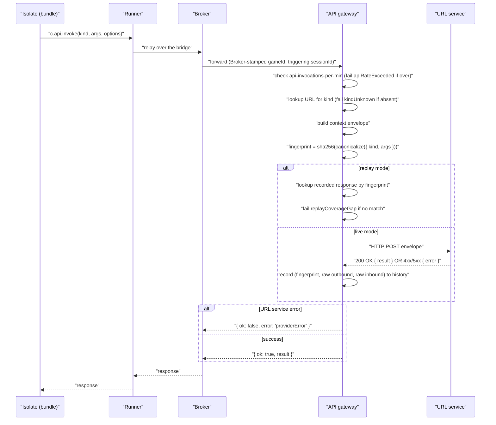

# External API channel

> Layer: **Contract**

A single bundle-facing channel — `c.api.invoke(kind, args, options?)` —
is how creator code talks to anything external (LLMs, image generators,
HTTP fetches, moderation services, vercel-backend balance queries,
anything else). The vercel backend owns the kind→URL registry; the
substrate is the trust seam, the context envelope builder, and the
wire-grain recorder.

The substrate is **opinion-free** about what API calls *mean*. It does
not validate `args`, interpret `result` bodies, model billing, enforce
business caps, or know what an "AI token" is. Its only job: take a call
from creator code, enrich it with accurate session/runtime context,
dispatch it to the registered URL, record the wire bytes, and return the
response verbatim.

## Bundle-facing API

```ts
c.api.invoke<T = unknown>(
  kind: string,
  args: unknown,
  options?: { idempotencyKey?: string }
): Promise<ApiInvokeResponse<T>>

type ApiInvokeResponse<T = unknown> =
  | { ok: true, result: T }
  | { ok: false, error: ApiInvokeError, detail?: unknown };

type ApiInvokeError =
  | 'kindUnknown'           // kind not in the gateway's registry
  | 'providerError'         // URL service returned non-2xx or timed out
  | 'apiRateExceeded'       // compute-plane budget
  | 'replayCoverageGap';    // replay mode and no recorded response matches
```

The bundle gets the URL service's response **verbatim** as `result` on
success, or a typed substrate-owned error on failure.

If the bundle wants to communicate billing intent to a URL service ("bill
this call to player P1 at most 100 ai-tokens"), it puts that inside
`args` where the substrate never looks. The URL service interprets it
and applies whatever billing rules the URL service owns.

## Kind registration

The substrate has a flat config table mapping `kindName → URL`. The vercel
backend registers kinds via admin REST:

```
POST /admin/api-kinds                    # register
GET /admin/api-kinds                     # list
GET /admin/api-kinds/:kindName           # one
DELETE /admin/api-kinds/:kindName        # unregister
```

When creator code calls `c.api.invoke('ai.chat.v1', args)`, the gateway
looks up the URL, builds the context envelope, makes the HTTP call,
records the wire bytes, and returns the response. The thing at the URL
is opaque — Node service, Rust service, Vercel edge function, anything.

## Kind versioning

The version is part of the kind name. `ai.chat.v1` and `ai.chat.v2` are
two separate registered kinds with two separate URLs (or the same URL
behind a path discriminator — the substrate doesn't care).

The substrate does **no version resolution**. It looks up the registered
name literally. To deprecate v1, the vercel backend unregisters it;
subsequent calls fail `kindUnknown`. There is no deprecation window.

See [`why/why-url-per-kind.md`](../why/why-url-per-kind.md).

## The HTTP envelope sent to the URL service

The substrate is opinionated about exactly one thing: the shape of the
HTTP request it sends and the response it expects back. URL services must
conform; everything inside `args` and `result` is opaque.

```http
POST <registered URL>
Content-Type: application/json
X-Gateway-Envelope-Version: 2
X-Gateway-Request-Id: <uuid>
X-Gateway-Game-Id: <gameId>
X-Gateway-Kind: <kindName>
X-Gateway-Mode: live
traceparent: <W3C trace context>

{
  "args": <opaque to substrate, bundle-provided>,
  "context": {
    "gameId": "...",
    "triggeringSessionId": "..." | null,
    "triggeringJwtClaims": { ... } | null,
    "connectedSessions": [
      { "sessionId": "...", "playerId": "...", "connectedAt": 1779980000000 },
      ...
    ],
    "bundleName": "...",
    "bundleCompatTag": "...",
    "runId": "..." | null,
    "traceId": "..." | null,
    "idempotencyKey": "..." | null
  }
}
```

The `X-Gateway-Mode` header is **always `live`** from the URL service's
perspective. The substrate short-circuits replay before any HTTP call is
made; URL services never receive a `replay` value on the wire. Internally,
the substrate records `mode: 'live' | 'replay'` on the `api.invoke.wire`
history event for oracle purposes.

Response (success):
```http
200 OK
Content-Type: application/json
{ "result": <opaque to substrate> }
```

Response (error):
```http
4xx or 5xx
Content-Type: application/json
{ "error": "<error-code>", "detail": <opaque> }
```

The substrate maps URL service errors to `providerError` on the bundle
side, preserving the URL service's body in `detail`.

See [`reference/gateway-envelope.md`](../reference/gateway-envelope.md)
for the full schema.

## The context envelope explained

The `context` block is the substrate's contribution. It enables URL
services to make trust-aware decisions without giving them substrate
internals:

| Field | What it is | Why it's there |
|---|---|---|
| `gameId` | The game the call came from | URL service scoping |
| `triggeringSessionId` | The `sessionId` of the player whose `onPlayerMessage` triggered this call; `null` if triggered by `onWake` / `onSleep` / `onCapacityWarning` / `onHostEvent` | URL service can attribute the call to a specific session |
| `triggeringJwtClaims` | Verbatim JWT claims of the triggering session | URL service reads opaque vercel-backend-signed info (Firebase claims, etc.) |
| `connectedSessions` | Snapshot of every open session for this game at the moment of dispatch | URL service can implement "only bill connected players" etc. |
| `bundleName` | Bundle that issued the invoke | URL service can check that the call is from an expected bundle |
| `bundleCompatTag` | `bundle.manifest.compatTagProduced` | URL service can apply version-shaped policy |
| `runId` | Scenario-runner run id; `null` in production | URL service can scope test/staging data |
| `traceId` | W3C trace id | URL service propagates for distributed tracing |
| `idempotencyKey` | Optional, bundle-provided | URL service dedupes retries |

Guarantee #4 commits the substrate to making `connectedSessions` an
accurate snapshot at dispatch time. URL services can trust this for
billing/participation/anti-fraud decisions.

## Wire-grain record/replay

Every `c.api.invoke` round trip is recorded at the gateway:

```ts
{
  fingerprint: 'sha256:...',         // sha256(canonicalize({ kind, args }))
  rawOutbound: <serialized full request body>,
  rawInbound: <serialized full response body>,
  mode: 'live' | 'replay',
  statusCode: number,
  durationMs: number,
  // ... timestamps, trace ids
}
```

In **live mode**, the gateway dispatches the HTTP call and records the
round trip.

In **replay mode**, the gateway short-circuits the HTTP call: it looks up
a recorded response by fingerprint and returns it. The replay key is the
stable `{ kind, args }` pair, so volatile context fields (`runId`,
`traceId`, session ids, connection timestamps) do not make fixtures
one-run-only. **If no recorded response matches, the gateway hard-fails
with `replayCoverageGap`** — not a silent fall-through to live calls.

The trust seam is the **HTTP egress from the gateway to the URL service**.
Anything the URL service does internally (its own calls to vendors, its
own ledger writes, its own caches) is invisible to the substrate; only
the URL service's final HTTP response is captured. A replay against a
new substrate build re-executes everything inside the substrate
(gateway logic, runtime, creator code) while freezing what came back
from the URL service.

See [`subsystems/scenario-runner.md`](../subsystems/scenario-runner.md)
for how scenarios consume replay fixtures.

## Idempotency

`options.idempotencyKey` is bundle-provided and passed through to the URL
service verbatim. The substrate does **not** dedupe on this key; URL
services dedupe on their side if they want to.

The substrate's own dedup story is on the bundle side
(`onPlayerMessage` `(playerId, seq)` is never delivered twice) and the
host-event side (`onHostEvent` is at-least-once; bundles must dedupe on
`(eventType, payload)`).

## The api-invocations-per-min budget

Every `c.api.invoke` consumes one slot in the sliding 1-minute window.
The gateway enforces; over-budget calls return
`{ ok: false, error: 'apiRateExceeded' }` and **do not** contact the
URL service.

The bundle sees this via `c.compute.budget()` like any other budget. See
[`compute-budgets.md`](compute-budgets.md).

## The call flow



The bridge is **async**: while the isolate awaits its `c.api.invoke`, it
yields the Runner's event loop so co-tenant games keep running (see
[`subsystems/runner.md`](../subsystems/runner.md)). The Broker stamps
`gameId` and the triggering `sessionId` from its own state — the Runner
cannot forge them.

No reservation, no commit, no ledger touch, no debit verification. The
substrate hands off, records, and returns. Whatever the URL service does
with billing is its own affair.

## Cross-references

- [`reference/gateway-envelope.md`](../reference/gateway-envelope.md) — full HTTP wire spec
- [`reference/admin-api.md`](../reference/admin-api.md) — kind registration endpoints
- [`reference/error-codes.md`](../reference/error-codes.md) — error taxonomy
- [`subsystems/api-gateway.md`](../subsystems/api-gateway.md) — gateway internals
- [`subsystems/scenario-runner.md`](../subsystems/scenario-runner.md) — replay mode
- [`operator-overlays/url-service-authoring.md`](../operator-overlays/url-service-authoring.md) — writing URL services
- [`operator-overlays/billing-policy.md`](../operator-overlays/billing-policy.md) — billing on top of session context
- [`why/why-url-per-kind.md`](../why/why-url-per-kind.md)
- [`why/why-no-billing.md`](../why/why-no-billing.md)
- [`vision/guarantees.md`](../vision/guarantees.md) #5
