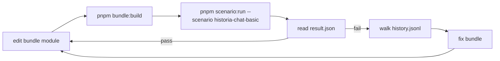

# Proof: `historia-default` bundle

> Layer: **Proof**

The `historia-default` bundle is the substrate's first end-to-end proof
that the contract is rich enough to host a real-world game backend and
that the scenario-runner + oracle harness is sufficient to iterate a
bundle to correctness.

This is not a production migration. Pax-historia's existing Rivet +
Next.js stack stays on its current backend. The proof exists in this
repo and runs against the substrate under the scenario-runner.

## Success criteria

- The bundle lives at `examples/bundles/historia-default/`.
- It runs end-to-end in the scenario-runner against deterministic URL
  service responses, with API-producing scenarios carrying canned replay
  fixtures.
- A representative scenario suite passes (one scenario per Pax-historia
  game-session module).
- All 17 substrate-side oracles pass on every scenario.
- All bundle-correctness oracles (per-scenario) pass.

## Deliverables

| Deliverable | Location |
|---|---|
| The bundle | `examples/bundles/historia-default/` (with `manifest.ts`, modules under `src/`, `dist/bundle.js`) |
| Five URL service specs (schema-only) | `examples/url-services/<kind>/README.md` for each of `ai.chat.v1`, `flag.search.v1`, `moderation.audit.v1`, `participation.v1`, `projection.sync.v1` |
| Bundle scenario suite | `examples/bundles/historia-default/scenarios/<scenario>/` mirroring the substrate's own `testing/scenarios/` shape |
| Bundle-correctness oracles | `examples/bundles/historia-default/scenarios/<scenario>/oracles.mts` (scenario-local; never in `testing/oracles-lib/`) |

The substrate itself (`runtime/`, `orchestration/`, `sdk/`, `shared/`)
stays pure — nothing Pax-historia-specific touches those zones.

## What goes into the bundle

The bundle reimplements Pax-historia's existing game-session actor on
top of the substrate's contract:

- **7 module folders** under `src/modules/`: chat, advisor, actions,
  jump-forward, moderation, admin, cheats. Plus supporting modules:
  `player-management.ts`, `rounds.ts`, `round-timer.ts`, `map-state.ts`,
  `offline-cap.ts`, `permissions.ts`.
- **Workflow runtime** — engine, executors, task tracker. The
  nested-sandbox pattern collapses because the whole bundle already runs
  in its own `isolated-vm` isolate (one per game, inside a Runner);
  workflow generator functions `eval` inline.
- **5 default workflow strings** (chat, advisor, actions, jump-forward,
  moderation) ship verbatim as bundle defaults.
- **`GameContext` adapter** rewritten on top of `c.*`:
  - `gameCtx.s3Put` / `s3Get` → `c.blob.put` / `c.blob.get`.
  - `fetch` to Pax-historia Next.js → `c.api.invoke(<kind>, args)`.
  - Direct Postgres writes → `c.api.invoke('projection.sync.v1', ...)`.
- **WS routing + policy gates** from `routing/websocket.ts`. The WS
  transport itself is substrate-owned; the bundle dispatches from
  `body` inside `onPlayerMessage`.
- **State schema + migrations** under `compatTagsAccepted: ["historia:v1",
  "historia:v2", "historia:v3", "historia:v4", "historia:v5"]`,
  `compatTagProduced: "historia:v5"`.
- **Hydration + working state** onto the one `c.state` object (the running
  summary, ≤128 KB, eagerly hydrated on wake), with completed chapters /
  raw-detail snapshots kept either in version history (time travel) or in
  the optional `c.blob` keyed tier (per-chapter, per-snapshot keys).
- **Durability reconciliation.** Under unified checkpoint durability a
  `c.blob.put` is durable at the next checkpoint, not on resolve. The
  bundle therefore calls `await c.state.flush()` at chapter-commit
  boundaries (forcing a checkpoint that commits the chapter and the
  cleared working state together) instead of relying on a blob put having
  resolved. See [`why/why-unified-durability.md`](../why/why-unified-durability.md).

## What goes away (because the substrate does it)

| Pax-historia today | Becomes |
|---|---|
| Rivet `createState` / `createVars` / `onWake` / `onSleep` / `onConnect` / `onDisconnect` plumbing | Substrate lifecycle hooks |
| Firebase JWT verification in `createConnState` | Substrate verifies at placement router; bundle receives `jwtClaims` in `onPlayerConnect` |
| Direct R2 calls (`@aws-sdk/client-s3`) | `c.blob.put/get/delete/list` against substrate's Tigris namespace at `blob/<gameId>/` |
| Redis ban cache + cross-game RPC for `enforceBan` | Substrate's `DELETE /admin/players/:playerId` (cross-game force-disconnect) + host events for in-game notification |
| `child_process` workflow sandbox | Not needed — the bundle runs workflows inline in its own already-sandboxed isolate (one isolate per game inside a Runner) |
| Postgres-sync fire-and-forget calls (`/api/live-games-db/*`) | Mix of substrate history tailing (category 1) and explicit `projection.sync.v1` calls (category 3); see [`operator-overlays/projection-sync.md`](../operator-overlays/projection-sync.md) |

## The five URL services

Each URL service is **spec-only** for the proof — no operator-owned HTTP
server ships here. The live proof registers the kinds against deterministic
gateway reference routes, and replay checks consume canned fixtures by request
fingerprint.

| Kind | Wraps Pax-historia's | Spec location |
|---|---|---|
| `ai.chat.v1` | `app/api/simple-chat/route.ts` | `examples/url-services/ai.chat.v1/README.md` |
| `flag.search.v1` | `app/api/flags/published/get-published-flags/route.ts` | `examples/url-services/flag.search.v1/README.md` |
| `moderation.audit.v1` | `app/api/live/moderation/{verdict,ban}/route.ts` | `examples/url-services/moderation.audit.v1/README.md` |
| `projection.sync.v1` | `app/api/live-games-db/*` routes | `examples/url-services/projection.sync.v1/README.md` |
| `participation.v1` | (new — doesn't exist in Pax-historia today; canonical participation store for the proof) | `examples/url-services/participation.v1/README.md` |

The proof's API-producing scenario fixtures contain canned responses keyed by
request fingerprint. The gateway can replay them, and the scenario-runner
asserts the bundle's behavior against the same fixed inputs.

### The load-bearing trust pattern in `ai.chat.v1`

The URL service calls `participation.v1.get(playerId, gameId)` for each
billable player and refuses to bill any player marked spectator. **No
caching** — the participation read happens on every billable call, in
parallel with the existing token-ledger / resource-ledger reads.

This is the defense against "compromised bundle bills non-participants."
See [`operator-overlays/billing-policy.md`](../operator-overlays/billing-policy.md).

## What's NOT a URL service in the proof

Per [`operator-overlays/projection-sync.md`](../operator-overlays/projection-sync.md):

- **Player time per game, who-was-where-when, allowed-player mutations,
  bundle-pointer flips** are all substrate-derivable. The vercel backend
  reads from `GET /admin/history` and `GET /admin/games/:id/sessions`.
- **Money spent per player per game, AI call counts, vendor breakdown**
  is URL-service-derivable. The vercel backend queries `ai.chat.v1`'s
  own `llm_logs` / `token_ledger` directly.
- **Cross-game ban enforcement** is substrate-derivable —
  `DELETE /admin/players/:playerId` fan-outs atomically.
- **Statsig telemetry** uses `c.log.emit` / `c.metrics.emit`; substrate's
  observability layer routes it.

## How workflows work in the new world

Default bundle ships ready to play with the 5 hardcoded workflows from
Pax-historia today. Creator-supplied workflows are **optional content
stored in the game blob**, not a substrate primitive:

1. The blob carries an optional `workflows` key set:
   `blob.workflows = { chat?: { code, entryPoints }, advisor?: { ... }, ... }`.
2. The bundle's per-module trigger code reads
   `blob.workflows?.[module]?.code ?? DEFAULT_<MODULE>_WORKFLOW`.
3. The bundle's workflow engine `eval`s the resolved code as a
   generator function within the bundle's existing isolate. No nested
   sandboxing — the substrate already sandboxes the whole bundle and
   the vercel backend vetted the blob at game-create time.
4. The command vocabulary stays unchanged (`callAI`, `emitChatEvent`,
   `setState`, etc.).
5. `callAI` resolves to `c.api.invoke('ai.chat.v1', args)`.

The substrate knows nothing about "workflow," "preset," "engine,"
"executor." It just runs the bundle.

## Phases

Suggested sequencing — all phases land in `pax-backend`; nothing
touches Pax-historia:

| Phase | Output |
|---|---|
| **Phase 0** | This proof page is written |
| **Phase 1** | The 5 URL service specs as `examples/url-services/<kind>/README.md` |
| **Phase 2** | Bundle skeleton: `package.json`, `manifest.ts`, build step → `dist/bundle.js` |
| **Phase 3** | Port modules one at a time (chat first); workflow runtime ports as one unit |
| **Phase 4** | Port WS routing + hydration onto `onPlayerMessage` / `onPlayerConnect` |
| **Phase 5** | Port persistence + migrations onto `c.state` + `c.blob` |
| **Phase 6** | Scenario suite (10 representative scenarios; see table below) |
| **Phase 7** | Close the loop: run the full suite; verify all substrate-side + bundle-side oracles pass |

## Representative scenarios

| Scenario | What it exercises |
|---|---|
| `chat-basic` | 2 players, 1 chat thread, AI response (canned), assert broadcast |
| `jump-forward-basic` | 4 players ready, JF runs, canned AI streams events, round commits |
| `advisor-basic` | 1 player asks advisor, canned response, persisted to advisor log |
| `actions-basic` | 1 player requests action suggestions, canned AI, broadcast |
| `role-claim-flow` | Player connects as spectator, vercel backend promotes via `participation.v1`, bundle gets `onHostEvent`, broadcasts updated state |
| `role-destroy-flow` | Bundle dissolves a role mid-game, broadcasts via `ws.send`, vercel backend re-prompts via picker (simulated) |
| `spectator-billing-block` | Bundle (intentionally buggy fixture) tries to bill a spectator; `ai.chat.v1` rejects with `playerIsSpectator`; bundle handles gracefully |
| `moderation-flow` | Content flagged, `moderation.audit.v1.recordVerdict` called, ban path via `DELETE /admin/players/:id` |
| `workflow-override-loaded` | Game blob carries a custom `workflows.chat.code`; bundle picks it up instead of the default |
| `host-event-wake-delivery` | Moderation eject fired with `wakeOnDelivery: true`; game wakes from sleep just to receive the event |

## The iteration loop for the proof

The scenario-runner provides every piece of this loop. See
[`subsystems/scenario-runner.md`](../subsystems/scenario-runner.md).

## What's explicitly NOT in scope

- **Production cutover.** No Pax-historia games migrate. No live URL
  services route to `pax-backend`. No bundle-name flips in production.
- **Pax-historia repo shrink.** Pax-historia keeps its
  `/api/simple-chat`, `/api/flags/*`, `/api/live/*`, `/api/live-games-db/*`
  routes exactly as they are today.
- **Real-server URL service implementations.** The 5 URL services are
  spec + scenario-fixture only.
- **Pax-historia's preset-authoring UI**, billing pipeline source, frontend,
  presets schema. All stay in Pax-historia, unchanged.
- **Substrate-internal work** (ship the Broker + Runner runtime, the
  placement router, the runtime SDK, the API gateway, etc.). That's the
  agents working in parallel on the substrate track; the proof rides on
  top of whatever they ship.

## Cross-references

- [`vision/parties-and-roles.md`](../vision/parties-and-roles.md) — the
  three actors
- [`vision/guarantees.md`](../vision/guarantees.md) — the 17 guarantees
  the scenario suite gates on
- [`subsystems/scenario-runner.md`](../subsystems/scenario-runner.md) —
  the iteration tooling
- [`operator-overlays/`](../operator-overlays/) — all the patterns the
  bundle composes
- [`contract/`](../contract/) — the contract the bundle programs against
