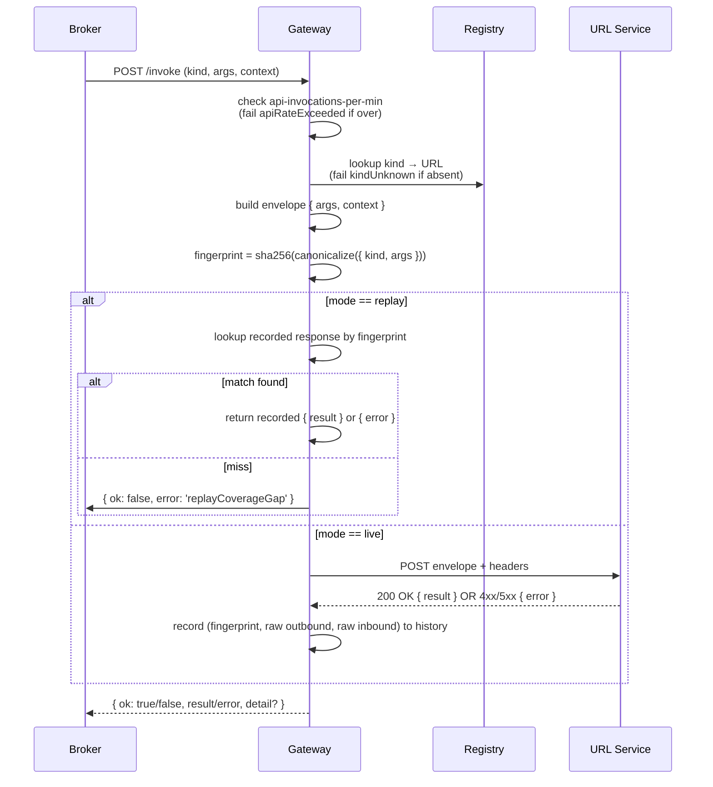

# API gateway

> Layer: **Subsystem**

The gateway is the substrate's bridge between bundle code's `c.api.invoke`
calls and the operator-defined URL services that actually do the work.

## Purpose

For every `c.api.invoke`:

1. Enforce the `api-invocations-per-min` compute budget.
2. Look up the kind's URL.
3. Build the canonical context envelope.
4. Either dispatch live HTTP (production) or look up a recorded
   response (replay).
5. Record the wire-grain round trip to history.
6. Return the response verbatim to the Broker (which returns it to the
   bundle's isolate).

## Owns

- The kind→URL registry (loaded at boot from a Redis config table the
  vercel backend updates via admin REST).
- The canonical envelope construction (see
  [`reference/gateway-envelope.md`](../reference/gateway-envelope.md)).
- The `api-invocations-per-min` sliding-window counter, per game.
- The replay fingerprint computation (`sha256(canonicalize({ kind, args }))`).
- Wire-grain record/replay logic.
- The first-party reference URL services co-deployed in the same
  process (`echo.v1`, `delay.v1`, `http.fetch.v1`, `mock-ai.v1`).

## Doesn't own

- The bundle's `args` or the URL service's `result` (opaque to the
  gateway).
- Business-shaped errors (gateway sees only "URL service returned
  non-2xx" → `providerError`).
- Per-URL-service authentication. URL services authenticate the
  gateway via shared secrets they manage themselves; the gateway
  presents whatever bearer/header the registration row tells it to.
- The kind→URL registry's authoritative storage (the control plane
  owns the admin endpoints; the gateway just caches at boot).
- Outbound retries — if a URL service returns 503, the gateway returns
  `providerError`; the bundle decides whether to retry.

## Inputs

| Source | What |
|---|---|
| Broker | `POST /invoke` internal API: `{ gameId, sessionId?, jwtClaims?, kind, args, idempotencyKey?, traceId?, runId? }` |
| Control plane | Kind registry updates (via Redis or cache invalidation) |
| Scenario-runner (in replay mode) | `PAX_API_REPLAY_FIXTURES_PATH` pointing at a fixture directory keyed by fingerprint |

## Outputs

| Destination | What |
|---|---|
| URL services | HTTP POST with canonical envelope, `X-Gateway-Envelope-Version: 2` |
| Broker | `{ ok: true, result }` or `{ ok: false, error, detail? }` |
| Tigris (via Vector) | Wire-grain records (`api.invoke.wire` history events) + raw outbound/inbound payloads |
| Self (Prometheus) | `pax_gateway_*` metrics |

## The dispatch flow



## Replay mode

The scenario-runner sets `PAX_API_REPLAY_FIXTURES_PATH` to a directory
of JSONL fixtures keyed by fingerprint. In replay mode, the gateway:

1. Computes the fingerprint of the stable `{ kind, args }` replay key.
2. Looks up the fingerprint in the fixtures path.
3. If found, returns the recorded response without making any HTTP call.
4. If not found, returns `{ ok: false, error: 'replayCoverageGap' }`.

There is no fall-through to live calls. **Coverage gaps are hard
failures** so scenario oracle results stay meaningful (guarantee #5).

The fixture file format is one JSON object per line:

```jsonc
{
  "event": "api.invoke",
  "fingerprint": "...",
  "kind": "ai.chat.v1",
  "statusCode": 200,
  "rawInbound": "{\"result\": ...}",
  "recordedAt": "..."
}
```

## Wire-grain recording

Every live-mode round trip is recorded as an `api.invoke.wire` history
event:

```jsonc
{
  "event": "api.invoke.wire",
  "ts": "...",
  "shardId": "...",
  "pax_seq": N,
  "gameId": "...",
  "sessionId": "..." | null,
  "traceId": "..." | null,
  "requestId": "...",
  "kind": "ai.chat.v1",
  "mode": "live",
  "fingerprint": "...",
  "statusCode": 200,
  "durationMs": 142,
  "rawOutbound": "{ ... }",          // serialized full canonical envelope
  "rawInbound": "{ ... }"            // serialized full URL service response body
}
```

This event is large. To avoid bloating the in-process history ring
buffer, the gateway:

1. Writes a "thin" event to the in-process ring (no raw payloads).
2. Writes the full event with `rawOutbound` / `rawInbound` to a
   separate sink (Tigris via Vector).
3. The `GET /admin/games/:id/snapshot` endpoint reads from both
   sources (thin for cheap snapshot; full for full diagnostic).

## Reference URL services

The gateway co-deploys four reference URL services as HTTP routes
inside the same process:

| Kind | Path | Behavior |
|---|---|---|
| `echo.v1` | `POST /_url-services/echo/invoke` | Returns `{ result: args }` |
| `delay.v1` | `POST /_url-services/delay/invoke` | Waits `args.delayMs` then returns `{ result: { waited: args.delayMs } }` |
| `http.fetch.v1` | `POST /_url-services/http-fetch/invoke` | Makes a real outbound HTTP request against a configured allowlist |
| `mock-ai.v1` | `POST /_url-services/mock-ai-v1/invoke` | Returns a canned ai-shaped response keyed by `sha256(args)` |

These exist so:

- The hello-world bundles have something to call without the vercel
  backend being up.
- Scenarios can use real-feeling URL services without canned fixtures
  in the simple cases.
- The local-mac smoke loop has no external dependencies.

These are deployable separately if hot kinds need to move; the gateway
is registry-driven and doesn't care whether `echo.v1` is co-located or
on a different machine.

## Trust position

**Platform-trusted.** The gateway:

- Holds URL service registration data and any per-URL-service secrets.
- Sees every `c.api.invoke` invocation including `args` (which may
  contain sensitive data in some kinds).
- Records wire bytes verbatim.

If compromised, all `c.api.invoke` traffic on the cluster is compromised.

## Observability surface

| Signal | Owner |
|---|---|
| Metrics: `pax_gateway_invoke_duration_seconds{kind, mode, result}`, `pax_gateway_url_service_http_duration_seconds`, `pax_gateway_invoke_replay_coverage_gap_total`, `pax_gateway_api_rate_exceeded_total`, `pax_gateway_kind_unknown_total`, `pax_gateway_envelope_bytes{direction}` | Self; `:9081/metrics` |
| Logs: structured JSON | Self → stdout |
| Traces: OTel spans `gateway.invoke` (outer), `gateway.url_service.http` (nested) | Self → OTLP |
| History events: `api.invoke.wire` and the thin `api.invoke.request`/`.response` pair | Self |

## End-state contract

- **`POST /invoke` p99 ≤ URL-service-duration + 5 ms** in steady state.
- **`apiRateExceeded` rejects before any HTTP call.**
- **`replayCoverageGap` returns within 10 ms** (just a fingerprint
  lookup).
- **Every live-mode call records to history before the response returns
  to the Broker** (so oracle reads from history reflect the response
  the bundle saw).
- **The envelope version is `X-Gateway-Envelope-Version: 2`** for all
  outbound HTTP. URL services that need to parse different envelope
  versions dispatch on this header.

## Cross-references

- [`contract/external-api-channel.md`](../contract/external-api-channel.md)
- [`reference/gateway-envelope.md`](../reference/gateway-envelope.md)
- [`reference/error-codes.md`](../reference/error-codes.md)
- [`scenario-runner.md`](scenario-runner.md) — replay mode wiring
- [`why/why-url-per-kind.md`](../why/why-url-per-kind.md)
- [`operator-overlays/url-service-authoring.md`](../operator-overlays/url-service-authoring.md)
- [`vision/guarantees.md`](../vision/guarantees.md) #5
