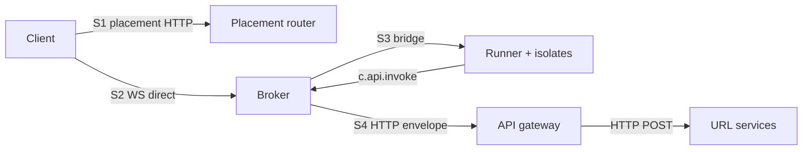
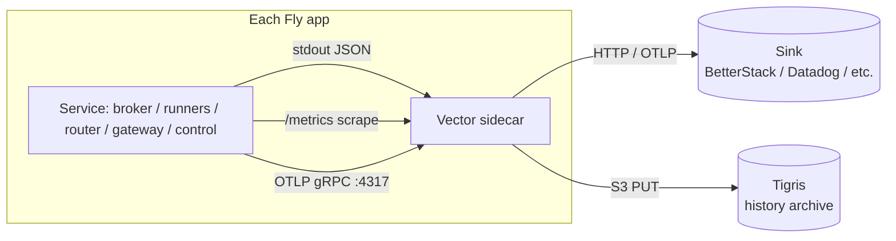

# Observability

> Layer: **Subsystem**

The substrate is opinion-free about business semantics, so it has to be
extremely opinionated about narrating itself. Every named subsystem
boundary is hop-instrumented from day one with four primitives and one
correlation backbone. Operators can ship their own sinks; BetterStack is
one of many.

## Purpose

Emit enough signal that any cliff, regression, or oracle violation
attributes to a named subsystem within minutes. The substrate is the
source of truth for its own narration.

## Owns

- The four-primitive contract per surface (logs, metrics, traces,
  history events).
- The correlation backbone (six fields: `trace_id`, `span_id`, `run_id`,
  `game_id`, `session_id`, `pax_seq`).
- Vector sidecar config per Fly app (scrape, transform, ship).
- The metrics naming and label cardinality firewall.
- The OpenTelemetry SDK wiring per surface.
- Per-game CPU/memory sampling from the Runner's built-in isolate
  counters (doubles as the capacity control input).
- The history-events tier (described in [`contract/history-events.md`](../contract/history-events.md)).

## Doesn't own

- Any specific sink. BetterStack is the default; Vector can ship to
  Datadog, OTLP-compatible backends, or anywhere else with one config
  change.
- Frontend telemetry. The substrate's story ends at WS send.
- Vercel-backend observability. URL services have their own
  observability; the gateway records the wire bytes, but inside the URL
  service is their problem.

## The four observability surfaces



Each surface gets the same four primitives and the same correlation
backbone. There is **no vendored shard-engine surface** — the runtime is
the substrate's own Broker + Runner pool (see
[`why/why-broker-runner.md`](../why/why-broker-runner.md)), so there are no
opaque pass-through metrics to cardinality-cull. The Runner contributes
per-isolate counters (CPU/memory) sampled in-process and reported to the
Broker, not a `/metrics` endpoint per game.

## The four primitives, at every surface

### 1. Structured logs

- **Format**: one-line JSON, OTel-log-data-model compatible. Required
  fields: `ts` (RFC3339 ns), `level`, `service`, `trace_id`, `span_id`,
  `run_id?`, `game_id?`, `session_id?`, `pax_seq?`, `event`, `msg`,
  plus free-form attributes.
- **Loggers**: `tracing` in Rust (Stackdriver-style JSON via
  `RUST_LOG_FORMAT=gcp`), `pino` in Node.
- **Shipping**: stdout → Vector → sink.

### 2. Prometheus metrics

- **Endpoints**: `GET /metrics` on every long-running process:
  - placement-router `:9080/metrics`
  - broker `:7700/metrics` (includes per-Runner / per-isolate aggregates)
  - api-gateway `:9081/metrics`
  - control-plane `:9070/metrics`
  - URL services `:78xx/metrics`
- **Naming**: `pax_<surface>_*` for first-party (`pax_broker_*`,
  `pax_runner_*`, `pax_router_*`, `pax_gateway_*`, `pax_control_*`).
- **Buckets**: standardized
  - `BUCKETS_SECONDS_FINE`: `0.0001 … 50`
  - `BUCKETS_SECONDS_COARSE`: `0.001 … 500`
  - `BUCKETS_BYTES_PAYLOAD`: `16 … 16M`
  - `BUCKETS_BUDGET_RATIO`: `0 … 1` step `0.05`
- **Catalog**: [`reference/metrics-catalog.md`](../reference/metrics-catalog.md).

### 3. OTLP traces

- **Format**: OTel SDK in every service. `@opentelemetry/sdk-node` for
  Node; `tracing-opentelemetry` for Rust.
- **Sampling**: default 1.0 at v1 scale. Scenario-runner overrides via
  env per mode.
- **Span naming**: hierarchical dot-separated:
  ```
  router.placement
  broker.ws_accept
    broker.session
      broker.on_player_message
        runner.handler.on_player_message
      broker.broadcast
      broker.api_invoke
        gateway.invoke
          gateway.url_service.http
            urlsvc.<kind>.<phase>
  broker.checkpoint
  ```

### 4. History events

The substrate's own log. See
[`contract/history-events.md`](../contract/history-events.md) for the
contract; [`reference/event-schema.md`](../reference/event-schema.md)
for the full event catalog. Guarantee #14 ensures completeness.

## The correlation backbone — six fields

Every observable event carries:

| Field | Lifetime | Origin | Purpose |
|---|---|---|---|
| `trace_id` (W3C 16-byte hex) | One placement→isolate→response round trip | Router on inbound HTTP; new if absent | Distributed tracing |
| `span_id` (W3C 8-byte hex) | One hop within a trace | Each instrumented boundary | OTel span correlation |
| `run_id` | One scenario-runner invocation | Scenario runner; absent in prod | Lets oracles slice by run |
| `game_id` | One game's lifetime | Substrate on game create | Domain ID; logged/spanned; **never** a metric label |
| `session_id` | One WS connection | Substrate on `onPlayerConnect` | Domain ID; same rule |
| `pax_seq` (monotonic u64) | One shard's lifetime | Broker on every history write | Causal ordering within a shard |

Plus low-cardinality span attributes: `bundle_name`, `bundle_compat_tag`
(also a metric label), `runner_name`, `pool_name`.

### Stamping rules

- **S1 client→router**: HTTP `traceparent` header; router generates if
  absent; stamps into the signed JWT (`trace_id`, `run_id` claims).
- **S2 client→broker (WS)**: `trace_id` arrives in the JWT (decoded once
  at WS accept). Stamped into a session-scoped span; every
  `onPlayerMessage` opens a child span.
- **S3 broker↔runner bridge**: every bridge request carries `trace_id`,
  `span_id`, `ts_ns` (the bridge envelope shape is governed by the runtime
  contract version).
- **S4 broker→gateway→URL service**: gateway sets W3C `traceparent` on
  outbound HTTP. The library-defined envelope carries `context.traceId`
  under `X-Gateway-Envelope-Version: 2`.

## Label cardinality firewall

Most observability backends die from label explosion before they die from
volume. Discipline is non-negotiable.

**Allowed Prometheus label values** (bounded):

- `shard_id` (≤ 10 in v1)
- `runner_name` / `pool_name` (bounded by Runner count)
- `kind` (registered API kinds; operator-controlled, bounded)
- `bundle_compat_tag` (low-cardinality by convention; enforced by an
  upload-time linter that fails uploads with > 50 distinct tags in the
  active fleet)
- `runtime_contract` (single integer)
- `game_id_bucket` = `hash(game_id) mod 256`
- `session_count_bucket` = exponential (1, 10, 100, 1k)
- `handler` ∈ enumerated set
- `mode` ∈ {`live`, `replay`}
- `result` ∈ enumerated error class set
- `direction` ∈ {`inbound`, `outbound`}
- `budget` ∈ the eight compute budgets

**Forbidden as Prometheus labels** (unbounded):

- raw `game_id`, `session_id`, `player_id`, `trace_id`, `request_id`,
  `bundle_name`

**Where the unbounded IDs go** (full fidelity):

- OTel span attributes (sampled; backend handles cardinality)
- Log lines (structured-log indexes handle it)
- History events (the substrate's own log; oracles want raw IDs)

Per-game CPU/memory numbers (from the Runner's isolate counters) follow
this rule strictly: **raw per-game numbers go to history / logs / traces,
never as Prometheus labels.** Aggregated/bucketed series go to metrics. A
CI metric-linter checks every metric call site against
[`reference/metrics-catalog.md`](../reference/metrics-catalog.md).

## Per-surface focus

### Placement router

`pax_router_placement_decision_lock_wait_ms`,
`pax_router_placement_capacity_row_staleness_ms`,
`pax_router_runtime_contract_gate_rejections_total{required, supported_min, supported_max}`,
`pax_router_jwt_*`. Slow-hop structured warns at ≥250ms.

### Broker

The most instrumented surface. `pax_broker_frame_age_seconds`,
`pax_broker_channel_age_seconds`, `pax_broker_broadcast_*_duration_seconds`,
`pax_broker_broadcast_payload_bytes`, `pax_broker_handler_duration_seconds{handler, result}`,
`pax_broker_event_loop_lag_seconds`, `pax_broker_compute_budget_consumed_ratio{budget}`,
`pax_broker_compute_budget_warnings_total{budget}`,
`pax_broker_runner_lifecycle_total{reason}`,
`pax_broker_api_invoke_duration_seconds{kind, mode, result}`,
`pax_broker_checkpoint_duration_seconds`, `pax_broker_checkpoint_dirty_games`,
`pax_broker_checkpoint_skipped_clean_total`,
`pax_broker_capacity_watermark_state{resource}` (admit-stop / drain-target /
evict-start), `pax_broker_eviction_total{resource}`.

### Runner (per-isolate sampling)

`pax_runner_isolate_cpu_seconds_total` (aggregated; bucketed per
`game_id_bucket`), `pax_runner_isolate_heap_bytes`,
`pax_runner_process_rss_bytes`, `pax_runner_isolates_resident`,
`pax_runner_sample_duration_seconds`. The Runner samples its isolates'
cumulative `cpuTime`/`wallTime` and `getHeapStatistics()` on a 1-10 s tick,
takes deltas, and reports to the Broker; raw per-game values flow to
history, not metric labels.

### API gateway

`pax_gateway_invoke_duration_seconds{kind, mode, result}`,
`pax_gateway_invoke_fingerprint_lookup_seconds`,
`pax_gateway_invoke_replay_coverage_gap_total{kind}`,
`pax_gateway_url_service_http_duration_seconds{kind, status}`,
`pax_gateway_envelope_bytes{kind, direction}`,
`pax_gateway_api_rate_exceeded_total{bundle_compat_tag}`,
`pax_gateway_kind_unknown_total{kind}`.

### Control plane

`pax_control_admin_call_duration_seconds{endpoint, status}`,
`pax_control_bundle_upload_duration_seconds`,
`pax_control_flip_gate_rejections_total{reason}`,
`pax_control_host_event_delivery_total{mode}`.

## The collection pipeline



One Vector instance per Fly app (sidecar pattern in
`pax-backend-shards`, `pax-backend-control`, `pax-backend-driver`).
Config in `scripts/observability/vector-prod.toml` and
`scripts/observability/vector-local-dev.toml`.

Transforms applied uniformly:
- **Label cardinality cull**: drop forbidden labels on Prometheus-bound
  metrics; keep them on log-bound copies.
- **Run-id enrichment**: if `PAX_RUN_ID` is set, tag every signal.
- **Stable resource attributes**: `fly.app`, `fly.machine_id`,
  `fly.region`, `pax.zone` (runtime|orchestration|testing),
  `pax.runtime_contract`.

## Sinks: BetterStack as default, replaceable

BetterStack (logs/metrics/telemetry) is the default sink because it's
cheap and integrates with the existing Pax-historia BetterStack team.
But the architecture is sink-agnostic:

- Vector can ship to BetterStack, Datadog, Honeycomb, Grafana Cloud, any
  OTLP-compatible backend, S3-compatible storage, etc.
- A self-hosted Grafana LGTM stack works too.

The `scripts/observability/` config sets BetterStack as default; an
operator who wants a different sink edits the Vector config and
re-deploys. No substrate code changes.

## Offline / no-network fallback

`PAX_OBSERVABILITY=off|buffer|on`:

| Value | Behavior |
|---|---|
| `on` (default) | Full pipeline; fail fast if Vector can't reach sink within 10s |
| `buffer` | Vector starts with local JSONL buffer sinks and prunes them to `PAX_VECTOR_LOCAL_BUFFER_MAX_BYTES` (default 512 MiB); for offline/dev fallback, not scale-soak evidence |
| `off` | Skip Vector entirely; services log to stdout and history to `var/history.jsonl`; `pnpm smoke` still works |

This keeps the local-mac dev loop working from a plane / hotel / no
BetterStack reachability.

## Testing-mode observability

The scenario-runner co-owns observability for runs:

- Sets `PAX_RUN_ID`; every signal tagged.
- Auto-promotes the saturation rung ±1 to `cliff_hold` sampling profile.
- Consumes the per-surface metric panel to compute the attribution
  sentence.
- Ships history to Tigris for cross-version replay.

See [`scenario-runner.md`](scenario-runner.md) §sampling profiles.

## End-state contract

- **Every named subsystem emits all four primitives** (logs, metrics,
  traces, history events).
- **Every event carries the six correlation fields.**
- **`pax_seq` is gap-free per shard across restart.**
- **Metric cardinality is bounded by the firewall**; per-game numbers
  never become labels.
- **One trace_id flows end-to-end** from placement HTTP to URL service
  HTTP and back.

## Cross-references

- [`contract/history-events.md`](../contract/history-events.md) — the
  history primitive
- [`reference/event-schema.md`](../reference/event-schema.md) — event
  catalog
- [`reference/metrics-catalog.md`](../reference/metrics-catalog.md) —
  metrics catalog
- [`broker.md`](broker.md) — the most instrumented surface
- [`runner.md`](runner.md) — per-isolate counter sampling
- [`scenario-runner.md`](scenario-runner.md) — testing-mode behavior
