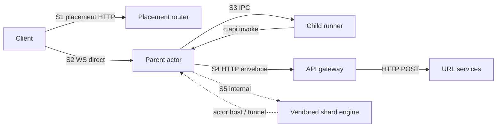
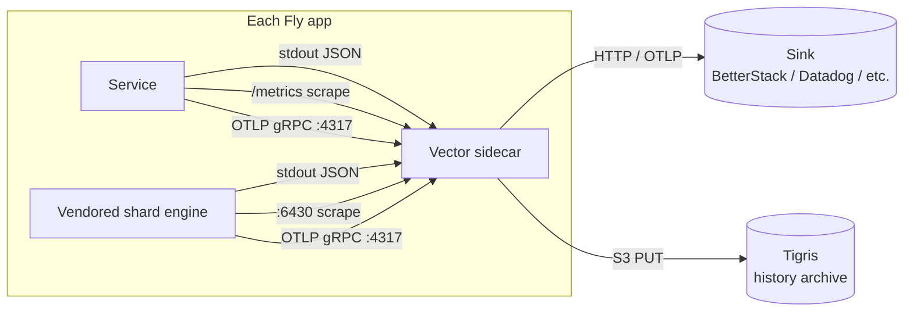

# Observability

> Layer: **Subsystem**

The substrate is opinion-free about business semantics, so it has to be
extremely opinionated about narrating itself. Every named subsystem
boundary is hop-instrumented from day one with four primitives and one
correlation backbone. Operators can ship their own sinks; BetterStack is
one of many.

## Purpose

Emit enough signal that any cliff, regression, or oracle violation
attributes to a named subsystem within minutes. The substrate is the
source of truth for its own narration.

## Owns

- The four-primitive contract per surface (logs, metrics, traces,
  history events).
- The correlation backbone (six fields: `trace_id`, `span_id`, `run_id`,
  `game_id`, `session_id`, `pax_seq`).
- Vector sidecar config per Fly app (scrape, transform, ship).
- The metrics naming and label cardinality firewall.
- The OpenTelemetry SDK wiring per surface.
- The history-events tier (described in [`contract/history-events.md`](../contract/history-events.md)).

## Doesn't own

- Any specific sink. BetterStack is the default; Vector can ship to
  Datadog, OTLP-compatible backends, or anywhere else with one config
  change.
- Frontend telemetry. The substrate's story ends at WS send.
- Vercel-backend observability. URL services have their own
  observability; the gateway records the wire bytes, but inside the URL
  service is their problem.

## The five observability surfaces



Each surface gets the same four primitives and the same correlation
backbone. S5 (the vendored shard engine — Rivet today; opaque from the
contract's perspective per [`why/why-rivet-vendored.md`](../why/why-rivet-vendored.md))
emits its own pass-through metrics and traces; the substrate cardinality-
culls them before remote-write.

## The four primitives, at every surface

### 1. Structured logs

- **Format**: one-line JSON, OTel-log-data-model compatible. Required
  fields: `ts` (RFC3339 ns), `level`, `service`, `trace_id`, `span_id`,
  `run_id?`, `game_id?`, `session_id?`, `pax_seq?`, `event`, `msg`,
  plus free-form attributes.
- **Loggers**: `tracing` in Rust (Stackdriver-style JSON via
  `RUST_LOG_FORMAT=gcp`), `pino` in Node.
- **Shipping**: stdout → Vector → sink.

### 2. Prometheus metrics

- **Endpoints**: `GET /metrics` on every long-running process:
  - placement-router `:9080/metrics`
  - parent-actor `:7700/metrics`
  - api-gateway `:9081/metrics`
  - control-plane `:9070/metrics`
  - URL services `:78xx/metrics`
  - vendored shard engine (Rivet) `:6430/metrics` (pass-through)
- **Naming**: `pax_<surface>_*` for first-party; vendor-namespaced (`rivet_*`)
  for pass-through vendored metrics.
- **Buckets**: standardized
  - `BUCKETS_SECONDS_FINE`: `0.0001 … 50`
  - `BUCKETS_SECONDS_COARSE`: `0.001 … 500`
  - `BUCKETS_BYTES_PAYLOAD`: `16 … 16M`
  - `BUCKETS_BUDGET_RATIO`: `0 … 1` step `0.05`
- **Catalog**: [`reference/metrics-catalog.md`](../reference/metrics-catalog.md).

### 3. OTLP traces

- **Format**: OTel SDK in every service. `@opentelemetry/sdk-node` for
  Node; `tracing-opentelemetry` for Rust;
  `RIVET_OTEL_ENABLED=1` for the engine.
- **Sampling**: default 1.0 at v1 scale. Scenario-runner overrides via
  env per mode.
- **Span naming**: hierarchical dot-separated:
  ```
  router.placement
  parent.ws_accept
    parent.session
      parent.on_player_message
        child.handler.on_player_message
      parent.broadcast
      parent.api_invoke
        gateway.invoke
          gateway.url_service.http
            urlsvc.<kind>.<phase>
  ```

### 4. History events

The substrate's own log. See
[`contract/history-events.md`](../contract/history-events.md) for the
contract; [`reference/event-schema.md`](../reference/event-schema.md)
for the full event catalog. Guarantee #14 ensures completeness.

## The correlation backbone — six fields

Every observable event carries:

| Field | Lifetime | Origin | Purpose |
|---|---|---|---|
| `trace_id` (W3C 16-byte hex) | One placement→child→response round trip | Router on inbound HTTP; new if absent | Distributed tracing |
| `span_id` (W3C 8-byte hex) | One hop within a trace | Each instrumented boundary | OTel span correlation |
| `run_id` | One scenario-runner invocation | Scenario runner; absent in prod | Lets oracles slice by run |
| `game_id` | One game's lifetime | Substrate on game create | Domain ID; logged/spanned; **never** a metric label |
| `session_id` | One WS connection | Substrate on `onPlayerConnect` | Domain ID; same rule |
| `pax_seq` (monotonic u64) | One shard's lifetime | Parent on every history write | Causal ordering within a shard |

Plus low-cardinality span attributes: `bundle_name`, `bundle_compat_tag`
(also a metric label).

### Stamping rules

- **S1 client→router**: HTTP `traceparent` header; router generates if
  absent; stamps into the signed JWT (`trace_id`, `run_id` claims).
- **S2 client→parent (WS)**: `trace_id` arrives in the JWT (decoded
  once at WS accept). Stamped into a session-scoped span; every
  `onPlayerMessage` opens a child span.
- **S3 parent↔child IPC**: every IPC envelope carries `trace_id`,
  `span_id`, `ts_ns` (the IPC envelope shape is governed by the runtime
  contract version).
- **S4 parent→gateway→URL service**: gateway sets W3C `traceparent` on
  outbound HTTP. The library-defined envelope carries `context.traceId`
  under `X-Gateway-Envelope-Version: 2`.
- **S5 internal shard engine**: the vendored shard engine (Rivet today)
  emits its own spans for actor host, tunnel, and workflow internals
  that inherit the parent span via `traceparent`. The substrate sets
  the engine's OTel flag (Rivet's case: `RIVET_OTEL_ENABLED=1`) and
  scrapes its metrics endpoint.

## Label cardinality firewall

Most observability backends die from label explosion before they die
from volume. Discipline is non-negotiable.

**Allowed Prometheus label values** (bounded):

- `shard_id` (≤ 10 in v1)
- `kind` (registered API kinds; operator-controlled, bounded)
- `bundle_compat_tag` (low-cardinality by vercel backend convention;
  enforced by an upload-time linter that fails uploads with > 50
  distinct tags in the active fleet)
- `runtime_contract` (single integer)
- `game_id_bucket` = `hash(game_id) mod 256`
- `session_count_bucket` = exponential (1, 10, 100, 1k)
- `handler` ∈ enumerated set
- `mode` ∈ {`live`, `replay`}
- `result` ∈ enumerated error class set
- `direction` ∈ {`inbound`, `outbound`}
- `budget` ∈ the eight compute budgets

**Forbidden as Prometheus labels** (unbounded):

- raw `game_id`, `session_id`, `player_id`, `actor_id`, `trace_id`,
  `request_id`, `bundle_name`, `database_id`

**Where the unbounded IDs go** (full fidelity):

- OTel span attributes (sampled; backend handles cardinality)
- Log lines (structured-log indexes handle it)
- History events (the substrate's own log; oracles want raw IDs)

A CI metric-linter checks every metric call site against
[`reference/metrics-catalog.md`](../reference/metrics-catalog.md).

## Per-surface focus

### Placement router

`pax_router_placement_actor_create_ms`, `pax_router_placement_decision_lock_wait_ms`,
`pax_router_placement_capacity_row_staleness_ms`,
`pax_router_runtime_contract_gate_rejections_total{required, supported_min, supported_max}`,
`pax_router_jwt_*`. Slow-hop structured warns at ≥250ms.

### Parent actor

The most instrumented surface. `pax_parent_frame_age_seconds`,
`pax_parent_ipc_age_seconds`, `pax_parent_broadcast_*_duration_seconds`,
`pax_parent_broadcast_payload_bytes`, `pax_parent_handler_duration_seconds{handler, result}`,
`pax_parent_event_loop_lag_seconds`, `pax_parent_compute_budget_consumed_ratio{budget}`,
`pax_parent_compute_budget_warnings_total{budget}`,
`pax_parent_child_lifecycle_total{reason, kind}`,
`pax_parent_api_invoke_duration_seconds{kind, mode, result}`.

### API gateway

`pax_gateway_invoke_duration_seconds{kind, mode, result}`,
`pax_gateway_invoke_fingerprint_lookup_seconds`,
`pax_gateway_invoke_replay_coverage_gap_total{kind}`,
`pax_gateway_url_service_http_duration_seconds{kind, status}`,
`pax_gateway_envelope_bytes{kind, direction}`,
`pax_gateway_api_rate_exceeded_total{bundle_compat_tag}`,
`pax_gateway_kind_unknown_total{kind}`.

### Control plane

`pax_control_admin_call_duration_seconds{endpoint, status}`,
`pax_control_bundle_upload_duration_seconds`,
`pax_control_flip_gate_rejections_total{reason}`,
`pax_control_host_event_delivery_total{mode}`.

### Vendored shard engine

Today the shard engine is vendored Rivet (see
[`why/why-rivet-vendored.md`](../why/why-rivet-vendored.md)); these
metrics are the engine's own pass-through, not substrate-defined.

Pass-through `:6430/metrics` scrape. Cardinality-cull engine-internal
unbounded labels (`actor_id_gen`, `database_id`, raw `game_id`) in Vector
before remote-write. Expose engine pressure / tick-epoch signals via a
parent-side bridge as substrate-namespaced metrics
(`pax_parent_engine_pressure_age_seconds`, `pax_parent_engine_tick_epoch_lag`)
so contract-level observability does not depend on engine-specific
metric names.

## The collection pipeline



One Vector instance per Fly app (sidecar pattern in
`pax-backend-shards`, `pax-backend-control`, `pax-backend-driver`).
Config in `scripts/observability/vector-prod.toml` and
`scripts/observability/vector-local-dev.toml`.

Transforms applied uniformly:
- **Label cardinality cull**: drop forbidden labels on Prometheus-bound
  metrics; keep them on log-bound copies.
- **Run-id enrichment**: if `PAX_RUN_ID` is set, tag every signal.
- **Stable resource attributes**: `fly.app`, `fly.machine_id`,
  `fly.region`, `pax.zone` (runtime|orchestration|testing|vendor),
  `pax.runtime_contract`.

## Sinks: BetterStack as default, replaceable

BetterStack (logs/metrics/telemetry) is the default sink because it's
cheap and integrates with the existing Pax-historia BetterStack team.
But the architecture is sink-agnostic:

- Vector can ship to BetterStack, Datadog, Honeycomb, Grafana Cloud,
  any OTLP-compatible backend, S3-compatible storage, etc.
- A self-hosted Grafana LGTM stack works too if Pax-historia ever wants
  to bring observability in-house.

The `scripts/observability/` config sets BetterStack as default; an
operator who wants a different sink edits the Vector config and
re-deploys. No substrate code changes.

See `scripts/observability/` for the BetterStack-specific Vector configs.

## Offline / no-network fallback

`PAX_OBSERVABILITY=off|buffer|on`:

| Value | Behavior |
|---|---|
| `on` (default) | Full pipeline; fail fast if Vector can't reach sink within 10s |
| `buffer` | Vector starts with local JSONL buffer sinks and prunes them to `PAX_VECTOR_LOCAL_BUFFER_MAX_BYTES` (default 512 MiB); for offline/dev fallback, not scale-soak evidence |
| `off` | Skip Vector entirely; services log to stdout and history to `var/history.jsonl`; `pnpm smoke` still works |

This keeps the local-mac dev loop working from a plane / hotel / no
BetterStack reachability.

## Testing-mode observability

The scenario-runner co-owns observability for runs:

- Sets `PAX_RUN_ID`; every signal tagged.
- Auto-promotes the saturation rung ±1 to `cliff_hold` sampling profile.
- Consumes the per-surface metric panel to compute the attribution
  sentence.
- Ships history to Tigris for cross-version replay.

See [`scenario-runner.md`](scenario-runner.md) §sampling profiles.

## End-state contract

- **Every named subsystem emits all four primitives** (logs, metrics,
  traces, history events).
- **Every event carries the six correlation fields.**
- **`pax_seq` is gap-free per shard across restart.**
- **Metric cardinality is bounded by the firewall.**
- **One trace_id flows end-to-end** from placement HTTP to URL service
  HTTP and back.

## Cross-references

- [`contract/history-events.md`](../contract/history-events.md) — the
  history primitive
- [`reference/event-schema.md`](../reference/event-schema.md) — event
  catalog
- [`reference/metrics-catalog.md`](../reference/metrics-catalog.md) —
  metrics catalog
- [`scenario-runner.md`](scenario-runner.md) — testing-mode behavior
- [`why/why-rivet-vendored.md`](../why/why-rivet-vendored.md) — vendored
  shard engine observability pass-through
