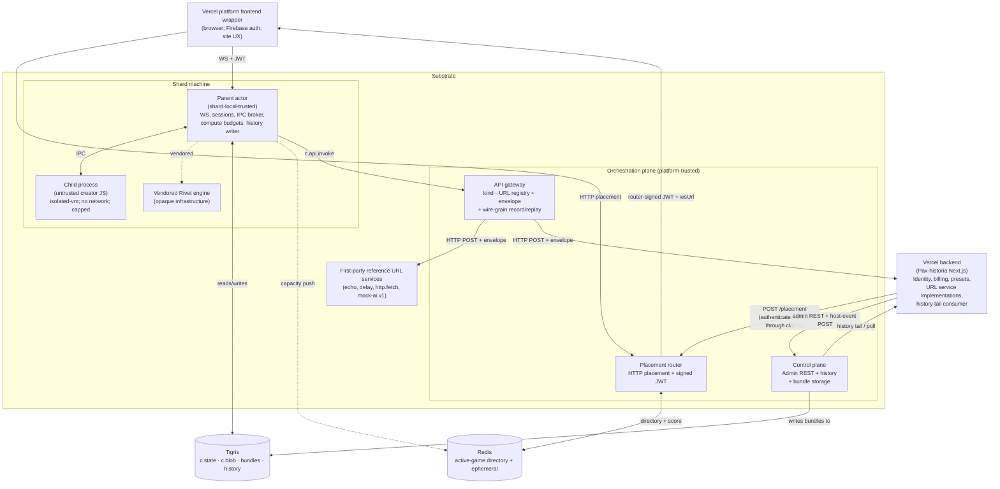

# Substrate overview

> Layer: **Vision**

## What the substrate is

A general-purpose-shaped backend platform that:

1. **Runs untrusted creator JavaScript** inside a per-game sandbox.
2. **Connects browsers to that JS** over WebSocket, with substrate-owned
   session lifecycle and substrate-verified JWTs.
3. **Dispatches outbound calls** from creator JS to operator-defined URL
   services through a single typed channel (`c.api.invoke`), with rich
   session context attached and every round trip recorded at wire grain.
4. **Faithfully records** what happened — every channel call, every session
   transition, every wire-grain API round trip, every shard event — into a
   single observable history.
5. **Owns the compute plane** (CPU, RAM, bandwidth, message rate,
   state/blob bytes, blob keys, API rate) and enforces per-game budgets.
6. **Owns bundle storage** — both the binary blob and its manifest metadata.
7. **Stays deliberately ignorant** of everything business-shaped: billing,
   identity, roles, metadata, marketplace, social, moderation policy,
   spectator rules.

That's the whole substrate. Everything else either lives in the **vercel
backend** (identity, billing, presets, metadata, URL service implementations)
or in **operator overlays** (worked patterns the vercel backend happens to
use; see [`operator-overlays/`](../operator-overlays/)).

## The single architecture diagram

Three points to notice in the diagram:

- The substrate has **no WebSocket data path through the router**. The router
  is HTTP-only. Clients connect WS directly to the parent actor on the shard
  they were placed on. That keeps the router stateless and the data plane
  short.
- **All three substrate-internal storage tiers (`c.state`, `c.blob`, bundles,
  history archives) sit in Tigris.** Redis is for ephemeral, low-value data
  (directory rows, capacity push, sessions in-flight). Per-shard volumes
  exist for Rivet engine internals only.
- **The vercel backend hosts URL services**, but the substrate ships
  first-party reference services co-located with the gateway. From the
  gateway's perspective every URL service is the same: a `kindName → URL`
  registry lookup followed by an HTTP POST under a fixed envelope.

## How the pieces compose into the contract

The substrate's value proposition rests on three intertwined properties:

### 1. Authoritative session observability

Every WebSocket connection gets a substrate-generated `sessionId`. That id is:

- Unforgeable (clients can't pick their own).
- Opaque (the substrate has no opinion on its structure).
- Cluster-wide unique.
- Stable for the connection lifetime.

The `sessionId` flows through every lifecycle hook (`onPlayerConnect`,
`onPlayerMessage`, `onPlayerDisconnect`), every `c.api.invoke` context
envelope (`triggeringSessionId` plus a `connectedSessions[]` snapshot of
every open session at dispatch time), and every session-bracketing history
event (`session.opened`, `session.closed`).

This is what lets the vercel backend implement arbitrarily sophisticated
billing, participation, role, and anti-fraud logic on top of the substrate
without the substrate having any vocabulary for any of it: the vercel
backend's URL services see, on every call, exactly who was connected when,
with which JWT claims. They make the trust decisions. See
[`operator-overlays/billing-policy.md`](../operator-overlays/billing-policy.md).

### 2. Wire-grain record and replay

Every `c.api.invoke` round trip is recorded as `(fingerprint, raw outbound
envelope, raw inbound response)` at the gateway↔URL-service boundary. Two
consequences:

- **Production replay.** Re-run a historical session against a new substrate
  build with URL service responses frozen. The runtime, gateway logic, and
  creator code re-execute; the only frozen variable is what came back from
  the URL service. Differences attribute to substrate code, not to vendor
  drift.
- **Scenario fixtures.** A scenario's `api-responses/` directory is a set of
  recorded responses keyed by fingerprint. The scenario-runner short-circuits
  HTTP dispatch in replay mode. Missing fixture coverage is a hard fail
  (`replayCoverageGap`), not a fall-through to live calls.

### 3. Small contract, testable in full

The contract surface is intentionally narrow:

- 7 lifecycle hooks ([`contract/lifecycle-and-wake.md`](../contract/lifecycle-and-wake.md))
- 8 compute budgets ([`contract/compute-budgets.md`](../contract/compute-budgets.md))
- 17 strong platform guarantees ([`vision/guarantees.md`](guarantees.md))
- 3 versioning axes ([`contract/bundle-compatibility.md`](../contract/bundle-compatibility.md))
- 1 external API channel ([`contract/external-api-channel.md`](../contract/external-api-channel.md))
- 2 storage tiers ([`contract/storage.md`](../contract/storage.md))

Every guarantee maps to an oracle that reads pure history. Every oracle is
run by the scenario-runner on every release. See
[`subsystems/scenario-runner.md`](../subsystems/scenario-runner.md).

## Scale target

**1k concurrent games across 10 Rivet shard machines** (100 games per shard).
The substrate's interesting properties (router throughput, per-shard
hibernation, cross-shard migration, redeploy safety, history completeness
under load) are all measurable at this size. If it works cleanly, we add
shards.

Initial Fly footprint:

- **10 Rivet shard machines** on `pax-backend-shards`. One Fly Volume per
  shard for Rivet engine internals; 5–10 GB each. Volume usage is bounded
  by working set, not by lifetime game count.
- **1 control + gateway machine** on `pax-backend-control` co-locating the
  placement router, control plane, API gateway, and first-party reference
  URL services. Split out as evidence demands.
- **Scenario-runner driver machines on demand** on `pax-backend-driver`.

No in-app Postgres. The substrate has no ledger.

## What the substrate is not

A storytelling platform. A billing system. A credit store. A payment
processor. A Pax-branded anything. A multi-tenant service. A frontend.

See [`vision/non-goals.md`](non-goals.md) for the closed list.
