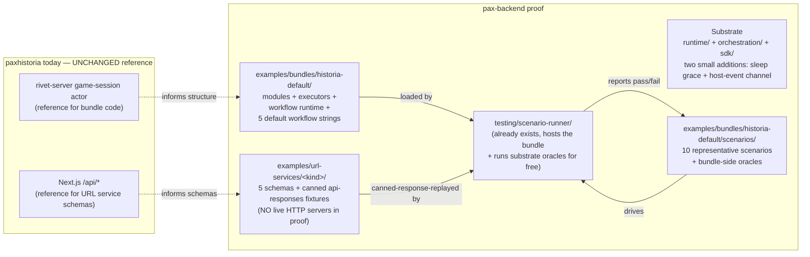
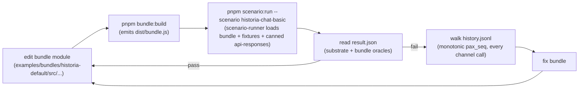

# Prove the substrate by building historia-default in pax-backend

> **Framing — this is a substrate-validation proof, not a production migration.**
> Production paxhistoria stays on its current Rivet + Next.js stack. Nothing
> here causes a live game to flip backends. The goal is to prove that the
> substrate contract is rich enough to host a real-world game backend AND
> that the scenario-runner + oracle harness is sufficient to iterate a
> creator bundle to correctness.

**Success criteria.** The `historia-default` bundle exists in
[`examples/bundles/historia-default/`](../../examples/bundles/historia-default/),
runs end-to-end in the scenario-runner against canned URL service responses,
and passes a representative scenario suite covering every module of the
paxhistoria game-session actor.

**Deliverable shape:**

| Deliverable | Path |
|---|---|
| One reference bundle | [`examples/bundles/historia-default/`](../../examples/bundles/historia-default/) |
| Five URL service specs (schema-only, no servers) | [`examples/url-services/<kind>/`](../../examples/url-services/) |
| A scenario suite mirroring `testing/scenarios/<scenario>/` | `examples/bundles/historia-default/scenarios/<scenario>/` |
| A short substrate-additions RFC | [`substrate-additions-for-historia-port.md`](substrate-additions-for-historia-port.md) |

The substrate itself (`runtime/`, `orchestration/`, `sdk/`, `shared/`) stays
pure: nothing paxhistoria-specific touches those zones. The scenario-runner
already supports this shape — see §5b on the iteration environment.

## 1. What "the bundle" is

Paxhistoria's `game-session` actor today is a monolith of substrate-shaped
code + game-shaped code + five hardcoded workflows. The bundle peels the
substrate concerns off and lands the rest as one bundle.

**What goes in `examples/bundles/historia-default/`:**

- **All 7 `modules/<name>/`** ported as-is (chat, advisor, actions,
  jump-forward, moderation, admin, cheats) plus supporting modules
  (`player-management.ts`, `rounds.ts`, `round-timer.ts`, `map-state.ts`,
  `offline-cap.ts`, `permissions.ts`, etc.). Source:
  [`paxhistoria/rivet-server/src/actors/game-session/modules/`](../../../paxhistoria/rivet-server/src/actors/game-session/modules/)
  (~18 K LoC).
- **Workflow runtime** = engine + executors + task tracker. Source:
  [`paxhistoria/rivet-server/src/actors/game-session/ai/`](../../../paxhistoria/rivet-server/src/actors/game-session/ai/)
  minus `ai-client.ts` (which becomes a thin `c.api.invoke` wrapper). The
  sandbox-in-child-process pattern collapses: the entire bundle is *already*
  in `isolated-vm` under the substrate, so workflow generator functions can
  `eval` directly inside the bundle's own context without nested sandboxing.
- **The 5 `DEFAULT_*_WORKFLOW` strings** (chat, advisor, actions,
  jump-forward, moderation) ship verbatim as the bundle's hardcoded
  defaults.
- **`GameContext` adapter** rewritten on top of `c.state` / `c.blob` /
  `c.ws.send` / `c.api.invoke` / `c.log.emit`. Replaces `gameCtx.s3Get/s3Put`
  with `c.blob.*`, replaces fetch-to-Next.js with `c.api.invoke`.
- **WS routing + policy gates** (`routing/websocket.ts`, `message-caps.ts`)
  — but the WS transport itself is now substrate (substrate calls
  `onPlayerMessage(playerId, sessionId, seq, body)`; the bundle does its own
  dispatch from `body`).
- **Blob schema + migrations** (`core/migrations.ts`,
  `migrate-v*-to-v*.ts`) — substrate is opinion-free on blob shape, just
  stamps an opaque `compatTag`. The bundle's `manifest.compatTagsAccepted`
  widens to span the old `v1`…`v5` chain.
- **Hydration + working state** (`core/persistence.ts`,
  `core/initialization.ts`, `hydration.ts`) — recasts onto substrate's
  `c.state` (sync API, Tigris-canonical, ~1s flush window, ≤128 KB cap)
  + `c.blob` (Tigris keyed namespace at `blob/<gameId>/`, ≤1024 keys and
  ≤100 MB total, both substrate-enforced). Working state fits comfortably
  in `c.state`. The main `LiveGameBlob` snapshot goes under a single key
  (e.g. `current`); paxhistoria's existing
  `moderation-snapshots/{banId}.gz` pattern maps naturally to additional
  keys in the same namespace. The substrate's storage-tiers-v2 changes
  (see [README.md](../../README.md) §"Storage tiers") make this port
  cleaner than paxhistoria's status quo: cross-shard migration = normal
  wake (no shard-pinning), and incremental blob checkpoints (per chapter,
  per moderation snapshot) replace the single-gzipped-object rewrite on
  every commit.

**What gets dropped (substrate does it now):**

| Was in paxhistoria | Is now |
|---|---|
| Rivet `createState` / `createVars` / `onWake` / `onSleep` / `onConnect` / `onDisconnect` plumbing | Substrate `onWake` / `onSleep` / `onPlayerConnect` / `onPlayerDisconnect` lifecycle hooks |
| Firebase JWT verification in `createConnState` | Substrate verifies at placement router; bundle receives `jwtClaims` in `onPlayerConnect` |
| Direct R2 calls (`@aws-sdk/client-s3`) | `c.blob.put` / `.get` / `.delete` / `.list` against the substrate-owned Tigris namespace at `blob/<gameId>/` |
| Redis ban cache + `moderationCoordinator` cross-actor RPC + `enforceBan` fan-out | Substrate's `DELETE /admin/players/:playerId` (force-disconnects across all games) |
| `child_process` workflow sandbox | Not needed — bundle runs workflows inline in its own already-sandboxed isolate |
| Postgres-sync fire-and-forget calls (`/api/live-games-db/*`) | Mix of substrate history tailing (substrate-derivable facts) and explicit `projection.sync.v1` calls (bundle-only-knowable facts); see §2 |

## 2. URL services to define

Five URL service kinds total. The substrate stays
participation-agnostic, so participant state lives in a URL service the
bundle and AI service both consult.

| Kind | Wraps | Args / Result shape lives in |
|---|---|---|
| `ai.chat.v1` | `app/api/simple-chat/route.ts` | [`ai.chat.v1/README.md`](../../examples/url-services/ai.chat.v1/README.md) |
| `flag.search.v1` | `app/api/flags/published/get-published-flags/route.ts` | [`flag.search.v1/README.md`](../../examples/url-services/flag.search.v1/README.md) |
| `moderation.audit.v1` | `app/api/live/moderation/{verdict,ban}/route.ts` | [`moderation.audit.v1/README.md`](../../examples/url-services/moderation.audit.v1/README.md) |
| `projection.sync.v1` | `app/api/live-games-db/{sync-status,player-ready,round-completed,player-joined,player-left}/route.ts` | [`projection.sync.v1/README.md`](../../examples/url-services/projection.sync.v1/README.md) |
| `participation.v1` | Canonical store for per-game per-player participation | [`participation.v1/README.md`](../../examples/url-services/participation.v1/README.md) |

The load-bearing rule in `ai.chat.v1`: **the URL service calls
`participation.v1.get(playerId, gameId)` for each billable player and
refuses to bill any player marked spectator.** This is the defense against
"compromised bundle bills non-participants." No caching — the
participation read happens on every billable call, in parallel with the
existing token-ledger / resource-ledger reads the AI service already does.

**Not URL services (substrate or AI service is already the trusted
source):**

- **Player time per game, who-was-where-when, allowed-player mutations,
  bundle-pointer flips** — all substrate-derivable from `HistoryEvent`s
  and `/admin/games/:id/sessions`. Host polls or tails substrate. This is
  the official substrate observability API
  (`orchestration/control-plane/src/history.mts` exports
  projection-shaped helpers).
- **Money spent per player per game, AI call counts, vendor breakdown**
  — `ai.chat.v1`'s own `llm_logs` + `token_ledger` is the trusted
  source. Host queries directly.
- **Cross-game ban enforcement** — substrate's
  `DELETE /admin/players/:playerId` already fan-outs atomically
  (force-disconnects everywhere, writes audit event). Host moderation flow
  calls substrate admin directly.
- **Statsig telemetry** — bundle uses `c.log.emit` / `c.metrics.emit`;
  substrate's observability layer routes from there (see
  [`docs/ops/observability.md`](../ops/observability.md)).

### 2b. Trust categories for game metadata

Every piece of game metadata sorts into exactly one of four buckets:

| Category | Trusted source | Mechanism | Examples |
|---|---|---|---|
| Substrate-derivable | Substrate | Host tails `/admin/history`, queries `/admin/games/:id/sessions` | Player session times, allowed-player changes, bundle flips, game-create/destroy events |
| AI-URL-service-derivable | `ai.chat.v1`'s ledger | Host queries `llm_logs` / `token_ledger` | Money spent per player per game, AI call counts, model breakdowns |
| Bundle-only-knowable | Bundle | `c.api.invoke('projection.sync.v1', {op, ...})` explicit call | Game `status` (in-progress/ended), display `currentRound`, `playerReady` for "your turn" badges, title overrides, round-completed events |
| Host-and-bundle co-managed | `participation.v1` URL service | Bundle reads/demotes via `c.api.invoke('participation.v1', ...)`; host promotes via host-auth REST call; AI URL service reads before billing | Per-game per-player participant-vs-spectator state, entity assignment |

Long-term preset-boost ranking (boost by player time spent per game and
money spent per game) falls entirely in categories 1 and 2 — both
substrate or AI-service-authoritative. The bundle never has to be trusted
for those signals.

### 2c. Participation authority (the main rule)

Because participation drives billing, who can write to `participation.v1` is
the load-bearing question. The asymmetric rule:

- **Bundle (creator code) can:** demote any player to spectator
  (`setSpectator` allowed), reject any in-progress claim attempt by
  demoting post-hoc, answer per-player queries about what entities they
  can claim (by `c.ws.send` pre-publishing the option list to the player
  at connect or on state change).
- **Bundle (creator code) cannot:** promote any player to participant.
  `setParticipant` calls from the bundle fail with `403 hostOnly`.
- **Host (paxhistoria Next.js) can:** promote (with host auth token),
  demote, query.
- **Player can:** flip themselves to spectator at any time via the host's
  "Spectate" button, which calls `setSpectator` on their behalf. The
  bundle receives the change via `onHostEvent` (see §4.2).
- **AI URL service does:** read `participation.v1.get` before billing
  every player. Spectator → `playerIsSpectator` error to the bundle. This
  is the final defense if a compromised bundle ignores everything else.

This gives the bundle full game-logic authority (kill a nation, dissolve a
coop, demote a bad actor) without giving it the ability to abuse promotion
for billing fraud.

## 3. How workflows work in the new world

The default bundle ships ready to play with the 5 hardcoded workflows from
paxhistoria today. Creator-supplied workflows are **optional content stored
in the game blob**, not a substrate primitive.

**Mechanism:**

1. The blob carries an optional `workflows` field — e.g.
   `blob.workflows = { chat?: { code, entryPoints }, advisor?: { ... }, ... }`.
2. The bundle's per-module trigger code reads
   `blob.workflows?.[module]?.code ?? DEFAULT_<MODULE>_WORKFLOW`.
3. The bundle's workflow engine `eval`s the resolved code as a generator
   function within the bundle's existing isolate. No nested sandboxing
   needed — the substrate already sandboxes the whole bundle, and the
   operator vetted the blob contents at game-create time.
4. The command vocabulary stays exactly as paxhistoria has it today
   (`callAI`, `emitChatEvent`, `setState`, etc.). Executor implementations
   (the trusted half) live in the bundle.
5. `callAI` resolves to `c.api.invoke('ai.chat.v1', args)`. Workflows
   themselves never see substrate primitives; they only know about the
   executor command ABI.

**What the substrate doesn't know:** "workflow," "preset," "engine,"
"executor." It just runs the bundle.

**What the bundle exposes to creators who want custom workflows:** a small
TS SDK that produces a `{ code, entryPoints }` shape for each module, plus
a way to bundle the result into a preset's blob at game-create time. That
tooling lives alongside paxhistoria's existing preset-authoring UI, not in
pax-backend.

## 4. Substrate additions required by the port

Two **small** substrate-contract additions. Neither introduces billing or
game-shaped vocabulary; both are generic primitives the substrate can
specify in a paragraph each. Full spec lives in
[`substrate-additions-for-historia-port.md`](substrate-additions-for-historia-port.md);
this section summarizes them.

Earlier rounds of this plan proposed larger additions (`c.schedule.*`
scheduled wakeups, `Role`/`RoleAssignment` substrate units); both have been
**rejected** in favor of leaner mechanisms — see §4.3 for the trade-offs.

### 4.1 Sleep grace period

Substrate constant `SLEEP_GRACE_MS = 60_000`. On last WS disconnect, the
substrate starts a 60s timer; if no new connect arrives, it fires the
existing `onSleep` hook and hibernates. Fixed across all bundles; no
per-bundle override in v1. Trivial: one constant + one timer in the
existing sleep-policy code path.

### 4.2 Host event channel (with wake-on-delivery)

The port needs out-of-band push for two flows:

- **Participation-change notifications** (per §2c): the bundle has to
  learn that a player flipped to spectator. Best-effort while-awake is
  fine — if the game is asleep, the bundle re-fetches fresh state from
  `participation.v1` on next wake.
- **Moderation eject events** (per §2's moderation flow): the host has
  to be able to fire "eject this player from this game" to every game the
  user is in — **including games that are asleep and may not have been
  played for weeks.** This requires the substrate to wake the game just
  to deliver the event.

So:

| Element | Shape |
|---|---|
| Admin endpoint | `POST /admin/games/:id/host-event` body `{ eventType: string, payload: unknown, wakeOnDelivery?: boolean }` |
| Bundle hook | `onHostEvent({ eventType, payload, receivedAt })` |
| Default delivery | Best-effort while-awake; dropped if asleep |
| `wakeOnDelivery: true` delivery | Durable; substrate persists, wakes the game if asleep, delivers, game goes back to sleep naturally |
| Auth | Substrate admin token (same as other `/admin/*`) |
| Ordering | FIFO per game |
| TTL on queued wake-on-delivery events | 30 days |

The `wakeOnDelivery` machinery is most of the infrastructure that would
have been needed for scheduled wakeups (durable queue + wake mechanism). If
substrate ever adds timer-driven wakes in v2+, the path is cheap from here
— but the trigger remains host-driven, never bundle-driven.

### 4.3 What was rejected and why

Two earlier proposals were dropped in favor of leaner mechanisms after
design discussion:

- **`c.schedule.*` scheduled wakeups + `onTimer` lifecycle hook +
  `ScheduledTimer` persisted unit + scheduler component** — rejected. The
  new rule is *games are alive iff someone is connected (plus grace period
  and substrate-initiated migration warning)*. Bundle uses in-isolate
  `setTimeout` only for short-lived deadlines that fire while at least one
  player is connected; those timers are lost when the game sleeps, which
  is acceptable because by definition no one is around to observe the
  loss. **Long-duration deadlines (hours/days/weeks) MUST NOT use
  JavaScript timers** — the bundle pattern is to stamp the `fireAt`
  timestamp into `c.state` or `c.blob` when the deadline is set, and check
  on every `onWake` (and during normal handler ticks while alive) whether
  the threshold has been crossed. This is the "mark timestamp, check on
  wake" pattern. **Trade-off accepted:** no async-game auto-progression
  while everyone is offline. The deadline check fires on the next
  reconnect or substrate-initiated wake; for paxhistoria's async-game
  flows (jump-forward delay tokens, etc.) this is acceptable per explicit
  decision. If a strict-deadline workflow ever needs server-driven wakes,
  the host runs a cron job that force-advances or force-ends stale games
  via substrate admin endpoints — not a substrate concern.
- **`Role` and `RoleAssignment` substrate-owned units +
  `c.roles.create/destroy/list` channels + `onRoleAssigned` /
  `onRoleReleased` lifecycle hooks + envelope-side
  `triggeringSessionRoleId`** — rejected. Substrate stays
  participation-agnostic; participant state lives in the
  `participation.v1` URL service (§2). The host-event channel (§4.2)
  handles bundle notification of changes. **Trade-off accepted:** every
  `ai.chat.v1` call does a fresh HTTP hop to `participation.v1` (no
  caching), in parallel with the service's existing token-ledger /
  resource-ledger reads — the round-trip lands inside the existing
  latency envelope. The trust property is preserved by
  `participation.v1`'s server-side rule that `setParticipant` requires the
  host auth token, not the bundle's call.

### 4.4 Substrate-contract gaps the port works around

Not every gap rises to "the substrate must add this." These are friction
points the bundle absorbs:

- **No cross-actor RPC.** Paxhistoria's `moderationCoordinator` actor and
  `enforceBan` fan-out have no substrate equivalent. Replaced by
  `moderation.audit.v1` URL service + substrate
  `DELETE /admin/players/:id`.
- **Substrate WS is `playerId`-based, no channel subscriptions.**
  Paxhistoria's frontend subscribes to chat threads, map state, advisor
  channels via Rivet's typed subscriptions. Substrate exposes only
  `ws.send(playerId|'all', body)`. Bundle implements topic routing inside
  its own WS handler (cheap; common pattern).
- **`c.state` is 128 KB, not arbitrary.** Paxhistoria's working state
  averages well within this, but cheats / pre-JF moderation snapshots
  could spike. Spillover goes to additional keys in `c.blob` (the
  storage-tiers-v2 keyed namespace makes this clean — no more
  one-giant-object pattern). Need to audit working-state size during
  port.
- **Blob storage path differs.** Paxhistoria writes to its own R2 bucket
  at `games/{gameId}/current.gz`. Substrate writes via `c.blob` to its own
  Tigris bucket (`pax-backend-blobs`). Migration of existing games is a
  separate one-shot job; the bundle itself never sees the old bucket.
- **Auth model.** Paxhistoria verifies Firebase JWTs in `createConnState`.
  Substrate's placement router verifies its own JWT (`PAX_JWT_SECRET`).
  The host product is the one that issues placement-time JWTs to the
  client, *after* its own Firebase login flow. The bundle receives
  `jwtClaims` in `onPlayerConnect` (substrate forwards them verbatim);
  the bundle can still read Firebase claims if the host stuffs them in.
- **No `allowed-player.added` / `allowed-player.removed` history event.**
  Paxhistoria currently projects "added to roster" via
  `/api/live-games-db/player-joined`. In the new model, the host knows
  when it calls substrate's
  `POST /admin/games/:id/allowed-players/:playerId` (it's the one making
  the call), so it writes its own Postgres projection synchronously at
  that point. Not a substrate gap — just a host-implementation detail to
  handle.

## 5. Phases (deliverables for the proof)

Implementation is for whoever picks this up next. Suggested phasing — all
phases land within pax-backend; nothing touches paxhistoria:

- **Phase 0 — write this plan doc** (you are reading it).
- **Phase 1 — URL service specs as scenario fixtures.** For each of the 5
  kinds, write `examples/url-services/<kind>/README.md` documenting the
  args/result schemas. **No real HTTP server is built for the proof** —
  instead, every URL service call from the bundle is served by canned
  `api-responses` fixtures the scenario-runner already supports
  (request-fingerprint keyed; gateway short-circuits HTTP dispatch in
  replay mode). Optionally also stub a tiny reference implementation
  under `examples/url-services/<kind>/src/` matching the schema for
  documentation purposes — but not part of the proof's success criteria.
- **Phase 1b — substrate-additions RFC.** Already written at
  [`substrate-additions-for-historia-port.md`](substrate-additions-for-historia-port.md).
  These can land on the substrate's own track; bundle scaffolding
  (Phases 2–5) is unblocked without them.
- **Phase 2 — bundle skeleton.** Scaffold
  `examples/bundles/historia-default/` with `package.json`, `manifest.ts`
  (`compatTagProduced: "historia:v5"`,
  `compatTagsAccepted: ["historia:v1", ..., "historia:v5"]`,
  `runtimeContractRequired: <current>`), empty module files, and a build
  step that produces `dist/bundle.js` matching the existing
  `examples/bundles/hello-ws-echo/` shape.
- **Phase 3 — port modules.** One module at a time (chat first — simplest
  workflow surface), rewriting `gameCtx.*` calls onto substrate's `c.*`.
  Workflow runtime (engine, executors, task tracker, shared utilities)
  ports as one unit, executing workflow generator functions inline in the
  bundle's isolate (no nested child-process sandbox). Default workflow
  strings (`DEFAULT_CHAT_WORKFLOW` et al, 5 total) copy verbatim. Each
  module's HTTP calls to paxhistoria Next.js become `c.api.invoke` calls
  to the relevant URL service kind.
- **Phase 4 — port WS routing + hydration.** Move `routing/websocket.ts`
  (dispatch + policy gates) + `hydration.ts` (initial client snapshot)
  onto substrate's `onPlayerMessage` / `onPlayerConnect`. Bundle's WS
  handler implements its own topic-routing.
- **Phase 5 — port persistence + migrations.** `core/persistence.ts`
  (working-state + R2 commit) + `core/initialization.ts` (cold-load
  rebuild) + 4 blob migrations onto `c.state` (128 KB working state) +
  `c.blob` (Tigris LiveGameBlob).
- **Phase 6 — bundle scenario suite.** Author scenarios under
  `examples/bundles/historia-default/scenarios/<scenario>/` mirroring the
  existing `testing/scenarios/<scenario>/` structure (see §5b). Target a
  representative set covering every module:

  | Scenario | What it exercises |
  |---|---|
  | `chat-basic` | 2 players, 1 chat thread, AI response (canned), assert broadcast |
  | `jump-forward-basic` | 4 players ready, JF runs, canned AI streams events, round commits |
  | `advisor-basic` | 1 player asks advisor a question, canned response, persisted to advisor message log |
  | `actions-basic` | 1 player requests action suggestions, canned AI response, suggestions broadcast |
  | `role-claim-flow` | Player connects as spectator, host promotes via `participation.v1`, bundle gets `onHostEvent`, broadcasts updated state |
  | `role-destroy-flow` | Bundle dissolves a role mid-game, broadcasts via `ws.send`, host re-prompts via picker (simulated) |
  | `spectator-billing-block` | Bundle (intentionally buggy fixture) tries to bill a spectator; `ai.chat.v1` rejects with `playerIsSpectator`; bundle handles gracefully |
  | `moderation-flow` | Content flagged, `moderation.audit.v1.recordVerdict` called, ban path via `DELETE /admin/players/:id` |
  | `workflow-override-loaded` | Game blob carries a custom `workflows.chat.code`; bundle picks it up instead of the default; canned execution path observable in history |
  | `host-event-wake-delivery` | Moderation eject fired with `wakeOnDelivery: true`; game wakes from sleep just to receive the event |

- **Phase 7 — close the loop.** Run the full scenario suite; verify all
  substrate-side oracles pass + all bundle-side oracles pass. Document
  any substrate-contract surprises in this doc. This is the finish line
  for the proof.

**Explicitly NOT in scope:**

- **Production cutover.** No paxhistoria games migrate. No live URL
  services route to pax-backend. No bundle-name flips in production.
- **Host shrink.** Paxhistoria's Next.js keeps its `/api/simple-chat`,
  `/api/flags/*`, `/api/live/*`, `/api/live-games-db/*` routes exactly as
  they are today. The pax-backend URL service specs document *what those
  endpoints would look like if they were ported*, but no porting happens.
- **Real-server URL service implementations.** The 5 URL services are
  spec + scenario-fixture only.

## 5b. The bundle iteration environment

How a developer (or agent) iterates on `historia-default` until it works:

**The scenario-runner already provides every piece of this loop**
(`testing/scenario-runner/`):

- **Reads scenario manifest + workload plan** (typed via
  `@pax-backend/scenario-runner`); declarative phases like
  `seed-fixtures` → `open-sessions` → `send-json` →
  `expect-history-events`.
- **Loads `api-responses` fixtures** (canned URL service responses keyed
  by request fingerprint); gateway short-circuits live HTTP in replay
  mode.
- **Runs all substrate-side oracles automatically** from
  `@pax-backend/oracles-lib` — every one of the 16 strong platform
  guarantees is checked for free on every scenario run.
- **Supports scenario-local oracles** (the `oracles.mts` per scenario);
  this is where bundle-correctness oracles live for `historia-default`.
- **Emits `result.json`** with per-oracle pass/fail, attribution
  sentences, scenario/nemesis/run metadata.
- **History is JSONL** with monotonic `pax_seq` per shard; trivially
  `jq`-able for ad-hoc inspection, and a small `pnpm history:step` CLI
  could be added later for interactive walking (not bundle-specific work).

**Two minor pieces missing today** that aren't bundle-specific:

- The scenario-runner's "execute workload phases" loop is pending (per
  its README — "It does not yet execute the workload phases…"). When the
  substrate track lands this, the bundle scenarios run for free.
- The history-stepping CLI doesn't exist yet. Optional and additive; can
  be added when someone wants it.

**Bundle-specific authoring (per scenario):**

| File | Purpose |
|---|---|
| `manifest.mts` | Scenario metadata + which substrate oracles to gate on (probably all of them by default). |
| `clients/workload.mts` | Typed phases: seed fixtures, open sessions, send WS messages, drive specific module flows (e.g., a `claim-role` phase that POSTs to a host-simulator endpoint). |
| `oracles.mts` | Bundle-correctness oracles. Examples: "every `chat_message` from a participant produces a `chat_response_broadcast` event within 30s," "every `participationChanged: false` event is followed by no further AI billing for that session." |
| `fixtures/initial-state.json`, `fixtures/initial-blob.json`, `fixtures/allowed-players.json` | Initial game state seed. |
| `fixtures/api-responses/` | Canned responses for every `c.api.invoke` the scenario triggers; the scenario-runner replays them by fingerprint and hard-fails with `replayCoverageGap` on misses (so missing fixtures show up as scenario failures, not silent live calls). |

**Bundle-correctness oracles live with the bundle** at
`examples/bundles/historia-default/oracles-lib/` (or inline per scenario).
They never go into `testing/oracles-lib/`, which stays substrate-only. The
split keeps the substrate's release gate clean — substrate oracles gate
substrate CI; bundle oracles gate bundle CI.

**Net answer to "does this fit the existing testing infrastructure or is
it a different angle":** same angle, cleanly additive. The
historia-default bundle is exactly the kind of customer the scenario-runner
was built for; we don't need a separate testing layer, just bundle-side
scenario authoring + bundle-side oracles.

## 6. Open questions

None remaining at the substrate-design layer. The `HistoryEvent` schema
dependency that earlier rounds worried about has been verified against the
live repo:

- [`orchestration/control-plane/src/history.mts`](../../orchestration/control-plane/src/history.mts)
  exports a `HistoryEvent` interface plus projection-shaped helpers
  (`sessionsForGame`, `connectedPlayersForGame`, `sessionById`,
  `lastActivityAtForGame`, `apiWireRecordsForGame`) that handle
  `session.opened` / `.closed` with full
  `{sessionId, playerId, gameId, connectedAt, disconnectedAt, reason, shardId, jwtClaims}`
  semantics. This is essentially the projection layer the proof needs,
  already built.
- [`testing/oracles-lib/src/guarantees/history-completeness.mts`](../../testing/oracles-lib/src/guarantees/history-completeness.mts)'s
  `REQUIRED_FIELDS` catalog is the authoritative list of substrate-emitted
  event types and their required fields (it's code-as-spec, gating CI).
  The category-1 facts §2b depends on — session opens/closes, bundle
  flips, game/player deletions, placement decisions, API wire records —
  are all present with the right field shapes.
- Verified that
  [`runtime/parent-actor/src/parent.mts`](../../runtime/parent-actor/src/parent.mts)
  actually emits these event names today (grep confirms).

### Resolved during planning

- **Bundle/role authority** → URL-service-based `participation.v1` with
  asymmetric write rules (§2c).
- **Scheduled wakeups** → rejected; long-duration deadlines use the
  "mark timestamp, check on wake" pattern (§4.3).
- **Picker UI location** → host (paxhistoria Next.js), standardized
  across presets; bundle pre-publishes entity-options list via
  `c.ws.send`.
- **Game metadata sync** → three-bucket model (§2b); explicit
  `projection.sync.v1` URL service for bundle-only-knowable facts.
- **`ai.chat.v1` participation-check caching** → no cache; fresh
  `participation.v1.get` on every billable call, parallel with existing
  ledger reads.
- **Async-game offline progression** → confirmed not needed;
  long-duration deadlines handled via the mark-timestamp pattern;
  substrate stays out of timers.
- **`c.state` size** → 128 KB is fine; working state stays within. No
  spillover-to-blob logic needed in v1. (`c.state` is also now
  Tigris-canonical per storage-tiers-v2, so cross-shard migration loses
  nothing on planned transitions and at most one flush window on
  unplanned death.)
- **Workflow override loading API** → no typed SDK helper; bundle just
  reads `blob.workflows` directly. Easy to extend later if needed.
- **Moderation URL service ops** → `moderation.audit.v1` with
  `recordVerdict` + `recordBan` only. `checkBan` and `alertBanFailed`
  dropped (substrate force-disconnects bans; alerts use observability
  pipeline).
- **Sleep grace period** → 60s substrate constant. No per-bundle
  override.
- **Host-event `wakeOnDelivery` flag** → required, not optional.
  Moderation eject events must reach games that haven't been played for
  weeks. Substrate gets a per-game durable event queue + wake mechanism
  for this. (Note: this is most of the infrastructure that would have
  been needed for scheduled wakeups; if substrate ever adds timer-driven
  wakes in v2+, the path is cheap from here.)
- **Round-completed anti-fraud** → not a concern; round count is being
  removed from preset ranking soon, so falsifying it just irritates
  players (no malicious benefit).
- **AI cost-spike detection responsibility** → confirmed: lives in
  `ai.chat.v1`'s implementation, not substrate.

## What's deliberately not in this plan

- **Implementation.** This doc is the plan; actual bundle code is for
  whoever picks this up next.
- **Any production migration.** Paxhistoria's production stack stays
  untouched. No bundle-name flips on live games, no live URL services
  pointing at pax-backend, no host shrink.
- **Real URL service HTTP servers.** All 5 URL services are spec +
  canned `api-responses` fixtures for the proof. Real implementations
  come if/when a production cutover is ever decided on (separate
  planning round).
- **paxhistoria's preset-authoring UI**, billing pipeline source code,
  frontend, presets schema. All stay in paxhistoria, unchanged.
- **Substrate-internal work** (vendor Rivet, ship placement router, build
  runtime SDK, build API gateway, etc.). That's the
  agents-working-in-parallel track; the proof rides on top of whatever
  they ship.
