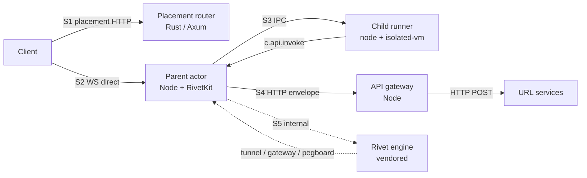
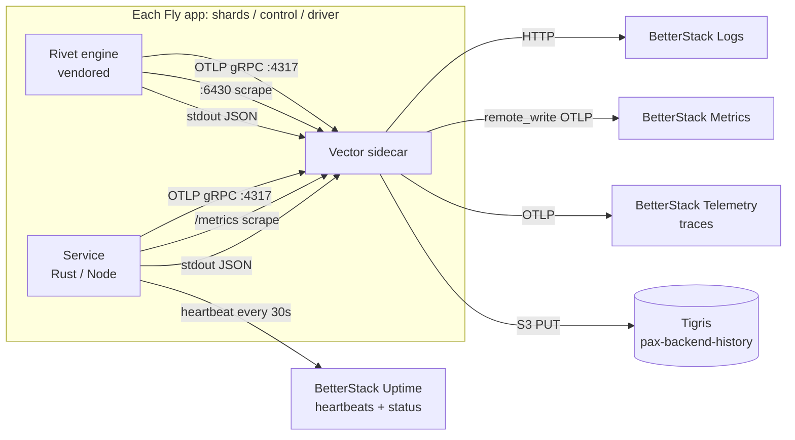

# Observability — the substrate's narration of itself

> Status: design spec. No code is changed by adopting this doc; implementation
> lands in subsequent milestones (see §11 and the companion runbook
> [docs/ops/observability-betterstack-setup.md](./observability-betterstack-setup.md)).
> Last reviewed 2026-05-27.

The substrate's job is to run untrusted JavaScript and **narrate what happened**
faithfully enough that any operator can build whatever policy on top. Observability
is therefore not an instrumentation afterthought — it is a substrate guarantee, on
the same footing as the README's strong platform guarantees. Every named subsystem
boundary in this repo must be hop-instrumented from day one so that "the cliff is
in the WS/client/gateway path" is never a publishable attribution. The sister-spike
work spent days proving exactly that lesson; we ship it as a contract instead of
rediscovering it.

---

## 1. Lessons that fix the shape of the design

Every choice below has at least one sister-spike receipt:

- **[pax-rivet-refactor](../../../pax-rivet-refactor/)** (vendored at `bdfb982`)
  proved that threshold-triggered structured slow-hop logs (≥1000ms setup, ≥500ms
  guard sub-hops) parsed by a harness into per-rung `p50/p95/p99/max` outperform
  Prometheus histograms for attribution. The named-walls table in
  `pax-rivet-refactor/AGENTS.md` (lines 49–71) lists ~25 hop names that became
  load-bearing: `prepare_keyed_create`, `wait_create_complete_v1`,
  `allocate_actor_v2.tx_total`, `lockWait`, `oldestWake`,
  `gateway_websocket_open_*_duration_ms`, etc.
- **[pax-spike-fly](../../../pax-spike-fly/)** proved 30s Prometheus sampling
  hides sub-second bursts. Their `phase2-baselines.js` `startMetricSampler` flips
  to 1s on `--cliff-hold=true`, but only against a `FAST_ENGINE_PROMETHEUS_FAMILIES`
  allowlist (otherwise the load-bot OOMs at ~1955MB on 30-min holds). They also
  coined "localization vs root cause" — frame-age histograms locate the *segment*,
  named subsystem metrics identify the *cause*.
- **[pax-sharded-spike](../../../pax-sharded-spike/)** shipped 4 Prometheus
  families in `orchestration/router-placement/src/main.rs` (actor-create histogram,
  decision-lock wait/hold + contention counters, capacity-row staleness,
  recent-wake cardinality) plus rich `serverTimings` in the placement response
  body. Their per-stress artifact shape (`kind`, `backend`, worker fanout, merged
  `percentiles`) is the cleanest substrate-test result format in the family.
- **Vendored Rivet** at [vendor/rivet/](../../vendor/rivet/) already gives us a
  ~120-metric Prometheus scrape on port `:6430`
  (`engine/packages/metrics-server/src/server.rs`), optional OTLP/gRPC tracing via
  `RIVET_OTEL_ENABLED=1` (`metrics-server/src/providers.rs:112`),
  `tracing::instrument` coverage on ~50 hot paths, and `Pressure.oldestAgeMs` in
  the v8 runner protocol. It does **not** carry W3C `traceparent` or end-to-end
  request IDs across the runner protocol — that's our gap.

The plan composes these: take what Rivet already gives us, layer the
sister-spike-proven attribution primitives on top, and stamp one correlation
backbone through every boundary the substrate owns.

---

## 2. The five observability surfaces (the "complete story")



Each surface gets the same four primitives (logs, metrics, traces, history events)
and the same correlation backbone. The substrate's job is to make the seams
between surfaces *legible*, not to invent a new observability product per seam.

---

## 3. The correlation backbone — one ID flow, six fields

The single largest gap across every sister spike is "no end-to-end
request/correlation ID from placement router → shard → child"
(`pax-sharded-spike` handoff doc). Fixing it is the highest-leverage change in
the design.

### 3.1 The six fields every observable event carries

| Field | Lifetime | Origin | Purpose |
|---|---|---|---|
| `trace_id` (W3C 16-byte hex) | One placement→child→response round trip | Router on inbound HTTP; new if no `traceparent` header | Distributed tracing — feeds OTLP to BetterStack Telemetry |
| `span_id` (W3C 8-byte hex) | One hop within a trace | Each instrumented boundary | OTel span correlation |
| `run_id` | One scenario-runner invocation | Scenario runner; absent in production live traffic | Lets oracles slice "events from this run only" |
| `game_id` | One game's lifetime | Substrate on `POST /admin/games` | Domain ID; logged / spanned but **never** a metric label |
| `session_id` | One WS connection | Substrate on `onPlayerConnect` | Domain ID; same rule |
| `pax_seq` (monotonic u64) | One shard's lifetime | Parent actor on every history write | Causal ordering inside the substrate; oracles use it to detect dropped events |

`bundle_name` and `bundle_compat_tag` ride along as low-cardinality span
attributes and (`bundle_compat_tag` only) metric labels.

### 3.2 Stamping rules

Every boundary in S1–S5 reads `traceparent` from inbound transport, writes it
to outbound transport, opens an OTel span, and records the trace fields on
every emitted event. The mapping:

- **S1 client→router**: HTTP `traceparent` + `tracestate` headers (W3C standard,
  accepted by Axum middleware `tower-otel`); generate fresh if absent. Stamped
  into the signed JWT (`traceId`, `runId` claims).
- **S2 client→parent (WS)**: trace_id arrives in the JWT (decoded once at WS
  accept). Stamped into the substrate-generated `session_id`-scoped span; every
  `onPlayerMessage` opens a child span with `parent_span_id = session.span_id`.
- **S3 parent↔child IPC**: extend [shared/ipc-protocol/src/index.mts](../../shared/ipc-protocol/src/index.mts)
  envelope to require `trace_id`, `span_id`, `ts_ns` fields (the `requestId`
  field already exists but is unused — repurpose). Bumps `IPC_VERSION` to 2.
- **S4 parent→gateway→URL service**: gateway sets W3C `traceparent` on
  outbound HTTP, plus `X-Gateway-Trace-Id` and `X-Gateway-Run-Id` for URL
  services that don't speak W3C. The library-defined envelope carries
  `context.traceId` under `X-Gateway-Envelope-Version: 2`.
- **S5 internal Rivet**: enable `RIVET_OTEL_ENABLED=1` and point exporter at the
  local Vector collector. Rivet already creates `guard_request`, `workflow`,
  `http_request`, `ws_to_tunnel_task` spans
  (`engine/packages/guard-core/src/proxy_service.rs:352`, etc.) — they'll
  inherit the parent span via the `traceparent` header the parent actor sets
  when calling the engine HTTP API. The v8 runner protocol does NOT propagate
  trace IDs (`engine/sdks/schemas/runner-protocol/v8.bare`), so spans from the
  runner side join the trace via the **request_id** field that already exists
  in `TunnelFrame.requestId`, mapped to a span attribute `rivet.request_id` we
  cross-reference in the parent actor's log/span correlation.

---

## 4. The four observability primitives at every surface

### 4.1 Structured logs (always-on)

- **Format**: JSON one-line, OTel-log-data-model compatible. Required fields:
  `ts` (RFC3339 ns), `level`, `service`, `trace_id`, `span_id`, `run_id?`,
  `game_id?`, `session_id?`, `pax_seq?`, `event`, `msg`, … free-form attributes.
- **Loggers**: `tracing` in Rust (Stackdriver-style JSON via
  `RUST_LOG_FORMAT=gcp`, matching Rivet's `runtime/src/traces.rs:23`), `pino` in
  Node (already in the parent), the engine's own subscriber.
- **Shipping**: stdout → Fly's log shipper → Vector → BetterStack Logs.

### 4.2 Prometheus metrics

- **Endpoints**: `GET /metrics` on every long-running process. Ports:
  - `placement-router` `:9080/metrics`
  - `parent-actor` `:7700/metrics` (Node, `prom-client`)
  - `api-gateway` `:7800/metrics`
  - `control-plane` `:7900/metrics`
  - URL services `:78xx/metrics` (one port per reference service)
  - `rivet-engine` `:6430/metrics` (already there; pass-through)
- **Scraping**: Vector's `prometheus_scrape` source on each Fly app polls
  localhost; pushes to BetterStack Metrics via OTLP remote write.
  **Cliff-bracket mode** in scenario-runner switches scrape interval from 30s
  to 1s but uses the `FAST_FAMILIES` allowlist (§8.4 below) to avoid the
  `pax-spike-fly` OOM.
- **Naming conventions** (enforced by a CI metric-linter against
  `docs/ops/metrics-catalog.md`):
  - `pax_router_*`, `pax_parent_*`, `pax_gateway_*`, `pax_control_*`,
    `pax_urlsvc_*` for first-party
  - `rivet_*` for vendored engine (untouched)
- **Bucket standardization**:
  - `BUCKETS_SECONDS_FINE` (matches Rivet's `MICRO_BUCKETS`): `0.0001 … 50`
  - `BUCKETS_SECONDS_COARSE` (matches Rivet's `BUCKETS`): `0.001 … 500`
  - `BUCKETS_BYTES_PAYLOAD`: `16 … 16M` (matches Rivet's `ups_bytes_per_message`)
  - `BUCKETS_BUDGET_RATIO`: `0 … 1` step `0.05`
- **Label discipline** (the hardest part): see §7.

### 4.3 OTLP traces

- **Format**: OTel SDK in every service. `@opentelemetry/sdk-node` for Node
  services; `opentelemetry` + `tracing-opentelemetry` for Rust;
  `RIVET_OTEL_ENABLED=1` for the engine.
- **Sampling**: default `1.0` (always-on) at v1 scale; scenario-runner overrides
  per-run via env. The substrate is small enough that 100% sampling at 1k games
  is affordable; we change only when evidence demands.
- **Exporter**: OTLP/gRPC to local Vector collector → BetterStack Telemetry.
- **Span naming** (catalogued in §"Span catalog" below): hierarchical, e.g.
  `router.placement`, `parent.ws_accept`, `parent.on_player_message`,
  `child.handler.on_player_message`, `gateway.invoke`,
  `gateway.url_service.http`, `engine.guard_request`,
  `engine.workflow.actor_setup`.

### 4.4 History events (the substrate's own log)

The README already makes "history is complete" a strong guarantee (G14). This
spec elevates it to the **canonical substrate observability stream**, with two
changes vs today's [runtime/parent-actor/src/parent.mts](../../runtime/parent-actor/src/parent.mts):

1. Every line gets a `pax_seq` (monotonic per shard, persisted across restart)
   and the six correlation fields above.
2. History persistence becomes tiered:
   - **In-process**: ring buffer of last N events for
     `GET /admin/games/:id/snapshot` (cheap).
   - **Per-shard**: append-only file on the Fly Volume (today's behavior, but
     with formal schema).
   - **Cross-shard durable**: Vector tails the JSONL file and ships to
     BetterStack Logs *and* (separately) to Tigris under
     `pax-backend-history/<shardId>/<runId>/<YYYY-MM-DD>/<hourly>.jsonl.zst` for
     long-term oracle replay.
3. The history sink exposes `GET /admin/history` from the control plane via
   Tigris-backed cursor pagination (substrate guarantee #14 becomes
   implementable).

A formal `HistoryEvent` Zod schema will live at
`shared/ipc-protocol/src/history-schema.mts`; the schema is the contract the
scenario-runner oracles read against.

---

## 5. Per-surface specs

### 5.1 Placement router (`orchestration/placement-router/`)

Port verbatim from
`pax-sharded-spike/orchestration/router-placement/src/main.rs`:

- Four custom Prometheus families (`pax_router_placement_actor_create_ms`,
  `pax_router_placement_decision_lock_wait_ms` + `_hold_ms`, contention
  counters, `pax_router_placement_capacity_row_staleness_ms`,
  `pax_router_placement_recent_wake_*`). Bucket structures lifted as-is.
- Per-response `serverTimings` block in the placement JSON, with the
  post-campaign split between `placementDecisionLocalLockHoldMs` and
  `placementDecisionRedisClaimMs` (the sharded-spike's last hard-won lesson —
  conflated metric was a false attribution).

Additions for `pax-backend`:

- `tracing::instrument` on every handler (today: zero coverage; `Cargo.toml`
  only pulls `tracing` for `info!` macros).
- W3C `traceparent` accept/propagate via `tower-otel` (or hand-rolled).
- New family `pax_router_runtime_contract_gate_rejections_total{required, supported_min, supported_max}`
  for guarantee #16.
- New family `pax_router_jwt_*` (sign duration histogram, errors counter).
- Slow-hop structured warns at ≥250ms for: directory GET, registry consult,
  capacity score, JWT sign, Redis claim. Same threshold/log shape as
  `pax-rivet-refactor`.

### 5.2 Parent actor (`runtime/parent-actor/`)

This is where most new observability lives because the parent is the dumb pipe
everything flows through.

New Prometheus families (all `pax_parent_*`):

| Family | What it measures | Buckets |
|---|---|---|
| `frame_age_seconds{game_id_bucket, session_count_bucket}` | parent receive → client WS send | FINE |
| `ipc_age_seconds{direction}` | parent↔child IPC envelope hop | FINE |
| `broadcast_call_duration_seconds` | `c.broadcast()` invocation only | FINE |
| `broadcast_total_duration_seconds` | full handler wall time | FINE |
| `broadcast_payload_bytes` | payload size distribution | BYTES |
| `handler_duration_seconds{handler, result}` | `onPlayerMessage` / `onWake` / `onSleep` / `onPlayerConnect` / `onPlayerDisconnect` | FINE |
| `event_loop_lag_seconds` | `perf_hooks.monitorEventLoopDelay` | FINE |
| `compute_budget_consumed_ratio{budget}` | per the eight compute budgets | RATIO |
| `compute_budget_warnings_total{budget}` | `onCapacityWarning` fires | counter |
| `child_pending_commands` | gauge of in-flight IPC RPCs | — |
| `child_lifecycle_total{reason, kind}` | crashes / restarts / OOMs / timeouts | counter |
| `api_invoke_duration_seconds{kind, mode, result}` | bridge from parent to gateway | FINE |

This list is directly informed by `pax-spike-fly`'s `parent.ts:78-86` and
`781-801` — they're the metrics that *actually* attributed cliffs.

OTel spans:

- `parent.ws_accept` (parent of every session)
- `parent.on_player_message` (one per WS message, child of session span)
- `parent.broadcast` (one per `c.ws.send` to multiple targets)
- `parent.api_invoke` (one per `c.api.invoke`, parent of `gateway.invoke`)
- `parent.handler.*` (one per lifecycle hook invocation, child of session span)

Slow-hop structured warns at configurable thresholds (default 250ms) for: IPC
enqueue→drain, IPC drain→child receive, child handler→broadcast,
broadcast→engine, engine→client ack. The thresholds and hop names live in
`docs/ops/attribution-playbook.md` (planned companion doc).

History writer changes: every event gets the six correlation fields; `pax_seq`
is monotonic and persisted across restart (via Fly Volume); writer becomes
async-batched (avoid `writeSync` on hot path) but with a flush-before-ack
discipline so oracles can trust ordering at session boundaries.

### 5.3 Child runner (`runtime/child-runner-ivm/`, `child-runner-noivm/`)

SDK additions to [sdk/runtime-sdk/src/index.mts](../../sdk/runtime-sdk/src/index.mts):

```ts
c.log.emit(payload, attributes?)
c.log.debug(msg, attrs?)  // + info / warn / error
c.metrics.counter(name, value=1, labels?)
c.metrics.gauge(name, value, labels?)
c.metrics.histogram(name, value, labels?)
```

All proxied via IPC to the parent, which:

- Validates metric name against `pax_creator_*` prefix (creator metrics live in
  their own namespace, never collide with substrate metrics).
- Caps the label set per creator (default 16 distinct label combinations per
  metric per game; over the cap → drop with a warning event).
- Bridges to Prometheus via `prom-client` registry the parent owns.
- Records every emission in history with the trace_id/span_id stamped at the
  point of `c.log.emit` call (parent receives IPC frame, opens a child span,
  emits).

Creator `console.{debug,log,info,warn,error}` calls are replaced inside both
child runners with shims that emit `log.emit` history payloads carrying
`event: "console"`, `source: "console"`, `level`, `message`, and normalized
`args`.

CPU-ms-per-tick measurement: child runners time bundle eval and handler
invocation with the parent-provided `handlerTimeoutMs` budget. They emit
`child.handlerComplete` / `child.handlerError` with `durationMs` and
`timeoutMs`; the parent records those history events and folds the latest
duration into `c.compute.budget()`.

### 5.4 API gateway (`orchestration/api-gateway/`)

Currently being scaffolded (other agent's work in flight). Built per the design
in README §"External API channel".

New Prometheus families:

| Family | What it measures | Buckets |
|---|---|---|
| `invoke_duration_seconds{kind, mode, result}` | full library-internal round trip | COARSE |
| `invoke_fingerprint_lookup_seconds{kind}` | replay-mode lookup wall time | FINE |
| `invoke_replay_coverage_gap_total{kind}` | replay misses | counter |
| `url_service_http_duration_seconds{kind, status}` | outbound HTTP wall | COARSE |
| `envelope_bytes{kind, direction}` | wire payload size | BYTES |
| `api_rate_exceeded_total{bundle_compat_tag}` | per-game per-min budget rejections | counter |
| `kind_unknown_total{kind}` | unregistered-kind invocations | counter |

OTel span: `gateway.invoke` (parent) → `gateway.url_service.http` (child) →
`urlsvc.<kind>.<phase>` (downstream, when URL service is one of ours).

Wire-grain record schema, persisted alongside history events, gains `trace_id`,
`span_id`, `pax_seq`:

```jsonc
{
  "pax_seq": 12345,
  "trace_id": "…", "span_id": "…", "ts_ns": …,
  "kind": "ai.chat.v1", "mode": "live", "result": "ok",
  "fingerprint": "sha256:…",
  "raw_outbound": { /* full envelope */ },
  "raw_inbound": { /* full response */ },
  "duration_ms": 142,
  "context": { /* the envelope context block */ }
}
```

Replay-mode pinning: fingerprint match required (`replayCoverageGap` is
hard-fail, per README G5 and `docs/contract/contract-spec.md`).

### 5.5 Internal Rivet engine (vendored at `vendor/rivet/`)

We don't add metrics to Rivet — it already exports ~120 (the upstream surface
covers `gasoline_*`, `ups_*`, `guard_*`, `pegboard_*`, `actor_*`, `sqlite_*`,
`udb_*`, `api_request_*`, etc.). Instead:

- Pass-through scrape of `:6430` via Vector → BetterStack Metrics.
- Enable `RIVET_OTEL_ENABLED=1`,
  `RIVET_OTEL_GRPC_ENDPOINT=http://127.0.0.1:4317` (the local Vector collector),
  `RIVET_OTEL_SAMPLER_RATIO=1.0` for v1.
- Set `RUST_LOG_FORMAT=gcp` so log lines are JSON parseable by Vector.
- Cardinality-cull `actor_id_gen`, `database_id`, raw `game_id` labels in
  Vector transform before remote-write (Rivet's own 10-min retention helps, but
  BetterStack remote write would still explode).
- Expose `Pressure.oldestAgeMs` and `TickWave.epoch` from the runner protocol
  via a small parent-side bridge: parent reads them on every tunnel frame,
  emits as `pax_parent_engine_pressure_age_seconds` and
  `pax_parent_engine_tick_epoch_lag`. This gives us the *free* hop-age
  substrate the v8 protocol designed in, lifted into our own metric namespace
  where label discipline lives.

The user has spent days iterating on Rivet internals already; the goal is to use
what's there, not bolt on more.

### 5.6 URL services (`orchestration/url-services/`, `examples/url-services/`)

Reference services (`echo`, `delay`, `http.fetch`, `mock-ai.v1`,
`billing-mock.v1`):

- Accept W3C `traceparent`, open child spans `urlsvc.<kind>.<phase>`.
- Emit `pax_urlsvc_<kind>_*` Prometheus metrics: invoke duration histogram,
  error counter by class.
- Echo `X-Gateway-Trace-Id` into response logs and any downstream calls (e.g.
  `mock-ai.v1` "calling its provider").
- A doc'd template at `examples/url-services/REFERENCE-OBSERVABILITY.md` (planned)
  so operator-owned URL services can crib the pattern.

---

## 6. Span catalog (initial set, lives here until it grows enough to spin out)

Hierarchical, dot-separated. Parent span is implicit by position in the
processing chain:

```
router.placement
parent.ws_accept
  parent.session                          # parent span for the WS lifetime
    parent.on_player_message              # one per WS message
      child.handler.on_player_message     # crossing IPC into the child
    parent.handler.on_wake
    parent.handler.on_sleep
    parent.broadcast                      # one per ws.send to multiple targets
    parent.api_invoke                     # bridge into the gateway
      gateway.invoke                      # gateway's own span
        gateway.url_service.http
          urlsvc.<kind>.<phase>           # when URL service is one of ours
engine.guard_request                      # Rivet-native; joins via traceparent
engine.workflow.actor_setup
engine.ws_to_tunnel_task
engine.tunnel_to_ws_task
```

Span attribute conventions:

- `pax.zone` ∈ {`runtime`, `orchestration`, `testing`, `vendor`}
- `pax.run_id` (scenario-runner only)
- `pax.game_id`, `pax.session_id`, `pax.player_id` (when applicable)
- `pax.bundle_name`, `pax.bundle_compat_tag`
- `pax.runtime_contract`
- `rivet.request_id`, `rivet.actor_id`, `rivet.workflow_id` (on engine spans
  only, for cross-referencing)

---

## 7. Label discipline (the cardinality firewall)

Most observability backends die from label explosion before they die from
volume. The discipline below is non-negotiable and enforced by Vector
transforms.

**Allowed Prometheus label values** (bounded):

- `shard_id` (≤ 10 in v1)
- `runner_name`, `pool_name`, `namespace_id` (handful)
- `kind` (registered API kinds; operator-controlled)
- `bundle_compat_tag` (low-cardinality by operator convention; enforced by an
  admin upload-time linter that fails uploads with > 50 distinct tags in the
  active fleet)
- `runtime_contract` (single integer)
- `game_id_bucket` = `hash(game_id) mod 256`
- `session_count_bucket` = exponential bucket (1, 10, 100, 1k)
- `handler` ∈ enumerated set
- `mode` ∈ {`live`, `replay`}
- `result` ∈ enumerated error class set
- `direction` ∈ {`inbound`, `outbound`}
- `budget` ∈ the eight compute budgets

**Forbidden as Prometheus labels** (unbounded):

- raw `game_id`, `session_id`, `player_id`, `actor_id`, `actor_id_gen`,
  `trace_id`, `request_id`, `bundle_name`, `database_id`

**Where the unbounded IDs DO go** (full fidelity):

- OTel span attributes (sampled; backend handles the cardinality)
- Log lines (BetterStack-Logs-style indexes handle it)
- History events (the substrate's own log; consumed by oracles, which want the
  raw IDs)

A CI step (`.github/workflows/metrics-linter.yml`, planned) greps every
`histogram!`, `counter!`, `gauge!`, `Histogram(`, `Counter(`, `Gauge(` call
site and checks it against `docs/ops/metrics-catalog.md` (planned companion
doc). New metrics require catalog edits in the same PR.

---

## 8. Testing-mode observability (the scenario-runner contract)

This is the half that makes the rest worth it. The substrate's job in test mode
is to give the scenario-runner enough information to produce **attribution
sentences** the way `pax-rivet-refactor` and `pax-spike-fly` finally landed on.

### 8.1 The artifact contract

Every scenario-runner invocation produces `result.json`, lifted in shape from
`pax-sharded-spike/tooling/scripts/run-stress.sh` lines 255–283:

```jsonc
{
  "schema_version": 1,
  "kind": "scenario|stress|chaos|fuzz|property|replay",
  "scenario_id": "chat-steady-state",
  "run_id": "run_…",
  "backend": "live|mock-shard|in-memory",
  "started_at": …, "finished_at": …, "duration_ms": …,
  "worker_count": N,
  "worker_artifacts": [{ "path": "…", "summary": {…} }],
  "metrics": {
    "per_surface": {
      "router":      { "placement_ms": { "p50": …, "p99": … }, … },
      "parent":      { "frame_age_seconds": …, "broadcast_total_duration_seconds": …, … },
      "child":       { "handler_duration_seconds": … },
      "gateway":     { "invoke_duration_seconds": … },
      "engine":      { "rivet_gasoline_signal_recv_lag": …, "rivet_ups_lane_oldest_age_seconds": … },
      "url_services":{ "ai.chat.v1": { … } }
    }
  },
  "attribution": {
    "sentence": "Previous rung's cliff was attributed to X (metric Y crossed threshold Z); this rung's change relaxes X by W.",
    "candidates": [
      { "subsystem": "parent.broadcast", "metric": "pax_parent_broadcast_total_duration_seconds", "p99_ms": 412, "rank": 1 }
    ],
    "falsified": [
      { "subsystem": "engine.ws_tx", "metric": "rivet_…", "p99_ms": 0.8, "note": "stayed flat under cliff hold" }
    ]
  },
  "oracles": {
    "G1_singleton": { "ok": true },
    "G3_unique_session_id": { "ok": false, "violations": [{ "session_id": "ses_abc", "count": 2 }] }
  },
  "history_url": "tigris://pax-backend-history/<shard>/<runId>/…",
  "trace_links": ["https://logs.betterstack.com/team/527589/.../<traceId>"]
}
```

### 8.2 Oracle library — one file per README guarantee

`testing/oracles-lib/src/guarantees/` ships 16 pure functions, one per Strong
Platform Guarantee in the README:

| Oracle | Reads from history | Asserts |
|---|---|---|
| G1 singleton-game | `game.created`, `game.destroyed`, `actor.start`, `actor.stop` | no overlapping active windows per `game_id` |
| G2 allowed-only-connection | `session.opened`, `auth.rejected`, `allowed-players.changed` | every `session.opened` had `playerId ∈ allowedPlayers(gameId)` at the moment |
| G3 unique-session-id | `session.opened` | `session_id` unique across cluster |
| G4 session-observability-accuracy | `session.opened`, `session.closed`, `api.invoke.start` | every `connectedSessions` snapshot matches the live state derived from session events |
| G5 faithful-api-dispatch | `api.invoke.start`, `api.invoke.end`, wire records | every start has matching end; every wire record matches the recorded fingerprint |
| G6 idempotent-player-input | `onPlayerMessage` | no `(playerId, seq)` appears twice per `game_id` |
| G7 compute-quotas-honored | `pax_parent_compute_budget_consumed_ratio` time-series | no series ever exceeds 1.0 without a corresponding `budget.rejected` event |
| G8 crash-blast-radius=1 | `child.exit`, `child.restart`, `child.fatal` | unexpected child exits restart only their own `game_id` |
| G9 no-random-parent-crashes | `parent.crash` events | no `parent.crash` without preceding `actor.stop` |
| G10 eviction-minimum-budget | `onSleep.fired`, `onSleep.completed` | `completed - fired ≥ documented_min(shape)` |
| G11 c.state-durability | `state.write`, `state.flush.complete`, `child.restart`, `actor.cross_shard_migrate`, `state.read` | planned migration preserves last write; unplanned crash loses ≤ flush window |
| G12 c.blob-survives-everything | `blob.put`, `blob.put.complete`, `blob.get`, `actor.cross_shard_migrate` | every key in the per-game namespace survives cross-shard migration |
| G13 migration-rollback-safety | `bundle.flip`, `onWake.failed`, `bundle.rollback.thresholdReached`, `bundle.rollback` | N consecutive `onWake.failed` triggers `bundle.rollback` within deadline |
| G14 history-completeness | all events | every channel call has a matching history event; `pax_seq` has no gaps |
| G15 bundle-compat-safety | `bundle.flip.refused`, `cold_wake.refused` | no flip succeeds where `blob_tag ∉ accepted` |
| G16 placement-contract-safety | `placement.refused`, `placement.accepted` | no shard receives a game whose `runtime_contract_required ∉ shard_range` |

G14 ("history completeness") is the meta-oracle that validates the observability
plan itself. Every other oracle reads from history; if G14 ever fails, the
others are uninterpretable.

### 8.3 Attribution sentence enforcement

The scenario-runner refuses to emit a `result.json` without
`attribution.sentence`. The sentence is generated by a `setupBottleneckGuess`-style
ranker (lifted from `pax-rivet-refactor`'s
`smoke/rocks-physics/src/rocks-physics-smoke.mjs` `setupBottleneckGuess`
function) over the cross-surface metric panel:

1. Compute `(p99, max)` per (surface, metric) tuple over the rung's window.
2. Rank the top 3 by `(max desc, p99 desc)`.
3. Identify metrics that crossed an attribution-playbook threshold.
4. Identify metrics whose hypothesis (from the prior rung's attribution)
   **stayed flat** — these go in `falsified[]`.
5. Compose the sentence per the `pax-spike-fly` template: *"Previous rung's
   cliff was attributed to X (metric Y crossing threshold Z); this rung's
   change relaxes X by W."*

Falsification is a valid sentence: *"Hypothesis Y was falsified — metric Z
stayed at p99=Wms while the cliff reproduced."*

### 8.4 Sampling profiles

Three named profiles control collector behavior, set via env at scenario start:

| Profile | Metric scrape interval | Trace sampler ratio | Engine Prometheus families |
|---|---|---|---|
| `ramp` (default) | 30s | 0.01 | all |
| `cliff_hold` | 1s | 1.0 | `FAST_FAMILIES` allowlist only |
| `replay` | 0 (live-tail history file only) | 1.0 | n/a |

`FAST_FAMILIES` allowlist (lifted from `pax-spike-fly`
`phase2-baselines.js:765-780`, adapted to the substrate surfaces):

- `rivet_gasoline_signal_pending`
- `rivet_gasoline_signal_recv_lag`
- `rivet_ups_lane_oldest_age_seconds`
- `rivet_ups_lane_queue_depth`
- `rivet_udb_transaction_pending`
- `rivet_pegboard_actor_pending_allocation`
- `rivet_gateway2_tunnel_ping_duration` (RTT)
- `pax_router_placement_decision_lock_wait_ms`
- `pax_router_placement_actor_create_ms`
- `pax_parent_frame_age_seconds`
- `pax_parent_ipc_age_seconds`
- `pax_parent_broadcast_total_duration_seconds`
- `pax_parent_event_loop_lag_seconds`
- `pax_gateway_invoke_duration_seconds`
- `pax_gateway_url_service_http_duration_seconds`

Scenario-runner auto-promotes the saturation rung ±1 to `cliff_hold`;
everything else stays `ramp`.

### 8.5 Wire-grain record/replay

- **Live mode**: gateway writes every round-trip to per-game wire-record JSONL,
  alongside history events. Shipped to Tigris on rotation.
- **Replay mode**: scenario-runner resolves the scenario's `api-responses`
  fixture into `PAX_API_REPLAY_FIXTURES_PATH`; gateway loads those wire-record
  fixtures, short-circuits HTTP dispatch, and looks up by fingerprint.
  `replayCoverageGap` is hard-fail (README G5 spec).
- **Cross-version replay**: re-run any historical session against a new
  substrate build; URL service responses frozen; runtime + creator code
  re-executes. Oracles re-run against the new history; differences flagged.

---

## 9. Production collection pipeline



### 9.1 Vector

- One Vector instance per Fly app (sidecar pattern within the existing
  `pax-backend-shards`, `pax-backend-control`, `pax-backend-driver` apps — no
  new app).
- Config files: `scripts/observability/vector-prod.toml` (production) and
  `scripts/observability/vector-local-dev.toml` (local; both planned).
- Transforms applied uniformly:
  - **Label cardinality cull**: drop forbidden labels (§7) on Prometheus-bound
    metrics; keep them on log-bound copies.
  - **Run-id enrichment**: if env `PAX_RUN_ID` is set (scenario-runner sets
    it), tag every metric and log with it; lets BetterStack dashboards slice by
    run.
  - **Stable resource attributes** added: `fly.app`, `fly.machine_id`,
    `fly.region`, `pax.zone` (runtime|orchestration|tooling|vendor),
    `pax.runtime_contract`.

### 9.2 BetterStack organization

We reuse the **existing BetterStack team** (`Pax-Historia`) that already serves
other services. Pax-backend resources are namespaced by source-name prefix and
a `service` tag.

- **Sources** (one per service group). Naming convention:
  `pax-backend-<service>-<env>` where `<env>` ∈ {`prod`, `local-dev-<user>`} so
  they sort cleanly in the BetterStack UI and never collide with other services
  in the same team. Production sources:
  - `pax-backend-router-prod`
  - `pax-backend-parent-prod`
  - `pax-backend-gateway-prod`
  - `pax-backend-control-prod`
  - `pax-backend-rivet-engine-prod`
  - `pax-backend-urlsvc-<kind>-prod` (one per registered API kind in the
    reference URL services)
- **Source `platform` choice**: `vector` for everything that flows through the
  sidecar (logs + Prometheus-scraped metrics). For OTLP traces specifically —
  `open_telemetry`. One source can ingest only one signal type, so each service
  group gets a logs source and an OTel source; we keep them paired in the same
  `service` tag.
- **Tagging**: every source created with `service=pax-backend-<service>`,
  `env=<prod|local-dev-…>`, `zone=<orchestration|runtime|testing|vendor>`.
  These become filterable dimensions in every dashboard, so filtering "only
  pax-backend" or "only the runtime zone" is one click.
- **Retention**: production sources at the team's default; local-dev sources at
  the minimum tier the team supports (typically 3 days) to keep cost
  negligible.
- **Data region**: `us_east` to match the Fly `iad` region (matches the
  existing other-services config; no per-team region change needed).
- **Dashboards** (one per zone): `pax-backend / runtime` (parent + child +
  engine), `pax-backend / orchestration` (router + control + gateway),
  `pax-backend / testing` (scenario-runner run history with attribution
  sentences pinned). Each dashboard's `source_eligibility_sql` filter scopes
  to `service LIKE 'pax-backend-%'` so they never pull data from other teams'
  services.
- **Correlation views**: a "trace inspector" dashboard that takes `trace_id`
  as a variable and pulls logs + spans + matching metrics windows from all
  pax-backend sources.
- **Heartbeats** (BetterStack Uptime): each shard machine pings every 30s;
  alert if missed 90s. Driver machines ping while a scenario is running; alert
  if a long-run goes silent. Heartbeat URLs created via
  `POST /api/v3/heartbeats` (on `uptime.betterstack.com`) by the provisioning
  script and stored in Infisical.
- **Alerts** (initial set, the rest grow with evidence):
  - Strong-guarantee oracle CI failure
  - Cliff-pattern alert: `pax_parent_frame_age_seconds p99` crosses 250ms while
    `pax_parent_broadcast_call_duration_seconds p99` stays flat — direct lift
    from `pax-spike-fly`'s frame-age-localization pattern
  - `pax_router_placement_decision_lock_wait_ms p99 > 1s` for > 5min
  - Any `rivet_pegboard_runner_eviction_total` rate > 0 outside drains
  - `pax_gateway_invoke_replay_coverage_gap_total > 0` in any non-replay run
  - Shard heartbeat missed

### 9.3 Secrets

All BetterStack secrets live in the existing `pax-backend` Infisical project
(`.infisical.json` already links it). Two categories:

- **Management** (single token, already provisioned — see the setup runbook):
  - `BETTERSTACK_API_TOKEN` — the existing **global** API token used by the
    provisioning script. Lives only in Infisical + local agent secrets; never
    deployed to a Fly app. Every create call passes `team_name: "Pax-Historia"`
    because this is a global (not team-scoped) token.
- **Ingestion** (one pair per Source, written back by the provisioning script):
  - `BETTERSTACK_<SERVICE>_<SIGNAL>_TOKEN` (e.g.
    `BETTERSTACK_PARENT_LOGS_TOKEN`, `BETTERSTACK_PARENT_OTEL_TOKEN`)
  - `BETTERSTACK_<SERVICE>_<SIGNAL>_INGESTING_HOST` (the
    `s95.eu-nbg-2.betterstackdata.com`-style ingest host the API returns)
  - `BETTERSTACK_HEARTBEAT_URL_<SHARD_ID>` per shard machine

[scripts/bootstrap/spin-up.sh](../../scripts/bootstrap/spin-up.sh) is extended
once (no new Fly app) to sync the ingestion secrets to each Fly app that needs
them — `pax-backend-shards` gets the parent/rivet-engine/heartbeat secrets,
`-control` gets the router/gateway/control/url-svc secrets, `-driver` gets the
heartbeat secret for its current run. The management token is never synced to
Fly.

---

## 10. Local dev observability

Goal: the dev loop exercises the **exact same wires** as production — same
Vector binary, same OTel SDKs, same metric names, same UI. No second
observability stack to learn, no dashboards-drift between dev and prod.

[scripts/dev/local-up.sh](../../scripts/dev/local-up.sh) gains exactly one new
process — a local Vector sidecar — and ships every signal to a per-developer
source in the existing BetterStack team.

### 10.1 Per-developer sources

Each developer runs the provisioning script once with `--env=local-dev` (see
the setup runbook) which creates:

- `pax-backend-router-local-dev-<USER>`
- `pax-backend-parent-local-dev-<USER>`
- `pax-backend-gateway-local-dev-<USER>` (when the gateway is part of the dev
  stack)
- `pax-backend-rivet-engine-local-dev-<USER>`

with minimum-tier retention (typically 3 days) and the
`env=local-dev-<USER>` tag. `<USER>` defaults to `$USER` on the Mac,
overridable via `PAX_DEV_HANDLE` for multi-machine devs. Source tokens are
written to a local `.env.local-dev` file (gitignored) loaded by `local-up.sh`;
they are **not** pushed to Infisical (each developer's local-dev tokens stay
on their machine).

### 10.2 Local Vector

A new `scripts/observability/vector-local-dev.toml` (mirrors the production
`scripts/observability/vector-prod.toml`):

- Same sources: prometheus scrape of router `:9080/metrics`, parent
  `:7700/metrics`, gateway `:7800/metrics`, engine `:6430/metrics`; OTLP gRPC
  receiver on `:4317`; file tail of `var/history.jsonl` and the local-up log
  files.
- Same transforms: label cull, run-id enrichment, fly-attribute enrichment
  swapped for `pax.dev_host=<USER>`.
- Sinks: BetterStack ingestion endpoints, scoped to the developer's tokens. No
  file/Tigris sink locally — keeps disk clean.

`local-up.sh` starts Vector after Redis but before the engine, so every other
process's startup logs hit BetterStack from boot.

### 10.3 The offline / no-network fallback

Three knobs let you still run `local-up.sh` when offline (plane, hotel, no
BetterStack reachability):

1. **`PAX_OBSERVABILITY=off`** — skip Vector entirely. Services still emit logs
   to stdout (visible in `var/local-up/*.log`) and history to
   `var/history.jsonl`. `pnpm smoke` continues to work — smoke-bot tails
   `var/history.jsonl` directly, independent of any backend.
2. **`PAX_OBSERVABILITY=buffer`** — Vector starts with its disk-buffer sink
   (`scripts/observability/vector-local-dev-buffer.toml`); when the network
   returns, it drains. Default cap 500 MB.
3. **`PAX_OBSERVABILITY=on`** (default) — full pipeline, fail fast if Vector
   can't reach BetterStack within 10s of startup. Useful in CI.

### 10.4 Cost / quota guardrails

To make sure local dev doesn't blow through the team's BetterStack quota:

- Per-developer sources at minimum retention.
- `local-up.sh` prints
  `BetterStack local-dev sources: pax-backend-*-local-dev-<USER>` on bring-up
  so devs see which sources their data is hitting.
- A small `scripts/observability/check-local-dev-volume.sh` queries the
  BetterStack API for the day's ingest volume on the local-dev sources and
  warns if a developer is shipping > 1 GB/day (rare; usually means a runaway
  loop).
- [scripts/dev/local-down.sh](../../scripts/dev/local-down.sh) is unchanged —
  sources persist across down/up cycles; that's intentional so each dev's
  dashboards are stable.

This is materially simpler than a self-hosted Grafana LGTM alternative: one
fewer container, no port allocations to worry about, no dashboards drift, and
the dev gets to use the same BetterStack UI they already know from the other
services. The trade-off is "you need network + BetterStack auth to see signals
locally" — addressed by the offline knobs above.

---

## 11. Open architectural questions (to surface as the implementation lands)

These don't block adopting the design but need a decision before the
corresponding implementation milestone:

- **Wire-grain history persistence in production** — Tigris (cheap, slow) for
  the canonical sink is right; the question is whether to add a Redis or
  per-shard local LRU on top for "hot recent" replay performance. Sister-spike
  evidence is silent.
- **OTel sampling for chaos/property-test runs** — adaptive sampling
  (always-sample when a game is in a chaos run, downsample otherwise) vs
  uniform 100%. Defer until v1 trace volume is measured.
- **`Pressure.oldestAgeMs` surfacing to creator code** — README mentions
  `onCapacityWarning` but doesn't enumerate which engine pressure signals
  trigger it. This spec exposes the metric; the question is whether it's also
  a `c.compute.budget` field.
- **Scenario-runner driver autoscaling** — for stress runs the driver machine
  count varies; the artifact merge format from `pax-sharded-spike` handles it,
  but worker_count discovery needs a control-plane assist.

These will be tracked as the implementation milestones land.

---

## 12. What this design does NOT do (intentional omissions)

- **No new Rivet patches** for observability. The vendored engine is
  comprehensive enough; we wire it in. (`pax-rivet-refactor` invariant #1 —
  "upstream-shaped patches" — already gives us a clean pin at `bdfb982`.
  Adding pax-side patches forks the patch ledger.)
- **No per-actor Prometheus scrape**. The spec'd `/gateway/<actor_id>/metrics`
  route in Rivet isn't implemented in the current pin; we live with the global
  `:6430` scrape and cardinality-cull `actor_id_gen` at Vector.
- **No business-plane metrics**. AI token counts, balances, debits — those live
  in operator URL services per README §"Why no billing primitives". We
  instrument every URL service round trip; operators add their own metrics
  inside.
- **No client-side observability**. The README explicitly drops the frontend;
  client-side telemetry is the host's problem. Our story ends at WS send.
- **No alerting framework beyond BetterStack's**. We define alert rules in the
  BetterStack dashboard config; no PagerDuty / OpsGenie integration in this
  design.

---

## 13. Companion documents

Planned siblings to this design doc, each carrying part of the contract:

- [`docs/ops/observability-betterstack-setup.md`](./observability-betterstack-setup.md)
  — the BetterStack provisioning runbook (lives now; see §9.3 / §10 above for
  how it's used).
- `docs/ops/metrics-catalog.md` (planned) — every Prometheus metric: name,
  type, unit, buckets, allowed labels, owner zone. CI metric-linter reads
  this.
- `docs/ops/attribution-playbook.md` (planned) — the named hops, their
  slow-log thresholds, the attribution sentences they enable. Per-spike table
  of falsified hypotheses so we don't re-walk them.
- `docs/ops/trace-id-flow.md` (planned) — diagram of W3C propagation across
  all six surfaces.
- `shared/ipc-protocol/src/history-schema.mts` (planned) — the formal
  `HistoryEvent` Zod schema, one section per event kind.
- `examples/url-services/REFERENCE-OBSERVABILITY.md` (planned) — the template
  operator-owned URL services follow.
