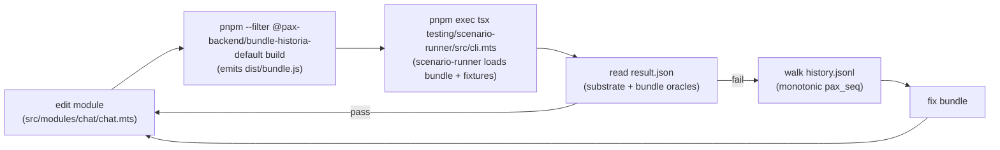

# `historia-default`

> **Status: Phase 3 proof complete.** The package builds to `dist/bundle.js`,
> the module/workflow runtime is wired through lifecycle routing and policy
> gates, and the ten-scenario suite has local and Fly proof artifacts under
> `var/phase-3/local-proof/` and `var/phase-3/fly-proof/`. The target shape is in
> [`docs-next/proofs/historia-default.md`](../../../docs-next/proofs/historia-default.md).

`historia-default` is the reference creator bundle for the historia game
shape — chat-driven world-building with AI advisors, jump-forward
simulation rounds, and moderation. It is the proof-of-concept that the
substrate contract is rich enough to host a real game backend and that
the scenario-runner is the right harness to iterate creator bundles to
correctness.

**This bundle is a proof, not a production migration.** Paxhistoria's
production stack stays on its current Rivet + Next.js architecture. This
bundle never serves a live paxhistoria game.

## What this bundle is responsible for

| Concern | Substrate or bundle? |
|---|---|
| WS transport, JWT verification, session lifecycle, isolated-vm sandbox, blob/state persistence, history, compute budgets, force-disconnect, placement, bundle compat gates | Substrate |
| The 7 game modules (chat, advisor, actions, jump-forward, moderation, admin, cheats) + supporting modules (player-management, rounds, round-timer, map-state, offline-cap, permissions) | Bundle |
| Workflow runtime (engine + executors + task tracker) executing workflow generator functions inline inside the bundle's own isolate | Bundle |
| The 5 default workflow strings (`DEFAULT_CHAT_WORKFLOW`, `DEFAULT_ADVISOR_WORKFLOW`, `DEFAULT_ACTIONS_WORKFLOW`, `DEFAULT_JUMP_FORWARD_WORKFLOW`, `DEFAULT_MODERATION_WORKFLOW`) | Bundle |
| Topic-routing inside the WS handler (substrate offers only `ws.send(playerId\|'all', body)`) | Bundle |
| Blob schema versioning + `v1`→`v5` migrations | Bundle (substrate just stamps an opaque `compatTag` per namespace) |
| Working-state shape (≤128 KB `c.state`) + LiveGameBlob serialization + decomposition into one-or-more `c.blob` keys per game | Bundle |
| Calling 5 URL services for AI, flag search, moderation audit, projection sync, participation | Bundle (via `c.api.invoke`) |

The substrate stays participation-agnostic and billing-agnostic. Anything
billing-shaped or participation-shaped goes through URL services.

## Manifest

```ts
{
  compatTagProduced: "historia:v5",
  compatTagsAccepted: ["historia:v1", "historia:v2", "historia:v3", "historia:v4", "historia:v5"],
  runtimeContractRequired: <current substrate contract version>,
}
```

The `compatTagsAccepted` list spans the full paxhistoria blob-schema
chain so existing games at any version can wake on this bundle. The
bundle's `onWake` handler runs the corresponding migration before any
other work.

## URL services this bundle calls

| Kind | When | Spec |
|---|---|---|
| `ai.chat.v1` | Every workflow `callAI` command (chat, advisor, JF, actions, moderation) | [`ai.chat.v1/README.md`](../../url-services/ai.chat.v1/README.md) |
| `flag.search.v1` | Jump-forward `fetchFlag` for new entities | [`flag.search.v1/README.md`](../../url-services/flag.search.v1/README.md) |
| `moderation.audit.v1` | Moderation workflow on verdict or ban | [`moderation.audit.v1/README.md`](../../url-services/moderation.audit.v1/README.md) |
| `projection.sync.v1` | On state changes (status, current round, player-ready, title, round-completed) | [`projection.sync.v1/README.md`](../../url-services/projection.sync.v1/README.md) |
| `participation.v1` | On read (before deciding to bill) or write (when bundle demotes a player to spectator) | [`participation.v1/README.md`](../../url-services/participation.v1/README.md) |

For the proof, none of these run as operator-owned HTTP servers. The live
scenario suite registers the kinds against deterministic gateway reference
routes, and API-producing scenarios also ship canned `api-responses` records
for gateway replay checks.

## Workflow override contract

The bundle ships ready to play with the 5 hardcoded workflows from
paxhistoria today. **Creator-supplied workflows are optional content
stored in the game blob**, not a substrate primitive. The mechanism:

1. Blob carries an optional `workflows` field:
   ```ts
   blob.workflows?: {
     chat?:        { code: string; entryPoints: { onHumanMessage: string; onConfirmSpeaker: string } };
     advisor?:     { code: string; entryPoints: { onAdvisorMessage: string } };
     actions?:     { code: string; entryPoints: { onRequestSuggestions: string } };
     jumpForward?: { code: string; entryPoints: { onJumpForward: string } };
     moderation?:  { code: string; entryPoints: { onChatMessage: string; onActionSubmitted: string; onCheatReason: string; onPreJumpForward: string } };
   };
   ```
2. The bundle's per-module trigger code reads
   `blob.workflows?.[module]?.code ?? DEFAULT_<MODULE>_WORKFLOW`.
3. The bundle's workflow engine `eval`s the resolved code as a generator
   function within the bundle's existing isolate. No nested sandboxing
   needed — the substrate already sandboxes the whole bundle, and the
   operator vetted the blob contents at game-create time.
4. The command vocabulary stays exactly as paxhistoria has it today
   (`callAI`, `emitChatEvent`, `setState`, etc.). Executor
   implementations (the trusted half) live in the bundle.
5. `callAI` resolves to `c.api.invoke('ai.chat.v1', args)`. Workflows
   themselves never see substrate primitives; they only know about the
   executor command ABI.

What the substrate doesn't know: "workflow," "preset," "engine,"
"executor." It just runs the bundle.

## Storage layout

| Tier | Used for | Size budget |
|---|---|---|
| `c.state` (Tigris-canonical; sync API, ~1s flush window) | Working state: current-round deltas (JF events/queue, player actions, chat events, advisor messages, cheat proposals, timers, etc.) | ≤128 KB (substrate hard limit) |
| `c.blob` (Tigris keyed namespace at `blob/<gameId>/`; async, durable on resolve) | Per-key checkpoints: the main `LiveGameBlob` snapshot under one key (e.g. `current`); paxhistoria's separate `moderation-snapshots/{banId}` rows map naturally to additional keys; optional `workflows` overrides ride inside the main key | ≤1024 keys AND ≤100 MB total per game (both substrate-enforced via the `blob-keys` and `blob-bytes` compute budgets) |
| In-isolate JavaScript variables | Ephemeral: workflow runtime state, dispatched-message dedup tables, in-flight AI task handles | Bounded by substrate's `memory-bytes` compute budget |

The substrate's storage-tiers-v2 changes give the bundle two useful
guarantees for free: (1) `c.state` is canonical in Tigris with a default
1s flush window, so working state survives shard death and cross-shard
migration without bundle-side migration code (cross-shard wake = normal
wake = one Tigris GET); (2) `c.blob` is a keyed namespace, so the bundle
can write checkpoints incrementally (one key per chapter, one per
moderation snapshot, etc.) instead of rewriting one giant gzipped object
on every commit like paxhistoria does today.

**On round commit:** the bundle merges working state into the main blob
snapshot in memory, calls `await c.blob.put('current', encodedSnapshot)`,
clears working state in `c.state` only after the put resolves, and calls
`c.state.flush()` if it needs the working-state clear durable before the
next handler tick. **On cold-load** (`onWake`): the bundle reads
`c.blob.get('current')`, runs the appropriate migration (per
`blobCompatTag`), and replays uncommitted working state from `c.state`.
**On planned sleep:** the substrate flushes pending `c.state` writes
before the runner process exits — zero loss. **On unplanned machine
death:** at most one flush window (~1 s) of `c.state` writes is lost;
anything the bundle needed durable-on-write should have used
`c.blob.put` or `c.state.flush()`.

## Lifecycle hooks (substrate → bundle)

| Hook | Bundle responsibility |
|---|---|
| `onWake` | Read blob, run migration if needed, rebuild in-memory derived state (entity index, etc.) |
| `onSleep` | Commit working state to blob, dispose workflow runtime, flush `c.state` |
| `onPlayerConnect` | Push entity-options list via `c.ws.send`; broadcast presence |
| `onPlayerDisconnect` | Update presence; if no participants online, mark game idle |
| `onPlayerMessage` | Dispatch on `body.type` to the relevant module handler |
| `onCapacityWarning` | Shed load (typically by skipping non-essential workflow runs) |
| `onHostEvent` | Dispatch on `eventType`; primary use today is `participationChanged` from `participation.v1`, and `moderationEject` with `wakeOnDelivery: true` |

## Substrate hooks this proof relies on

The proof relies on two substrate behaviors that already landed before the
bundle scaffold. Both are documented in
[`docs-next/proofs/historia-default.md`](../../../docs-next/proofs/historia-default.md):

1. **Sleep grace period** — game stays warm for 60s after the last
   disconnect.
2. **Host event channel** — `POST /admin/games/:id/host-event` + bundle
   `onHostEvent` lifecycle hook; supports `wakeOnDelivery: true` for
   moderation ejects that need to reach sleeping games.

The bundle routes participation and moderation host events through
`onHostEvent`; the proof suite includes both live participation updates and
sleeping-game wake delivery.

## File layout

```
examples/bundles/historia-default/
├── README.md
├── package.json
├── tsconfig.json
├── manifest.ts
├── src/
│   ├── index.mts
│   ├── context.mts
│   ├── hydration.mts
│   ├── ambient.d.ts
│   ├── modules/
│   │   ├── chat/ advisor/ actions/ jump-forward/ moderation/ admin/ cheats/
│   │   ├── player-management.mts
│   │   ├── rounds.mts
│   │   ├── round-timer.mts
│   │   ├── map-state.mts
│   │   ├── offline-cap.mts
│   │   ├── permissions.mts
│   │   └── types.mts
│   ├── ai/
│   │   ├── engine.mts
│   │   ├── executors.mts
│   │   ├── task-tracker.mts
│   │   └── workflow-runtime-shared.mts
│   ├── core/
│   │   ├── codec.mts
│   │   ├── persistence.mts
│   │   ├── migrations.mts
│   │   └── schema.mts
│   ├── routing/
│   │   ├── websocket.mts
│   │   └── host-events.mts
└── scenarios/
    ├── chat-basic/
    │   ├── manifest.mts
    │   ├── clients/workload.mts
    │   ├── oracles.mts
    │   └── fixtures/
    │       └── api-responses/
    ├── jump-forward-basic/
    ├── advisor-basic/
    ├── actions-basic/
    ├── role-claim-flow/
    ├── role-destroy-flow/
    ├── spectator-billing-block/
    ├── moderation-flow/
    ├── workflow-override-loaded/
    └── host-event-wake-delivery/
```

## Iteration loop

How a developer (or agent) iterates on this bundle until it works:



The substrate's existing scenario-runner
([`testing/scenario-runner/`](../../../testing/scenario-runner/)) hosts
every piece of this loop. See
[`docs-next/proofs/historia-default.md`](../../../docs-next/proofs/historia-default.md)
§5b for the full breakdown of what's already there vs. what's
bundle-specific authoring.

**On a substrate-side oracle failure:** the bundle has a substrate-contract
bug to file — record it as a finding in
[`docs-next/proofs/historia-default.md`](../../../docs-next/proofs/historia-default.md)
§6 and route to the substrate team.

**On a bundle-side oracle failure:** the bundle has a game-logic bug to
fix in this directory.

## Scenarios

The proof's representative coverage set; full descriptions in
[`docs-next/proofs/historia-default.md`](../../../docs-next/proofs/historia-default.md)
§5 Phase 6:

| Scenario | What it exercises |
|---|---|
| `chat-basic` | 2 players, 1 chat thread, AI response (canned), assert broadcast |
| `jump-forward-basic` | 4 players ready, JF runs, canned AI streams events, round commits |
| `advisor-basic` | 1 player asks advisor, canned response, persisted |
| `actions-basic` | 1 player requests action suggestions, canned response, broadcast |
| `role-claim-flow` | Spectator connects, host promotes via `participation.v1`, bundle gets `onHostEvent`, broadcasts |
| `role-destroy-flow` | Bundle dissolves a role mid-game, broadcasts via `c.ws.send`, host re-prompts (simulated) |
| `spectator-billing-block` | Bundle (intentionally buggy fixture) tries to bill a spectator; `ai.chat.v1` rejects with `playerIsSpectator`; bundle handles |
| `moderation-flow` | Content flagged, `moderation.audit.v1.recordVerdict` called, ban via substrate `DELETE /admin/players/:id` |
| `workflow-override-loaded` | Game blob carries a custom `workflows.chat.code`; bundle picks it up instead of the default |
| `host-event-wake-delivery` | Moderation eject fired with `wakeOnDelivery: true`; game wakes from sleep to receive |

Closing the loop (all scenarios pass, all substrate-side + bundle-side
oracles green) is the finish line for the proof.

## Cross-references

- Full proof plan: [`docs-next/proofs/historia-default.md`](../../../docs-next/proofs/historia-default.md)
- Substrate-additions RFC: [`docs-next/proofs/historia-default.md`](../../../docs-next/proofs/historia-default.md)
- Substrate creator contract: [`docs-next/contract/creator-runtime.md`](../../../docs-next/contract/creator-runtime.md)
- Substrate formal spec: [`docs-next/contract/external-api-channel.md`](../../../docs-next/contract/external-api-channel.md)
- Scenario-runner harness: [`testing/scenario-runner/`](../../../testing/scenario-runner/)
- Reference bundle (smoke): [`examples/bundles/hello-ws-echo/`](../hello-ws-echo/)
